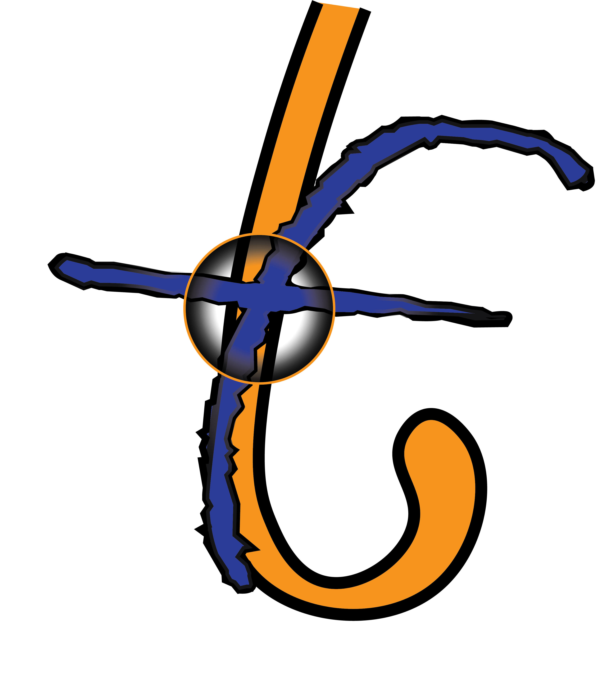

.. fusionlab documentation master file, created by
   sphinx-quickstart on Thu Apr 17 13:39:49 2025.

.. meta::
   :description: FusionLab: A modular library for Temporal Fusion
                 Transformer (TFT) variants. Extend, experiment,
                 and fuse time-series predictions with
                 state-of-the-art architectures.
   :keywords: time series, forecasting, temporal fusion transformer,
              tft, xtft, machine learning, deep learning, python,
              tensorflow

.. raw:: html

   

     
     
     
     
     
   

==================================================
FusionLab 🔥🧪: Igniting Next-Gen Fusion Models
==================================================

**A Modular Library for Temporal Fusion Transformer (TFT) Variants & Beyond**

*Extend, experiment, and fuse time-series predictions with
state-of-the-art architectures.*

---

**FusionLab** provides a flexible and extensible framework built on
**TensorFlow/Keras** for advanced time-series forecasting. It centers
on the **Temporal Fusion Transformer (TFT)** and its extensions like
the **Extreme Temporal Fusion Transformer (XTFT)**, offering modular
components and powerful utilities for researchers and practitioners.

Whether you need interpretable multi-horizon forecasts, robust
uncertainty quantification, or a platform to experiment with novel
temporal architectures, FusionLab aims to provide the necessary tools.

.. # Hiding the main toctree from the page content,
   # but it builds the sidebar.
.. toctree::
   :hidden:
   :maxdepth: 2
   :caption: Documentation

   self

.. # Define the main structure for the sidebar Table of Contents

.. toctree::
   :maxdepth: 2
   :caption: Overview

   motivation

.. toctree::
   :maxdepth: 2
   :caption: Getting Started

   installation
   quickstart

.. toctree::
   :maxdepth: 2
   :caption: User Guide

   user_guide/index

.. toctree::
   :maxdepth: 1
   :caption: Examples

   user_guide/examples/index

.. toctree::
   :maxdepth: 2
   :caption: API Reference

   api

.. toctree::
   :maxdepth: 1
   :caption: Development & Community

   contributing
   Code of Conduct <code_of_conduct> 
   Release Notes <release_notes> 

.. toctree::
   :maxdepth: 1
   :caption: Reference

   license
   citing 
   glossary

.. sd-card::
    :class-card: sd-outline-info sd-rounded-lg sd-p-4 # Style the card

    **✨ Key Features**
    ^^^
    * 🧩 **Modular Design:**
      Build custom forecasting models using interchangeable components
      like specialized attention layers, GRNs, VSNs, multi-scale LSTMs,
      and more. Facilitates research and tailored solutions.
    * 🚀 **Advanced Architectures:**
      Includes robust implementations of standard TFT, NTFT (variant),
      the high-capacity **XTFT** for complex scenarios, and experimental
      SuperXTFT. Ready-to-use state-of-the-art models.
    * 💡 **Extensible:**
      Designed for extension. Easily integrate new model architectures,
      custom layers, or novel loss functions to push the boundaries
      of time series forecasting.
    * ⚙️ **TensorFlow Backend:**
      Currently leverages the power and scalability of the TensorFlow/Keras
      ecosystem for building and training models.
    * 🛠️ **Comprehensive Utilities:**
      Offers a suite of helper tools for common tasks: data preparation,
      sequence generation, time series analysis, result visualization,
      hyperparameter tuning, and CLI applications.
    * 🔬 **Anomaly Detection:**
      Features integrated anomaly detection mechanisms within XTFT,
      allowing models to identify and potentially adapt to irregular data
      patterns during training.

---

Where to Go Next
----------------

* **New Users:** Start with :doc:`installation` and the
  :doc:`quickstart` guide.
* **Understand the 'Why':** Read the :doc:`motivation` behind the project.
* **Learn the Concepts:** Dive into the :doc:`User Guide </user_guide/index>`.
* **See it in Action:** Explore the :doc:`Examples </user_guide/examples/index>`.
* **Code Details:** Consult the :doc:`API Reference <api>`.
* **Cite the Work:** See how to cite ``fusionlab`` in the :doc:`citing` guide.

---

**Community & Development:**
------------------------------

* `GitHub Repository <https://github.com/earthai-tech/fusionlab>`_:
  Source code, issue tracking, and contributions.
* :doc:`contributing`: Learn how to contribute.
* :doc:`license`: Project license information (MIT License). *(Verify)*