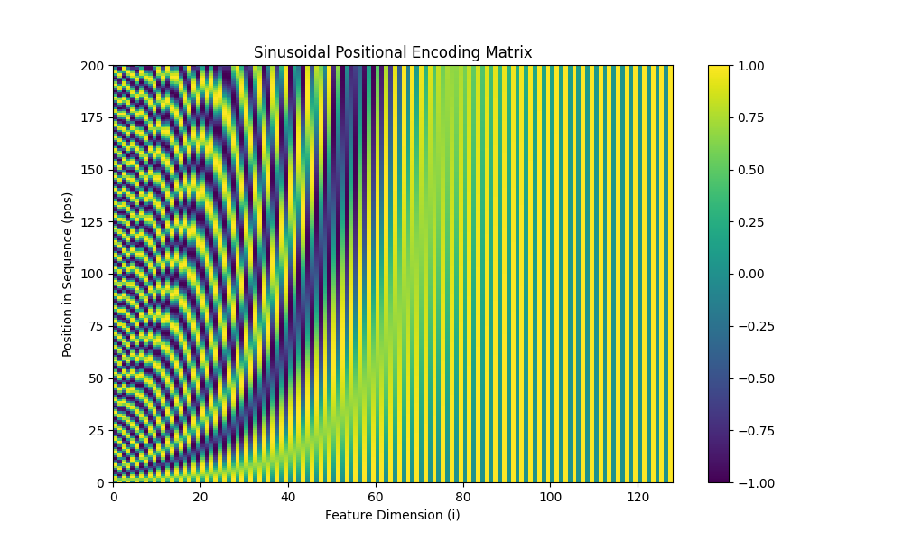
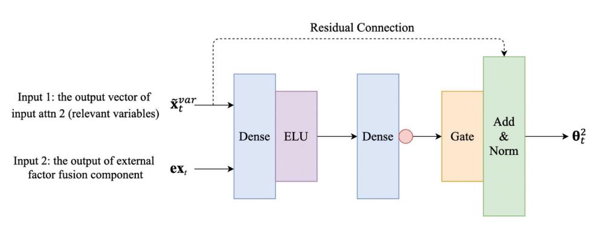

.. _user_guide_components:

============================
Core Model Components
============================

The advanced forecasting models in ``fusionlab-learn`` are not
monolithic black boxes. They are sophisticated pipelines constructed
from a rich ecosystem of specialized, reusable neural network layers,
or **components**. Each component is designed to perform a specific, well-defined
task, such as selecting important features, processing sequences, or
fusing information with attention.

This section serves as a detailed guide to these fundamental building
blocks, which are primarily located in the ``fusionlab.nn.components``
module.

Why Understanding Components Matters
--------------------------------------
A deep understanding of these components unlocks the full potential of
the library and is crucial for several reasons:

* **Deeper Insight:** It allows you to move beyond simply using a model
  and start to understand *how* it works. You can reason about the
  flow of information and the mechanisms that give the architectures
  their predictive power.
* **Enhanced Interpretability:** Many components offer direct paths to
  interpretability. By inspecting the learned weights of a
  ``VariableSelectionNetwork``, for instance, you can determine which
  input features the model found most predictive. Visualizing weights
  from an attention layer can reveal which past time steps were most
  influential for a given forecast.
* **Advanced Customization & Research:** The modular design is an open
  invitation for experimentation. Advanced users can easily "lego-brick"
  these components together to create novel architectures, test new
  hypotheses, or build a model tailored perfectly to the unique
  characteristics of a specific problem.

This guide provides an overview of the key components available, grouped
thematically by their primary function.

Architectural Components
--------------------------

Activation
~~~~~~~~~~
:API Reference: :class:`~fusionlab.nn.components.Activation`

This is a simple utility layer that wraps standard Keras activation
functions (e.g., 'relu', 'elu', 'sigmoid'). Its primary purpose is
to ensure consistent handling and serialization of activation
functions within the ``fusionlab`` framework, particularly when
models or custom layers using activations are saved and loaded. It
internally uses `tf.keras.activations.get()` to resolve string
names to callable functions.

While it can be used directly, users typically specify activations
as strings (e.g., ``activation='relu'``) when initializing other
layers (like :class:`~fusionlab.nn.components.GatedResidualNetwork`),
which then utilize this `Activation` layer or similar internal logic.
Therefore, a direct code example is less illustrative here.

Positional Encoding
~~~~~~~~~~~~~~~~~~~~~
:API Reference: :class:`~fusionlab.nn.components.PositionalEncoding`

**Purpose:** To inject information about the relative or absolute
position of tokens (time steps) in a sequence. This is a critical
component for any architecture that uses self-attention, such as the
Transformer, TFT, and XTFT models. Standard self-attention mechanisms
are permutation-invariant—they treat a sequence as an unordered "bag"
of inputs. Positional encoding solves this by adding a unique,
deterministic "signature" for each position, allowing the model to
understand the order and distance between different points in time.

**Functionality:** This layer implements the classic **sinusoidal
positional encoding** from the "Attention Is All You Need" paper [1]_.
It creates a unique vector for each time step and adds it to the
corresponding input feature embedding.

.. math::
   \text{Output}_t = \text{InputEmbedding}_t + PE_t

The positional encoding vector :math:`PE` at each position `pos` is
not a simple number but a vector whose elements are defined by sine
and cosine functions of different frequencies:

.. math::
   PE_{(pos, 2i)} = \sin\left(\frac{pos}{10000^{2i/d_{\text{model}}}}\right)

.. math::
   PE_{(pos, 2i+1)} = \cos\left(\frac{pos}{10000^{2i/d_{\text{model}}}}\right)

where :math:`pos` is the position in the sequence, :math:`i` is the
dimension index within the feature vector, and :math:`d_{\text{model}}`
is the total feature dimension (`embed_dim`). This formulation allows
the model to easily learn to attend to relative positions, as the
positional encoding of any time step can be represented as a linear
function of any other.

For efficiency, the entire positional encoding matrix is pre-calculated
up to a `max_length` and simply added to the input tensor during the
forward pass.

**Usage Context:** This layer is typically applied to the sequence of
temporal embeddings (derived from dynamic past and/or future inputs)
after the initial feature projection but before the data enters the
main temporal processing blocks, such as the encoder's self-attention
layers or a ``MultiScaleLSTM``.

**Code Example:**

The following example demonstrates how to apply the layer and provides
a visualization of the encoding matrix itself, which is a great way to
build intuition.

.. code-block:: python
   :linenos:

   import tensorflow as tf
   import matplotlib.pyplot as plt
   from fusionlab.nn.components import PositionalEncoding

   # Dummy input tensor (Batch, TimeSteps, Features)
   B, T, F = 4, 50, 128
   input_sequence = tf.random.normal((B, T, F))

   # Instantiate the layer
   pos_encoding_layer = PositionalEncoding(max_length=200)

   # Apply the layer to the input
   output_sequence = pos_encoding_layer(input_sequence)

   print(f"Input shape: {input_sequence.shape}")
   print(f"Output shape after Positional Encoding: {output_sequence.shape}")
   # The shape is unchanged.
   assert input_sequence.shape == output_sequence.shape

   # --- Visualize the Positional Encoding Matrix ---
   # Extract the pre-calculated encoding matrix from the layer
   pe_matrix = pos_encoding_layer.positional_encoding[0, :, :].numpy()

   plt.figure(figsize=(10, 6))
   cax = plt.pcolormesh(pe_matrix, cmap='viridis')
   plt.gcf().colorbar(cax)
   plt.title("Sinusoidal Positional Encoding Matrix")
   plt.xlabel("Feature Dimension (i)")
   plt.ylabel("Position in Sequence (pos)")
   plt.show()

**Expected Output:**

.. code-block:: text

   Input shape: (4, 50, 128)
   Output shape after Positional Encoding: (4, 50, 128)

   A visualization of the positional encoding matrix. Each row
   corresponds to a position in the sequence, and each column to a
   dimension in the feature vector. The plot clearly shows the unique
   sinusoidal patterns that give each time step its unique signature.

Gated Residual Network (GRN)
~~~~~~~~~~~~~~~~~~~~~~~~~~~~~~
:API Reference: :class:`~fusionlab.nn.components.GatedResidualNetwork`

**Purpose:** The Gated Residual Network (GRN) is arguably the most
fundamental and versatile building block in the Temporal Fusion
Transformer (TFT) family of models. It is a flexible and robust module
for applying non-linear transformations to features, while ensuring
the training process remains stable even in very deep networks.

It is designed to perform three key tasks simultaneously:

1.  **Non-linear Processing:** To learn complex, non-linear
    relationships in the data.
2.  **Contextual Conditioning:** To allow a transformation to be
    dynamically influenced by other information (e.g., static metadata).
3.  **Controlled Information Flow:** To learn when to apply or skip
    the transformation entirely.

Architectural Deep Dive
****************************
The power of the GRN comes from the combination of several well-established
deep learning concepts into a single, reusable component.

   A diagram illustrating the flow of information through the Gated
   Residual Network, showing the main data path, the optional context
   addition, the gating mechanism, and the final residual connection.
   *By Haizhou Du and Ziyi Duan, 2022, in Applied Intelligence (2022) 52:2496–2509)*
   https://doi.org/10.1007/s10489-021-02532-x

Let's break down the flow step-by-step:

1.  **(Optional) Context Addition:**
    The GRN can be conditioned on an external context vector :math:`c`.
    If provided, this context is linearly projected to match the
    dimension of the primary input :math:`a` and then added to it. This
    creates a contextualized input, :math:`a'`, allowing static
    information or other features to influence the transformation.

    .. math::
       a' = a + \text{Linear}_c(c)
       
    If no context is given, then :math:`a' = a`.

2.  **Main Transformation Path:**
    The (contextualized) input :math:`a'` is fed through a standard
    feed-forward path to learn a complex, non-linear representation.
    This typically involves a dense layer with a non-linear activation
    function like `ELU` or `ReLU`.

    .. math::
       \eta_1 = \text{ELU}(\text{Linear}_1(a'))

3.  **The Gating Mechanism:**
    In parallel, the input :math:`a'` is fed into a separate dense
    layer with a **sigmoid** activation function. The output of this
    layer, :math:`g`, is a vector of values between 0 and 1. This is
    the "gate."

    .. math::
       g = \sigma(\text{Linear}_2(a'))

    This gate acts as an adaptive filter. It is element-wise multiplied
    with the output of the main transformation path. If an element in
    the gate is close to 0, it effectively "turns off" the corresponding
    part of the transformation. If it's close to 1, it lets it pass
    through. This allows the GRN to learn to skip the non-linear
    transformation entirely in situations where a simple linear path is
    sufficient.

4.  **Residual ("Skip") Connection & Normalization:**
    Finally, the gated transformation is added back to the original
    input :math:`a`. This "skip connection," popularized by ResNets, is
    critical for training deep networks as it prevents vanishing
    gradients and allows the model to easily learn identity mappings.
    If the input dimension of :math:`a` differs from the GRN's output
    dimension, a projection (`Linear_p`) is applied to :math:`a` before
    the addition. The final result is passed through Layer Normalization.

    The complete formulation is:

    .. math::
       \text{GRN}(a, [c]) = \text{LayerNorm}\left(\text{proj}(a) + ( \eta_1 \odot g )\right)

**Usage Context:**

GRNs are the workhorse component used throughout the library's advanced
models for a variety of tasks:

* Processing static features to generate different context vectors.
* Acting as the core transformation block within the
  :class:`~fusionlab.nn.components.VariableSelectionNetwork`.
* Serving as the position-wise feed-forward networks inside attention blocks.
* Enriching temporal features with static context.

**Code Example:**

.. code-block:: python
   :linenos:

   import tensorflow as tf
   from fusionlab.nn.components import GatedResidualNetwork

   # --- Configuration ---
   batch_size = 4
   input_features = 32
   hidden_units = 16 # The output dimension of the GRN

   # --- Dummy input tensors ---
   # Primary input
   dummy_input = tf.random.normal((batch_size, input_features))
   # Optional context vector (must match the GRN's output units)
   dummy_context = tf.random.normal((batch_size, hidden_units))

   # --- 1. Instantiate the GRN Layer ---
   grn_layer = GatedResidualNetwork(
       units=hidden_units,
       dropout_rate=0.1,
       activation='elu'
   )

   # --- 2. Call without context ---
   # The GRN applies its non-linear transformation to the input.
   output_no_context = grn_layer(dummy_input, training=False)
   print(f"GRN output shape (no context): {output_no_context.shape}")
   assert output_no_context.shape == (batch_size, hidden_units)

   # --- 3. Call with context ---
   # The context vector influences the initial transformation.
   output_with_context = grn_layer(
       dummy_input, context=dummy_context, training=False
   )
   print(f"GRN output shape (with context): {output_with_context.shape}")
   assert output_with_context.shape == (batch_size, hidden_units)

   # --- 4. Inspecting the layer ---
   # The GRN is a standard Keras Layer with trainable weights.
   print(f"\nNumber of trainable weights in the GRN: {len(grn_layer.trainable_weights)}")

**Expected Output:**

.. code-block:: text

   GRN output shape (no context): (4, 16)
   GRN output shape (with context): (4, 16)

   Number of trainable weights in the GRN: 11

VariableSelectionNetwork (VSN)
~~~~~~~~~~~~~~~~~~~~~~~~~~~~~~~~
:API Reference: :class:`~fusionlab.nn.components.VariableSelectionNetwork`

**Purpose:** To perform **interpretable, instance-wise feature
selection**. In many complex forecasting problems, not all input
variables are equally important, and their relevance can change
depending on the context. For example, a `rainfall` feature might be
highly relevant for predicting river levels during a storm but irrelevant
during a drought.

The VSN is a powerful component designed to solve this problem. It allows
the model to dynamically learn which features to pay attention to and
which to ignore for each individual forecast, improving model performance
by filtering out noise and providing valuable insights into which
variables are driving the predictions.

Architectural Deep Dive
****************************
The VSN is much more sophisticated than a simple feature-dropping
mechanism. It learns to create a weighted sum of **rich, non-linear
representations** of each input variable. The architecture can be broken
down into four key stages:

1.  **Feature-wise Non-linear Processing:**
    First, instead of considering the raw input features directly, the
    VSN processes **each input variable independently**. Each variable
    :math:`\mathbf{x}_j` from the input set is passed through its own dedicated
    :class:`~fusionlab.nn.components.GatedResidualNetwork` (GRN).

    .. math::
       \tilde{\mathbf{x}}_j = \text{GRN}_j(\mathbf{x}_j, [c])

    This initial step is crucial. It allows the model to learn complex,
    non-linear patterns and transformations *within* each individual
    feature first, before deciding on its overall importance. This
    transformation can also be conditioned on an external `context` vector
    :math:`c` (e.g., static features).

2.  **Learning Variable Importances:**
    All the processed feature representations from the previous step,
    :math:`\{\tilde{\mathbf{x}}_1, \tilde{\mathbf{x}}_2, ..., \tilde{\mathbf{x}}_N\}`,
    are stacked together. This combined tensor is then fed into a separate,
    shared network (in this implementation, a single `Dense` layer followed
    by a GRN) to produce a single scalar logit, :math:`e_j`, for each variable.
    These logits represent the "un-normalized" importance of each feature.

3.  **Normalizing Weights with Softmax:**
    To ensure the learned weights are interpretable and well-behaved, the
    logits :math:`\{e_j\}` are passed through a **Softmax** function. This
    transforms them into the final importance weights, :math:`\alpha_j`,
    which are all positive and sum to 1.

    .. math::
       \alpha_j = \text{softmax}(e_j) = \frac{\exp(e_j)}{\sum_{k=1}^{N} \exp(e_k)}

    These weights, :math:`\alpha_j`, can be interpreted as the percentage of
    "attention" the model is paying to each input variable for a given
    prediction.

4.  **Weighted Summation:**
    The final output of the VSN is a weighted sum of the rich, processed
    feature representations from Step 1, using the softmax weights from
    Step 3 as the coefficients.

    .. math::
       \text{VSN}(\mathbf{X}, [c]) = \sum_{j=1}^{N} \alpha_j \tilde{\mathbf{x}}_j

The output is a single, information-rich vector where the most relevant
features (as determined by the network) have the greatest contribution.

**Usage Context:**
VSNs are a hallmark of the TFT architecture. In ``fusionlab-learn``, they
are used in models like `HALNet`, `XTFT`, and `PIHALNet` as the first step in
processing each of the three input types: static, dynamic past, and known
future features. This allows the models to perform intelligent feature
selection at every stage of the pipeline.

**Code Example:**

This example demonstrates how to use the VSN and, importantly, how to
inspect the learned feature importances after a forward pass.

.. code-block:: python
   :linenos:

   import tensorflow as tf
   from fusionlab.nn.components import VariableSelectionNetwork

   # --- Configuration ---
   batch_size = 4
   num_features = 8 # Number of input variables
   units = 16       # Dimension of the GRN outputs

   # --- 1. Create a dummy input tensor and a context vector ---
   input_features = tf.random.normal((batch_size, num_features))
   # Context vector can be used to influence the feature selection
   context_vector = tf.random.normal((batch_size, units))

   # --- 2. Instantiate and apply the VSN layer ---
   vsn_layer = VariableSelectionNetwork(
       num_inputs=num_features,
       units=units,
       dropout_rate=0.1
   )
   # Pass both the inputs and the optional context
   output_vector = vsn_layer(input_features, context=context_vector)

   # --- 3. Inspect the results ---
   print(f"Input shape: {input_features.shape}")
   print(f"Output shape (weighted sum of features): {output_vector.shape}")

   # The real value of VSN is its interpretability.
   # We can access the learned weights for each feature.
   feature_importances = vsn_layer.variable_importances_

   # Shape is (Batch, NumFeatures, 1)
   print(f"\nShape of learned feature importances: {feature_importances.shape}")

   # Let's look at the importances for the first sample in the batch
   sample_0_importances = tf.squeeze(feature_importances[0]).numpy()
   print("\nLearned Feature Importances for Sample 0:")
   for i, weight in enumerate(sample_0_importances):
       print(f"  Feature {i+1}: {weight:.3f}")

**Expected Output:**

.. code-block:: text

   Input shape: (4, 8)
   Output shape (weighted sum of features): (4, 16)

   Shape of learned feature importances: (4, 8, 1)

   Learned Feature Importances for Sample 0:
     Feature 1: 0.008
     Feature 2: 0.091
     Feature 3: 0.347
     Feature 4: 0.004
     Feature 5: 0.029
     Feature 6: 0.019
     Feature 7: 0.497
     Feature 8: 0.005
     

Position-wise Feed-Forward Network (FFN)
~~~~~~~~~~~~~~~~~~~~~~~~~~~~~~~~~~~~~~~~~~~~~
:API Reference: :class:`~fusionlab.nn.components.PositionwiseFeedForward`

The Position-wise Feed-Forward Network is a core component of the standard
Transformer block, as introduced in the "Attention Is All You Need"
paper. It is applied after the multi-head attention sub-layer and serves
two primary purposes:

1.  To introduce non-linearity, allowing the model to learn more complex
    functions.
2.  To process and transform the context-rich representation of each
    position (or time step) independently.

**How it Works**

The "position-wise" nature is its defining characteristic. The exact
same FFN, with the same learned weights, is applied to the feature
vector at every single position in the input sequence. It does not mix
information between positions; that task is handled by the preceding
attention layer.

The network itself is a simple two-layer fully-connected network. The
first layer expands the dimensionality of the input, and the second
layer projects it back down.

.. math::
   \text{FFN}(x) = \text{Linear}_2(\text{activation}(\text{Linear}_1(x)))

**Key Parameters**

* **`embed_dim`**: The input and output dimensionality of the layer,
  which must match the model's main embedding dimension (:math:`d_{model}`).
* **`ffn_dim`**: The dimensionality of the inner, expanded hidden layer.
  A common practice is to set this to `4 * embed_dim`.
* **`activation`**: The non-linear activation function (e.g., `'relu'` or
  `'gelu'`) applied after the first linear transformation.
* **`dropout_rate`**: The dropout rate for regularization.

**Usage Example**

.. code-block:: python
   :linenos:

   import tensorflow as tf
   from fusionlab.nn.components import PositionwiseFeedForward

   # 1. Create a dummy input tensor from a previous layer
   # (batch_size, sequence_length, embed_dim)
   input_tensor = tf.random.normal((32, 50, 128))

   # 2. Instantiate the FFN layer
   ffn_layer = PositionwiseFeedForward(
       embed_dim=128,  # Must match input's last dimension
       ffn_dim=512     # The expanded inner dimension
   )

   # 3. Pass the input through the layer
   output_tensor = ffn_layer(input_tensor)

   # The output shape is always the same as the input shape
   print(f"Input Shape: {input_tensor.shape}")
   print(f"Output Shape: {output_tensor.shape}")

**Expected Output:**

.. code-block:: text

   Input Shape: (32, 50, 128)
   Output Shape: (32, 50, 128)
   

Gated Residual Network (GRN) vs. Position-wise FFN
******************************************************

In the :class:`~fusionlab.nn.components.XTFT` architecture and the broader 
Temporal Fusion Transformer family, the standard Position-wise Feed-Forward 
Network(FFN) found in classic Transformers is deliberately replaced by a more
sophisticated component: the **Gated Residual Network (GRN)**. This
choice is critical for handling the complexity and noise inherent in
real-world time series data.

While an FFN provides essential non-linear transformation, a GRN
enhances this process with two key mechanisms. First, it incorporates a
**gating mechanism**, which acts like an intelligent information filter.
This gate dynamically learns to control how much information flows
through the layer, allowing the model to suppress noise or ignore
irrelevant features at a specific time step. Second, the GRN has a
**built-in residual connection**, which provides a direct path for
information to bypass the transformation block. This stabilizes the
training of deep networks by preventing the vanishing gradient problem
and ensures the transformation is only applied if it is beneficial. By
combining non-linear processing with learnable filtering and stable
gradient flow, the GRN provides a much more robust and expressive
building block than a standard FFN.

**Comparison Table: FFN vs. GRN**

.. list-table:: Comparison Table: FFN vs. GRN
   :widths: 20 40 40 40
   :header-rows: 1

   * - Feature
     - Position-wise Feed-Forward Network (FFN)
     - Gated Residual Network (GRN)
     - Significance & Benefit
   * - **Core Purpose**
     - To apply a non-linear transformation to each position's
       vector after attention.
     - To apply a **controlled**, non-linear transformation to each
       position's vector.
     - **GRN is more adaptive.** Both add complexity, but the GRN's
       transformation is conditional and can be skipped if not useful.
   * - **Basic Structure**
     - Two linear (Dense) layers with a simple activation function
       (e.g., ReLU).
     - Two linear layers combined with a **Gating Layer (GLU)** and a
       **residual (skip) connection**.
     - **GRN is more complex and powerful.** The gating and skip
       connections are what give it superior performance.
   * - **Information Flow**
     - Input data is always fully transformed by the network.
     - A gating mechanism learns to **filter** the input, deciding how
       much of the transformation to apply.
     - **GRN can ignore noise.** This is a major advantage in time
       series. The FFN lacks this dynamic filtering.
   * - **Residual Connections**
     - Relies on an **external** residual connection applied *after*
       the layer in the main Transformer block.
     - The residual connection is an **integral part** of the GRN's
       internal structure.
     - **GRN has better gradient flow.** Integrating the skip
       connection makes the component more robust and stable,
       especially in very deep networks.
   * - **Context Integration**
     - Has no explicit mechanism to incorporate external context.
     - Explicitly designed to accept an optional **context vector**,
       which influences the gating behavior.
     - **GRN is context-aware.** This allows static features to
       directly influence the temporal processing at every time step,
       a key feature of the TFT architecture.
   * - **Origin**
     - "Attention Is All You Need" (The original Transformer)
     - "Temporal Fusion Transformers for Interpretable Multi-horizon
       Time Series Forecasting"
     - The GRN is a specific innovation designed to overcome the
       limitations of a standard FFN for heterogeneous time series data.
   * - **When to Use**
     - Excellent for general-purpose sequence processing where the
       main goal is transformation (e.g., NLP).
     - Superior for complex, noisy time series forecasting where
       filtering, context integration, and training stability are critical.
     - ``XTFT`` uses GRNs because they are better suited for the
       challenges of real-world forecasting data.
       
       
StaticEnrichmentLayer
~~~~~~~~~~~~~~~~~~~~~~~
:API Reference: :class:`~fusionlab.nn.components.StaticEnrichmentLayer`

**Purpose:** To effectively infuse time-invariant **static context**
into a sequence of **time-varying temporal features**. In many real-world
problems, the nature of temporal patterns depends heavily on static
attributes. For example, the sales seasonality for "Product A" might
be completely different from "Product B".

This layer is the mechanism that allows the model to learn these
conditional relationships. It creates an "enriched" representation of
the time series where the temporal dynamics are modulated by the static
properties of the entity being forecast.

Architectural Deep Dive
****************************
The layer performs a three-step process to combine the two distinct types
of information into a single, powerful representation.

1.  **Input Tensors:** The layer takes two inputs:

    * **Temporal Features** (:math:`\mathbf{X}`): A 3D tensor of shape
      ``(Batch, TimeSteps, Units)``, typically the output of a
      sequence encoder like an LSTM. It contains information about
      "what is happening over time."
    * **Static Context** (:math:`\mathbf{c}`): A 2D tensor of shape
      ``(Batch, Units)``, typicallythe output of processing static
      metadata. It contains information about "what entity we are
      looking at."

2.  **Broadcasting the Static Context:**
    The static context vector, which lacks a time dimension, must be
    made compatible with the temporal features. The layer achieves
    this by expanding its dimensions and tiling it across the time
    step axis, transforming :math:`\mathbf{c}` into a new tensor
    :math:`\mathbf{C}` of shape ``(Batch, TimeSteps, Units)``. Now, every
    time step in the sequence is associated with the same static context vector.

3.  **Concatenation and Gated Transformation:**
    The broadcasted static context :math:`\mathbf{C}` and the original
    temporal features :math:`\mathbf{X}` are **concatenated** along the
    feature dimension. This creates a combined feature vector at each
    time step that contains both the original temporal information and the
    static context.

    This combined, richer tensor is then passed through a final
    :class:`~fusionlab.nn.components.GatedResidualNetwork` (GRN). The
    GRN applies a powerful, learnable non-linear transformation to this
    concatenated input, allowing the model to discover the complex and
    subtle interactions between the static attributes and the temporal
    dynamics. The output is the final "enriched" sequence.

**Usage Context:**

This is a standard and critical component in Temporal Fusion Transformer
(TFT) architectures. It is typically applied after the main sequence
encoder (like an LSTM) and before the temporal self-attention layer. It serves
as the primary mechanism for injecting static information deep into the
temporal processing pipeline.

**Code Example**

.. code-block:: python
   :linenos:

   import tensorflow as tf
   from fusionlab.nn.components import StaticEnrichmentLayer

   # --- Configuration ---
   batch_size = 4
   time_steps = 20
   units = 64 # Dimension of features and context

   # --- 1. Create Dummy Input Tensors ---
   # Represents the output of a sequence encoder (e.g., LSTM)
   temporal_features = tf.random.normal((batch_size, time_steps, units))
   # Represents the processed static metadata
   static_context_vector = tf.random.normal((batch_size, units))

   # --- 2. Instantiate the Layer ---
   enrichment_layer = StaticEnrichmentLayer(units=units, activation='relu')

   # --- 3. Apply the layer ---
   # The call signature is: call(temporal_features, static_context_vector)
   enriched_features = enrichment_layer(temporal_features, static_context_vector)

   # --- 4. Verify Shapes ---
   print(f"Input temporal shape: {temporal_features.shape}")
   print(f"Input static context shape: {static_context_vector.shape}")
   print(f"Output enriched shape: {enriched_features.shape}")
   # The output shape matches the temporal input shape, but its content
   # is now enriched with static information.
   assert enriched_features.shape == temporal_features.shape

**Expected Output:**

.. code-block:: text

   Input temporal shape: (4, 20, 64)
   Input static context shape: (4, 64)
   Output enriched shape: (4, 20, 64)

.. raw:: html

   

Input Processing & Embedding Layers
-------------------------------------
These layers are the first point of contact for the raw input data.
They handle the initial transformation and embedding of various input
types before they enter the main temporal processing stream of the models.

LearnedNormalization
~~~~~~~~~~~~~~~~~~~~
:API Reference: :class:`~fusionlab.nn.components.LearnedNormalization`

**Purpose:** To provide a dynamic, learnable alternative to traditional
data preprocessing. In a typical workflow, you might scale your data
using a tool like `scikit-learn`'s `StandardScaler`, which calculates a
fixed mean and standard deviation from a training set. ``LearnedNormalization``
brings this process *inside* the model, allowing the network to learn the
optimal normalization parameters as part of the end-to-end training process.

This approach gives the model the flexibility to adaptively determine the
most suitable scale and shift for its input features based on what best
minimizes the final loss function.

Benefits and Trade-offs
****************************
* **Adaptability:** If the data distribution is expected to shift between
  training and inference (a common issue known as data drift), a fixed
  scaler can become stale and suboptimal. By learning the normalization
  parameters, the model can be more robust to these variations.
* **End-to-End Optimization:** The normalization parameters (:math:`\mu`
  and :math:`\sigma`) are optimized with respect to the final model
  loss, just like any other weight. This means the model learns the
  *exact scaling* that helps it perform its task best, not just a
  generic standardization.
* **Simpler Deployment:** The normalization logic is part of the saved
  model itself. This eliminates the need to save, load, and manage
  separate scaler objects in a production pipeline.
* **Trade-off:** For simple, stationary datasets, a standard pre-calculated
  scaler is often sufficient and computationally lighter. `LearnedNormalization`
  is best suited for complex problems where you want to give the model
  maximum flexibility to control its internal representations.
  
How it Works
****************
The layer is simple yet powerful. During its `build` phase, it creates two
trainable weight vectors whose size matches the input feature dimension
(:math:`D`):

1.  A `mean` vector (:math:`\mathbf{\mu}_{learned}`), initialized to zeros.
2.  A `stddev` vector (:math:`\mathbf{\sigma}_{learned}`), initialized to ones.

During the forward pass, it applies standard normalization to the input
tensor :math:`\mathbf{X}` using these learned parameters:

.. math::
   \mathbf{X}_{norm} = \frac{\mathbf{X} - \mathbf{\mu}_{learned}}{\mathbf{\sigma}_{learned} + \epsilon}

Here, :math:`\epsilon` is a small constant (e.g., 1e-6) added for
numerical stability to prevent division by zero. These parameters are
then updated via backpropagation during training.

**Usage Context:**

This layer is used in the :class:`~fusionlab.nn.transformers.XTFT` model as
an initial processing step for static input features, giving the model
adaptive control over how it normalizes this crucial context.

**Code Example:**

.. code-block:: python
   :linenos:

   import tensorflow as tf
   from fusionlab.nn.components import LearnedNormalization

   # --- Configuration ---
   batch_size = 4
   num_features = 5

   # --- 1. Create a dummy input tensor ---
   # Represents a batch of static features with non-zero mean and std
   dummy_input = tf.random.normal(
       (batch_size, num_features), mean=10.0, stddev=2.0
   )

   # --- 2. Instantiate and apply the layer ---
   learned_norm_layer = LearnedNormalization()
   normalized_output = learned_norm_layer(dummy_input)

   # --- 3. Inspect the layer's state and output ---
   print("--- Layer State (Initial) ---")
   print(f"Layer has {len(learned_norm_layer.trainable_weights)} trainable weight sets (mean and stddev)")
   # The learned mean starts at 0
   print(f"Initial Learned Mean (first 3 features): {learned_norm_layer.mean.numpy()[:3]}")
   # The learned stddev starts at 1
   print(f"Initial Learned Stddev (first 3 features): {learned_norm_layer.stddev.numpy()[:3]}")

   print("\n--- Output Verification ---")
   print(f"Input shape: {dummy_input.shape}")
   print(f"Normalized output shape: {normalized_output.shape}")
   # Initially, the output is just (input - 0) / 1, so stats are similar
   print(f"Mean of normalized output (initial): {tf.reduce_mean(normalized_output):.2f}")
   print(f"Stddev of normalized output (initial): {tf.math.reduce_std(normalized_output):.2f}")

**Expected Output:**

.. code-block:: text

   --- Layer State (Initial) ---
   Layer has 2 trainable weight sets (mean and stddev)
   Initial Learned Mean (first 3 features): [0. 0. 0.]
   Initial Learned Stddev (first 3 features): [1. 1. 1.]

   --- Output Verification ---
   Input shape: (4, 5)
   Normalized output shape: (4, 5)
   Mean of normalized output (initial): 10.04
   Stddev of normalized output (initial): 1.95

.. note::
   The example shows that initially, the layer performs an identity-like
   transformation because its learned :math:`\mu` and :math:`\sigma` start
   at 0 and 1. Through backpropagation during model training, these weights
   would be updated to the optimal values for minimizing the overall model loss.

MultiModalEmbedding
~~~~~~~~~~~~~~~~~~~
:API Reference: :class:`~fusionlab.nn.components.MultiModalEmbedding`

**Purpose:** To process multiple, distinct streams of time-varying
data and fuse them into a single, unified representation. Advanced
forecasting models often ingest different **modalities** of temporal
data simultaneously, for example:

1.  **Dynamic Past Features:** Historical data, like past sales or
    sensor readings.
2.  **Known Future Features:** Data known in advance, like upcoming
    holidays, weather forecasts, or scheduled promotions.

These different input streams often have different numbers of features
and represent different kinds of information. The ``MultiModalEmbedding``
layer is the component responsible for projecting each of these disparate
modalities into a common, high-dimensional **embedding space** before
they are fused together for downstream processing.

Architectural Deep Dive
****************************
The layer follows a simple yet powerful three-step process:

1.  **Multiple Input Streams:** The layer is designed to accept a `list`
    of input tensors. Each tensor in the list represents a different
    modality, for example: ``[dynamic_input, future_input]``. A key
    requirement is that while the number of features (the last dimension)
    can differ between modalities, their batch and time dimensions must
    be the same.

2.  **Independent Projection:** The layer creates a separate, independent
    ``Dense`` layer for *each* input modality. When the model is called,
    each input tensor is passed through its own dedicated dense layer,
    which projects it from its original feature dimension to the common,
    unified ``embed_dim``.

3.  **Concatenation:** After each modality has been projected into the
    common embedding space, the resulting tensors are all **concatenated**
    along the last (feature) dimension. This creates a single, wide tensor
    that contains the learned representations of all input modalities,
    fused together and ready for the next stage of processing.

.. math::
   \mathbf{E}_{i} = \text{Dense}_i(\mathbf{M_i}) \quad \text{for each modality } i \\
   \mathbf{H}_{out} = \text{Concat}\big( \mathbf{E}_1, \mathbf{E}_2, \dots, \mathbf{E}_n \big)

**Usage Context:**
This layer is used at the beginning of the temporal processing pipeline in
models like :class:`~fusionlab.nn.transformers.XTFT`. It is one of the
first steps in creating a unified representation from the various
time-varying inputs before they are passed to components like
:class:`~fusionlab.nn.components.PositionalEncoding` or the main model
encoder.

**Code Example:**

This example demonstrates how to embed two different input modalities
(e.g., dynamic past features and known future features) into a single,
concatenated tensor.

.. code-block:: python
   :linenos:

   import tensorflow as tf
   from fusionlab.nn.components import MultiModalEmbedding

   # --- Configuration ---
   batch_size = 32
   time_steps = 10
   embed_dim_per_modality = 64

   # --- 1. Create Dummy Input Tensors for Two Modalities ---
   # Represents historical data with 16 features
   dynamic_input = tf.random.normal((batch_size, time_steps, 16))
   # Represents future data with 8 features
   future_input = tf.random.normal((batch_size, time_steps, 8))

   # --- 2. Instantiate and Apply the Layer ---
   mm_embedding_layer = MultiModalEmbedding(embed_dim=embed_dim_per_modality)

   # The layer accepts a list of the input tensors
   fused_embeddings = mm_embedding_layer([dynamic_input, future_input])

   # --- 3. Verify Shapes ---
   print(f"Shape of dynamic input: {dynamic_input.shape}")
   print(f"Shape of future input:  {future_input.shape}")
   print(f"Shape of fused output:  {fused_embeddings.shape}")

   # The final feature dimension is the sum of the embed_dim for each modality
   expected_output_dim = embed_dim_per_modality * 2
   print(f"\nExpected output feature dimension: {expected_output_dim}")
   assert fused_embeddings.shape[-1] == expected_output_dim

**Expected Output:**

.. code-block:: text

   Shape of dynamic input: (32, 10, 16)
   Shape of future input:  (32, 10, 8)
   Shape of fused output:  (32, 10, 128)

   Expected output feature dimension: 128

.. raw:: html

   

Sequence Processing Layers
----------------------------

These layers are designed to process temporal sequences to capture
dependencies, patterns, and contextual information over time.

MultiScaleLSTM
~~~~~~~~~~~~~~~~
:API Reference: :class:`~fusionlab.nn.components.MultiScaleLSTM`

**Purpose:** To analyze temporal patterns in a sequence at **multiple
time resolutions simultaneously**. Real-world time series often contain a
mixture of patterns that occur over different time horizons—for example,
intraday fluctuations, daily seasonality, and weekly or monthly trends. A
single LSTM processing data step-by-step can struggle to effectively
capture all these different frequencies at once.

The ``MultiScaleLSTM`` layer solves this by acting like a set of
parallel "lenses," each viewing the same input time series at a
different resolution or "zoom level." By applying multiple LSTMs to
sub-sampled versions of the input, it allows the model to concurrently
learn short-term, medium-term, and long-term dynamics, creating a rich,
multi-resolution summary of the temporal features.

Architectural Deep Dive
****************************
The layer internally manages a collection of standard Keras LSTM layers
and processes the input sequence through them in parallel.

1.  **Input:** The layer receives a single input time series tensor,
    :math:`\mathbf{X}`, of shape ``(Batch, TimeSteps, Features)``.

2.  **Parallel Sub-sampling:** For each integer `scale` :math:`s`
    provided in the ``scales`` list (e.g., `[1, 3, 7]`), the layer
    creates a new, shorter sequence by taking every :math:`s`-th
    time step from the original input.

    .. math::
       \mathbf{X}_s = \mathbf{X}[:, ::s, :]

    For example, a scale of `1` uses the original sequence, while a
    scale of `7` would effectively create a sequence of weekly data
    points from a daily input.

3.  **Independent LSTM Processing:** Each of these new, sub-sampled
    sequences (:math:`\mathbf{X}_1, \mathbf{X}_3, \mathbf{X}_7`, etc.)
    is fed into its own independent LSTM layer. While all LSTMs in the
    set share the same number of `lstm_units`, they each have their
    own separate, trainable weights, allowing them to specialize in
    finding patterns at their assigned scale.

4.  **Output Aggregation:** The final output format is controlled by the
    `return_sequences` parameter, catering to two primary use cases:

    * **Feature Extraction (`return_sequences=False`):**
      In this mode, each LSTM processes its sub-sampled sequence and
      returns only its **final hidden state**, a single vector of
      shape :math:`(B, \text{lstm\_units})` that summarizes the
      patterns found at that scale. All of these summary vectors are
      then **concatenated** along the feature dimension. This creates a
      single, rich feature vector that represents the temporal
      dynamics across all scales.
        
      .. math::
           \text{Output} \in \mathbb{R}^{B, \text{lstm}_{units} \times |\text{scales}|}

    * **Encoder Mode** (`return_sequences=True`):
      In this mode, each LSTM returns the **full sequence of hidden
      states** for its sub-sampled input. Because each sequence has a
      different length (:math:`\approx T/s`), the layer returns a
      **list** of output tensors. This mode is used when the layer
      is part of an encoder, and a downstream attention mechanism
      needs to attend to the full contextualized output of each scale.

**Usage Context:**
This layer is a key component of the `'hybrid'` encoder architecture
within :class:`~fusionlab.nn.models.BaseAttentive` and its children,
like :class:`~fusionlab.nn.models.HALNet` and :class:`~fusionlab.nn.models.XTFT`. The utility function
:func:`~fusionlab.nn.components.aggregate_multiscale` is often used
subsequently to combine the list of tensors produced when
``return_sequences=True``.

**Code Example:**

.. code-block:: python
   :linenos:

   import tensorflow as tf
   from fusionlab.nn.components import MultiScaleLSTM

   # --- Configuration ---
   batch_size = 4
   time_steps = 30
   features = 8
   lstm_units = 16
   # Analyze patterns at original, 5-step, and 10-step resolutions
   scales = [1, 5, 10]

   # --- Create a dummy input tensor ---
   dummy_input = tf.random.normal((batch_size, time_steps, features))
   print(f"Input shape: {dummy_input.shape}")

   # --- Example 1: Return only final hidden states ---
   # This mode is for creating a single feature vector summary.
   ms_lstm_final_state = MultiScaleLSTM(
       lstm_units=lstm_units,
       scales=scales,
       return_sequences=False # Default behavior
   )
   final_states_concat = ms_lstm_final_state(dummy_input)
   print("\n--- Return Final States ---")
   print(f"Output shape: {final_states_concat.shape}")
   print(f"(Expected: B, units * num_scales -> {batch_size}, {lstm_units * len(scales)})")

   # --- Example 2: Return full sequences ---
   # This mode is for encoder backbones.
   ms_lstm_sequences = MultiScaleLSTM(
       lstm_units=lstm_units,
       scales=scales,
       return_sequences=True
   )
   output_sequences_list = ms_lstm_sequences(dummy_input)
   print(f"\n--- Return Full Sequences ---")
   print(f"Output type: {type(output_sequences_list)}")
   print(f"Number of output sequences in list: {len(output_sequences_list)}")
   for i, seq in enumerate(output_sequences_list):
       print(f"  Shape of sequence for scale={scales[i]}: {seq.shape}")

**Expected Output:**

.. code-block:: text

   Input shape: (4, 30, 8)

   --- Return Final States ---
   Output shape: (4, 48)
   (Expected: B, units * num_scales -> 4, 48)

   --- Return Full Sequences ---
   Output type: <class 'list'>
   Number of output sequences in list: 3
     Shape of sequence for scale=1: (4, 30, 16)
     Shape of sequence for scale=5: (4, 6, 16)
     Shape of sequence for scale=10: (4, 3, 16)

DynamicTimeWindow
~~~~~~~~~~~~~~~~~~~
:API Reference: :class:`~fusionlab.nn.components.DynamicTimeWindow`

**Purpose:** To apply a "recency filter" to a sequence, selecting a
fixed-size window containing only the most recent time steps. In deep,
multi-stage forecasting models like :class:`~fusionlab.nn.models.XTFT`, information from the
distant past is often already processed and summarized by earlier
layers (e.g., :class:`~fusionlab.nn.components.MultiScaleLSTM` or 
:ref:`MemoryAugmentedAttention <memory_augmented_attention>` ).

The ``DynamicTimeWindow`` layer allows the final prediction stages of
the model to focus on the most immediate and often most relevant
temporal context, ensuring that the final output is not overwhelmed by
older, already-processed information.

How It Works
****************
Architecturally, this is one of the simplest layers, but it serves an
important strategic role. It performs a single, highly-optimized slicing
operation on the input tensor.

Given an input tensor representing a time series with :math:`T` steps
(shape :math:`(B, T, D)`), it returns only the last :math:`W` steps,
where :math:`W` is the ``max_window_size``.

.. math::
   \text{Output} = \text{Input}[:, -W:, :]

A key behavior is its robustness to variable sequence lengths. If the
input sequence length :math:`T` is less than or equal to the specified
``max_window_size``, the layer simply returns the entire, unmodified
input sequence.

**Usage Context:**
This layer is used within the :class:`~fusionlab.nn.transformers.XTFT`
model as one of the final steps in the temporal processing pipeline. It
is typically applied **after** the main attention fusion stages but
**before** the final temporal aggregation (controlled by `final_agg`)
and the :class:`~fusionlab.nn.components.MultiDecoder`.

This placement allows the model to first build a rich, long-range
context using attention, and then use this layer to zoom in on the most
recent, highly-contextualized features just before generating the
final forecast. It provides a mechanism to balance long-term context
with short-term recency.

**Code Example:**

.. code-block:: python
   :linenos:

   import tensorflow as tf
   from fusionlab.nn.components import DynamicTimeWindow

   # --- Configuration ---
   batch_size = 4
   time_steps = 30    # The full length of the input sequence
   features = 8
   window_size = 10   # We want to select only the last 10 steps

   # --- 1. Create a dummy input tensor ---
   # This could be the output of a complex attention fusion layer
   dummy_input = tf.random.normal((batch_size, time_steps, features))

   # --- 2. Instantiate and apply the layer ---
   time_window_layer = DynamicTimeWindow(max_window_size=window_size)
   windowed_output = time_window_layer(dummy_input)

   # --- 3. Verify Shapes ---
   print(f"Input shape: {dummy_input.shape}")
   print(f"Output windowed shape: {windowed_output.shape}")

   # The time dimension is now sliced to the window_size
   assert windowed_output.shape[1] == window_size
   # The batch and feature dimensions remain unchanged
   assert windowed_output.shape[0] == batch_size
   assert windowed_output.shape[2] == features

**Expected Output:**

.. code-block:: text

   Input shape: (4, 30, 8)
   Output windowed shape: (4, 10, 8)

.. raw:: html

   

   
.. _attention_components_guide:

Attention Mechanisms
----------------------

Attention layers are a powerful tool in modern deep learning,
allowing models to dynamically weigh the importance of different
parts of the input when producing an output or representation.
Instead of treating all inputs equally, attention mechanisms learn
to focus on the most relevant information for the task at hand.
``fusionlab-learn`` utilizes several specialized attention components,
often based on the core concepts described below.

**Core Concept: Scaled Dot-Product Attention**

The fundamental building block for many attention mechanisms is the
scaled dot-product attention [1]_. It operates on three sets of
vectors: Queries (:math:`\mathbf{Q}`), Keys (:math:`\mathbf{K}`), and
Values (:math:`\mathbf{V}`).

1.  **Similarity Scoring:** The relevance or similarity between each
    Query vector and all Key vectors is computed using the dot
    product.
2.  **Scaling:** The scores are scaled down by dividing by the
    square root of the key dimension (:math:`d_k`) to stabilize
    gradients during training.
3.  **Weighting (Softmax):** A softmax function is applied to the
    scaled scores to obtain attention weights, which sum to 1. These
    weights indicate how much focus should be placed on each Value
    vector.
4.  **Weighted Sum:** The final output is the weighted sum of the
    Value vectors, using the computed attention weights.

The formula is:

.. math::
   \text{Attention}(\mathbf{Q}, \mathbf{K}, \mathbf{V}) = \text{softmax}\left(\frac{\mathbf{Q}\mathbf{K}^T}{\sqrt{d_k}}\right)\mathbf{V}

Here, :math:`\mathbf{Q} \in \mathbb{R}^{T_q \times d_q}`,
:math:`\mathbf{K} \in \mathbb{R}^{T_k \times d_k}`, and
:math:`\mathbf{V} \in \mathbb{R}^{T_v \times d_v}` (where
:math:`T_k = T_v` usually holds, and often :math:`d_q = d_k`).
The output has dimensions :math:`\mathbb{R}^{T_q \times d_v}`.

**Multi-Head Attention**

Instead of performing a single attention calculation, Multi-Head
Attention [1]_ allows the model to jointly attend to information
from different representational subspaces at different positions.

1.  **Projection:** The original Queries, Keys, and Values are
    linearly projected :math:`h` times (where :math:`h` is the number
    of heads) using different, learned linear projections
    (:math:`\mathbf{W}^Q_i, \mathbf{W}^K_i, \mathbf{W}^V_i`
    for head :math:`i=1...h`).
2.  **Parallel Attention:** Scaled dot-product attention is applied
    in parallel to each of these projected versions, yielding :math:`h`
    different output vectors (:math:`head_i`).

    .. math::
       head_i = \text{Attention}(\mathbf{Q}\mathbf{W}^Q_i, \mathbf{K}\mathbf{W}^K_i, \mathbf{V}\mathbf{W}^V_i)

3.  **Concatenation:** The outputs from all heads are concatenated
    together.
4.  **Final Projection:** The concatenated output is passed through a
    final linear projection (:math:`\mathbf{W}^O`) to produce the
    final Multi-Head Attention output.

.. math::
   \text{MultiHead}(\mathbf{Q}, \mathbf{K}, \mathbf{V}) = \text{Concat}(head_1, ..., head_h)\mathbf{W}^O

This allows each head to potentially focus on different aspects or
relationships within the data.

**Self-Attention vs. Cross-Attention**

* **Self-Attention:** When :math:`\mathbf{Q}, \mathbf{K}, \mathbf{V}`
  are all derived from the *same* input sequence (e.g., finding
  relationships within a single time series).
* **Cross-Attention:** When the Query comes from one sequence and the
  Keys/Values come from a *different* sequence (e.g., finding
  relationships between past inputs and future inputs, or between
  dynamic and static features).

The specific attention components provided by ``fusionlab-learn`` build upon
or adapt these fundamental concepts for various purposes within time
series modeling.

ExplainableAttention
~~~~~~~~~~~~~~~~~~~~~~
:API Reference: :class:`~fusionlab.nn.components.ExplainableAttention`

**Purpose:** To serve as a **diagnostic and interpretability tool** for
understanding a model's inner workings. While standard attention layers
process an input sequence and return a transformed sequence, this layer
"opens up the black box" by exposing the raw **attention weights**.

Its goal is to directly answer the question: *"For a given time step,
which other time steps did the model focus on?"* This provides a direct
path to understanding the model's reasoning and debugging its behavior.

Architectural Deep Dive
****************************
This layer is a very thin wrapper around the standard Keras
:class:`~tf.keras.layers.MultiHeadAttention` layer, with a crucial change
in its ``call`` method.

1.  **Input:** It receives a single input tensor :math:`\mathbf{X}` of
    shape `(Batch, TimeSteps, Features)`.
2.  **Self-Attention:** It calls the internal `MultiHeadAttention` layer
    by passing the same input :math:`\mathbf{X}` as the **query**,
    **key**, and **value**. This signifies a **self-attention**
    operation, where the sequence attends to itself.
3.  **Return Scores:** Crucially, it sets the `return_attention_scores`
    argument to `True`. When called this way, the underlying Keras layer
    returns a tuple `(weighted_output, attention_scores)`. The
    `ExplainableAttention` layer **discards** the first element and
    returns only the `attention_scores`.

The output is a 4D tensor of shape
:math:`(B, H, T_q, T_k)`, where:

* :math:`B`: Batch size
* :math:`H`: Number of attention heads
* :math:`T_q`: Query sequence length (the "target" time steps)
* :math:`T_k`: Key sequence length (the "source" time steps)

For self-attention, :math:`T_q` and :math:`T_k` are the same.

**Usage Context & Interpretation**
This layer is primarily intended for **offline analysis, debugging, and
visualization**, not as a component in a model's main predictive path.
With the output attention scores, you can:

* **Visualize Attention Heatmaps:** For a single head in a single sample,
  you get a :math:`(T, T)` matrix that can be plotted as a heatmap to
  see which time steps attended to which others.
* **Identify Important Timesteps:** For a given prediction, you can find
  which past time steps received the highest attention weights, revealing
  if the model is focusing on recency, seasonality, or specific past events.
* **Debug Model Behavior:** If a model produces an unexpected forecast,
  visualizing the attention scores can reveal if it was "looking" at
  irrelevant or noisy parts of the input history.

**Code Example:**

This example demonstrates how to get the attention scores for a sequence
attending to itself.

.. code-block:: python
   :linenos:

   import tensorflow as tf
   import numpy as np
   from fusionlab.nn.components import ExplainableAttention

   # --- Configuration ---
   batch_size = 4
   time_steps = 20
   key_dim = 64
   num_heads = 2

   # 1. Create a dummy input sequence
   input_sequence = tf.random.normal((batch_size, time_steps, key_dim))

   # 2. Instantiate and apply the layer for self-attention
   explainable_attn_layer = ExplainableAttention(
       num_heads=num_heads,
       key_dim=key_dim
   )
   attention_scores = explainable_attn_layer(input_sequence)

   # 3. Verify and interpret the output shape
   print(f"Input sequence shape: {input_sequence.shape}")
   print(f"Output attention scores shape: {attention_scores.shape}")
   print("(Batch, Heads, Query_Steps, Key_Steps)")

   # 4. Example of inspecting the scores for one head
   # Get the scores for the first sample in the batch and the first head
   single_head_scores = attention_scores[0, 0, :, :].numpy()
   print(f"\nShape of scores for a single head: {single_head_scores.shape}")
   # This (20, 20) matrix shows how each of the 20 time steps
   # attended to every other time step.

**Expected Output:**

.. code-block:: text

   Input sequence shape: (4, 20, 64)
   Output attention scores shape: (4, 2, 20, 20)
   (Batch, Heads, Query_Steps, Key_Steps)

   Shape of scores for a single head: (20, 20)

CrossAttention
~~~~~~~~~~~~~~~~
:API Reference: :class:`~fusionlab.nn.components.CrossAttention`

**Purpose:** To enable a model to **fuse information and model the
interaction between two distinct input sequences**. If self-attention is
about a sequence "understanding itself" by finding internal
relationships, cross-attention is about one sequence "asking questions"
and finding the most relevant answers within a second, different
sequence.

Its primary role is to allow a **query sequence** to selectively
extract and integrate the most relevant information from a **key/value
context sequence**. This is the fundamental mechanism that allows an
encoder-decoder model to work, enabling the decoder to focus on the
most important parts of the encoded input when generating an output.

Architectural Deep Dive
****************************
The layer takes two sequences, `source1` and `source2`, and performs
the following steps:

1.  **Input Projections:**

    Since the two input sequences, :math:`\mathbf{S}_1` (from `source1`)
    and :math:`\mathbf{S}_2` (from `source2`), may have different feature
    dimensions, they are first passed through independent ``Dense`` layers
    to project them into a common, shared dimensionality,
    :math:`d_{model}`. This process creates the three essential inputs
    for the attention mechanism: the **Query**, **Key**, and **Value**
    matrices.
    
    * **Query**: :math:`\mathbf{Q} = \mathbf{S}_1 \mathbf{W}_q` (derived from `source1`)
    * **Key**: :math:`\mathbf{K} = \mathbf{S}_2 \mathbf{W}_k` (derived from `source2`)
    * **Value**: :math:`\mathbf{V} = \mathbf{S}_2 \mathbf{W}_v` (derived from `source2`)

    Note: In this implementation, the projection weights for the Key and
    Value are shared, meaning :math:`\mathbf{W}_k = \mathbf{W}_v`.

2.  **Scaled Dot-Product Attention:**

    The core attention mechanism is now applied. For each element (e.g.,
    time step) in the query sequence :math:`\mathbf{Q}`, a similarity
    score is computed against every element in the key sequence
    :math:`\mathbf{K}`. These scores are then normalized into attention
    weights, which are used to create a weighted average of the elements
    in the value sequence :math:`\mathbf{V}`.

    .. math::
       \text{Attention}(\mathbf{Q}, \mathbf{K}, \mathbf{V}) = \text{softmax}\left(\frac{\mathbf{Q}\mathbf{K}^T}{\sqrt{d_k}}\right)\mathbf{V}

    The result is a new sequence where each element is a summary of the
    most relevant parts of :math:`\mathbf{S}_2` from the perspective of
    the corresponding element in :math:`\mathbf{S}_1`.

3.  **Multi-Head Execution:**
    This entire process is performed in parallel across multiple
    "heads," each with its own set of learned projection matrices
    (:math:`\mathbf{W}_q^i, \mathbf{W}_k^i, \mathbf{W}_v^i`). This allows
    different heads to focus on different types of relationships between
    the two sequences simultaneously. The final outputs from all heads
    are then concatenated and linearly projected to produce the final result.

Self-Attention vs. Cross-Attention
**************************************
The following table clarifies the key differences between these two
fundamental attention types.

.. list-table:: Self-Attention vs. Cross-Attention
   :widths: 20 40 40
   :header-rows: 1

   * - Aspect
     - **Self-Attention**
     - **Cross-Attention**
   * - **Core Purpose**
     - To find relationships *within* a single sequence. Answers: "Which
       other parts of this sequence are relevant to the current position?"
     - To fuse information between *two different* sequences. Answers:
       "Which parts of the second sequence are relevant to the first?"
   * - **Inputs (Q, K, V)**
     - Query, Key, and Value are all derived from the **same** input
       sequence. :math:`\mathbf{Q, K, V} = f(\mathbf{S}_1)`
     - Query is from one sequence, Key and Value are from a **second**
       sequence. :math:`\mathbf{Q}=f(\mathbf{S}_1)`, :math:`\mathbf{K, V}=g(\mathbf{S}_2)`
   * - **Typical Use Case**
     - Encoder layers in a Transformer; refining representations by
       capturing internal context.
     - The bridge between the encoder and decoder in a Transformer;
       fusing multi-modal data.
   * - **Information Flow**
     - Internal. Enriches each element with context from its own sequence.
     - Directional. Transfers relevant information from the Key/Value
       sequence to the Query sequence.
   * - **Example Application**
     - In a sentence, determining that the word "it" refers to "the
       animal" from earlier in the same sentence.
     - In translation, a decoder generating a French word (query) attends
       to the entire English source sentence (key/value).

**Usage Context:**
Cross-attention is the cornerstone of encoder-decoder architectures.
In models like :class:`~fusionlab.nn.models.XTFT` and :class:`~fusionlab.nn.models.HALNet`,
it is used in the decoder to allow the future forecast context (the query) 
to attend to the rich summary of all historical information produced 
by the encoder (the key and value).

**Code Example:**

.. code-block:: python
   :linenos:

   import tensorflow as tf
   from fusionlab.nn.components import CrossAttention

   # --- Configuration ---
   batch_size = 4
   query_seq_len = 10   # Length of the "asking" sequence
   key_val_seq_len = 15 # Length of the "answering" sequence
   query_features = 8
   key_val_features = 12
   units = 16           # Target dimension for attention
   num_heads = 2

   # --- 1. Create Dummy Input Tensors ---
   # This sequence asks the questions (e.g., decoder context)
   query_sequence = tf.random.normal((batch_size, query_seq_len, query_features))
   # This sequence provides the context to be searched (e.g., encoder output)
   context_sequence = tf.random.normal((batch_size, key_val_seq_len, key_val_features))

   # --- 2. Instantiate and Apply the Layer ---
   cross_attn_layer = CrossAttention(units=units, num_heads=num_heads)

   # The layer expects a list: [query, context]
   output = cross_attn_layer([query_sequence, context_sequence])

   # --- 3. Verify Shapes ---
   print(f"Query (source 1) shape: {query_sequence.shape}")
   print(f"Context (source 2) shape: {context_sequence.shape}")
   print(f"Output context vector shape: {output.shape}")

   # The output shape aligns with the query sequence length and the layer's units.
   # It has shape (B, T_query, units)
   assert output.shape == (batch_size, query_seq_len, units)

**Expected Output:**

.. code-block:: text

   Query (source 1) shape: (4, 10, 8)
   Context (source 2) shape: (4, 15, 12)
   Output context vector shape: (4, 10, 16)

TemporalAttentionLayer
~~~~~~~~~~~~~~~~~~~~~~~~
:API Reference: :class:`~fusionlab.nn.components.TemporalAttentionLayer`

**Purpose:** To serve as the primary **temporal processing block**
within the Temporal Fusion Transformer architecture. Its core purpose
is to perform **contextualized self-attention**. This powerful mechanism
allows each time step in a sequence to look at all other past time
steps to find relevant information, but the "way" it looks (i.e., the
*query* it forms) is dynamically influenced by static, time-invariant
context.

This allows the model to answer questions like: *"Given
that I am forecasting for `Store_A` in the `Northeast_Region` (static
context), which historical sales days are most relevant for predicting
next week's sales?"*

Architectural Deep Dive
****************************
The ``TemporalAttentionLayer`` encapsulates the functionality of one
full "decoder" block from the original TFT paper. It seamlessly combines
static enrichment, multi-head self-attention, and position-wise
feed-forward networks into a single, robust layer.

The process flows through these key stages:

1.  **Inputs:** The layer takes two primary inputs:

    * **Temporal Features** (:math:`\mathbf{X}`): A 3D tensor of shape
      ``(Batch, TimeSteps, Units)``, which represents the sequence
      to be processed (e.g., the output of an LSTM encoder).
    * **Static Context Vector** (:math:`\mathbf{c}`): An optional 2D tensor
      of shape ``(Batch, Units)``, containing the processed static
      metadata for each sample in the batch.

2.  **Query Conditioning:** This is the "static enrichment" step. If a
    `context_vector` :math:`\mathbf{c}` is provided, it is first passed
    through its own dedicated :class:`~fusionlab.nn.components.GatedResidualNetwork`
    (GRN). The output is then added to **every time step** of the main
    temporal features :math:`\mathbf{X}`. This creates a conditioned
    **Query** tensor, :math:`\mathbf{Q}`, where each time step is now
    infused with the static context.

    .. math::
       \mathbf{Q} = \mathbf{X} + \text{broadcast}(\text{GRN}(\mathbf{c}))

    If no context is provided, the query is simply the original input,
    :math:`\mathbf{Q} = \mathbf{X}`.

3.  **Multi-Head Self-Attention:** The core attention mechanism is now
    applied. The conditioned Query (:math:`\mathbf{Q}`) attends to the
    original, unconditioned temporal features, which serve as both the
    Key (:math:`\mathbf{K}`) and Value (:math:`\mathbf{V}`).

    .. math::
       \mathbf{A} = \text{MultiHeadAttention}(\text{query}=\mathbf{Q}, \text{key}=\mathbf{X}, \text{value}=\mathbf{X})

4.  **First Residual Connection (Add & Norm):** In classic Transformer
    style, the output from the attention mechanism, :math:`\mathbf{A}`,
    is added back to the original input sequence :math:`\mathbf{X}` via a
    skip connection. The result is then passed through Layer
    Normalization to stabilize the outputs. This completes the first
    sub-layer.

    .. math::
       \mathbf{A}' = \text{LayerNorm}(\mathbf{X} + \text{Dropout}(\mathbf{A}))

5.  **Position-wise Feed-Forward (Output GRN):** The normalized output
    from the attention stage, :math:`\mathbf{A}'`, is then passed
    through a final, independent `GatedResidualNetwork`. This GRN acts
    as the position-wise feed-forward network, applying a further
    non-linear transformation to each time step of the sequence
    independently. This completes the second sub-layer of the
    Transformer block.

**Usage Context:**
This layer is the central component of the
:class:`~fusionlab.nn.transformers.TemporalFusionTransformer`. It is
responsible for temporal processing after the initial LSTM encoding and
static enrichment have occurred. Multiple `TemporalAttentionLayer`
instances can be stacked to form a deep temporal decoder.

**Code Example:**

.. code-block:: python
   :linenos:

   import tensorflow as tf
   from fusionlab.nn.components import TemporalAttentionLayer

   # --- Configuration ---
   batch_size = 4
   time_steps = 20
   units = 64 # The model's hidden dimension
   num_heads = 4

   # --- 1. Create Dummy Input Tensors ---
   # Represents a sequence, e.g., from an LSTM encoder
   temporal_features = tf.random.normal((batch_size, time_steps, units))
   # Represents processed static metadata for each sample in the batch
   static_context = tf.random.normal((batch_size, units))

   # --- 2. Instantiate the Layer ---
   temporal_attention_layer = TemporalAttentionLayer(
       units=units,
       num_heads=num_heads,
       dropout_rate=0.1
   )

   # --- 3. Apply the layer ---
   # The call signature is call(temporal_features, context_vector=...)
   output_features = temporal_attention_layer(
       temporal_features,
       context_vector=static_context
   )

   # --- 4. Verify Shapes ---
   print(f"Input temporal shape: {temporal_features.shape}")
   print(f"Input static context shape: {static_context.shape}")
   print(f"Output enriched shape: {output_features.shape}")
   # The output shape is identical to the input temporal shape, but its
   # values have been refined by the contextualized self-attention.
   assert output_features.shape == temporal_features.shape

**Expected Output:**

.. code-block:: text

   Input temporal shape: (4, 20, 64)
   Input static context shape: (4, 64)
   Output enriched shape: (4, 20, 64)

.. _memory_augmented_attention:

MemoryAugmentedAttention
~~~~~~~~~~~~~~~~~~~~~~~~~~
:API Reference: :class:`~fusionlab.nn.components.MemoryAugmentedAttention`

**Purpose:** To enhance a model's ability to capture long-range
dependencies and recurring, global patterns by providing it with a
**trainable, external memory bank**.

Standard attention mechanisms are powerful but are limited to the
context present within the current input sequences. They have no
persistent, long-term memory that exists beyond the lookback window.
Inspired by concepts like Neural Turing Machines [1]_, this layer
addresses that limitation.

The memory matrix can be thought of as learning to store **prototypical
temporal patterns** or important concepts that are relevant across many
different time series in the dataset. The model can then learn to "read"
from this shared, global memory to augment and improve its understanding
of the specific sequence it is currently processing.

Architectural Deep Dive
****************************
The layer's operation is a form of cross-attention, where the input
sequence attends to the external memory.

1.  **The Learnable Memory Matrix:**

    The core of this component is a trainable weight matrix, the
    **memory**, denoted as :math:`\mathbf{M}`. This matrix has a shape of
    ``(memory_size, units)``.
    
    * `memory_size` (:math:`M`) defines the number of "slots" or
        "concepts" the memory can store.
    * `units` (:math:`D`) defines the dimensionality of each memory slot.
    This matrix is initialized (e.g., with zeros) and its values are
    updated via backpropagation, just like any other weight in the network.

2.  **Cross-Attention over Memory:**

    During a forward pass, the layer receives an input sequence
    :math:`\mathbf{X}` of shape ``(Batch, TimeSteps, Units)``. It then
    performs a cross-attention operation where:
    
    * The **Query** is the input sequence :math:`\mathbf{X}`.
    * The **Key** is the learned memory matrix :math:`\mathbf{M}`.
    * The **Value** is also the learned memory matrix :math:`\mathbf{M}`.

    .. math::
       \mathbf{A}_{mem} = \text{MultiHeadAttention}(\text{query}=\mathbf{X}, \text{key}=\mathbf{M}, \text{value}=\mathbf{M})

    Intuitively, for each time step in the input sequence, the model
    computes how relevant each of the :math:`M` memory slots is and
    retrieves a weighted combination of those slots. The result,
    :math:`\mathbf{A}_{mem}`, is a context vector that summarizes the
    most pertinent information from the global memory for each time step.

3.  **Residual Connection:**

    The retrieved memory context, :math:`\mathbf{A}_{mem}`, is then
    added back to the original input sequence :math:`\mathbf{X}` via a
    residual (or "skip") connection.

    .. math::
       \text{Output} = \mathbf{X} + \mathbf{A}_{mem}

    The final output is an enriched sequence that has been "augmented"
    with relevant information retrieved from the model's learned,
    long-term memory.

**Usage Context:**
This layer is used in advanced hybrid architectures like
:class:`~fusionlab.nn.transformers.XTFT` to complement other temporal
processing mechanisms. While `MultiScaleLSTM` captures patterns at
different frequencies and standard attention captures local context,
``MemoryAugmentedAttention`` provides a global, persistent knowledge
base that the model can access at any time to recognize overarching
patterns.

**Code Example:**

.. code-block:: python
   :linenos:

   import tensorflow as tf
   from fusionlab.nn.components import MemoryAugmentedAttention

   # --- Configuration ---
   batch_size = 4
   time_steps = 15
   units = 64        # Feature dimension of the input and memory slots
   num_heads = 4
   memory_size = 30  # The number of 'concepts' the memory can store

   # 1. Create a dummy input sequence
   # This could be the output of another layer, like HierarchicalAttention
   input_sequence = tf.random.normal((batch_size, time_steps, units))

   # 2. Instantiate the layer
   mem_attn_layer = MemoryAugmentedAttention(
       units=units,
       memory_size=memory_size,
       num_heads=num_heads
   )

   # 3. Apply the layer to the input sequence
   output_sequence = mem_attn_layer(input_sequence)

   # 4. Verify shapes and inspect the memory
   print(f"Input shape: {input_sequence.shape}")
   print(f"Output shape: {output_sequence.shape}")
   print(f"Shape of the learned memory matrix: {mem_attn_layer.memory.shape}")

   # The output shape is preserved due to the residual connection
   assert output_sequence.shape == input_sequence.shape

**Expected Output:**

.. code-block:: text

   Input shape: (4, 15, 64)
   Output shape: (4, 15, 64)
   Shape of the learned memory matrix: (30, 64)

.. raw:: html

   

HierarchicalAttention
~~~~~~~~~~~~~~~~~~~~~~~
:API Reference: :class:`~fusionlab.nn.components.HierarchicalAttention`

**Purpose:** To process two distinct but related input sequences in
**parallel streams of self-attention** before fusing their outputs.
In many complex time series problems, there are different "views" of
the data that might contain different types of patterns. For example,
one input sequence could represent high-frequency, recent data, while
another could represent a down-sampled, long-term historical trend.

The ``HierarchicalAttention`` layer provides a mechanism to learn the
contextual relationships *within* each of these streams independently.
This prevents the patterns from one stream (e.g., noisy, short-term
data) from dominating or "drowning out" the subtler patterns in the
other stream during the self-attention process. Only after each stream
has been independently refined are their representations combined.

.. note::
   While the layer is named "Hierarchical," its architecture is best
   understood as a **Parallel Stream Attention**. The "hierarchy" refers
   to the intended *use case*, where one input sequence often represents
   a different level of temporal abstraction (e.g., short-term vs.
   long-term) than the other.

Architectural Deep Dive
****************************
The layer implements two parallel, independent self-attention pathways
that are fused at the end via simple addition.

1.  **Dual Input Streams:** The layer expects a list of two input
    tensors, :math:`\mathbf{X}_1` and :math:`\mathbf{X}_2`. For the final
    addition to be possible, they must have the same shape after their
    initial projection, typically ``(Batch, TimeSteps, Units)``.

2.  **Independent Self-Attention Streams:** Each input is processed
    through its own completely separate set of layers:
    
    * **Stream 1:** The first input, :math:`\mathbf{X}_1`, is projected
      by its own `Dense` layer and then fed into its own
      `MultiHeadAttention` layer, which performs self-attention to
      produce the output :math:`\mathbf{A}_1`.
        
      .. math::
         \mathbf{A}_1 = \text{MHA}_1(\text{query}=\mathbf{X}_1, \text{key}=\mathbf{X}_1, \text{value}=\mathbf{X}_1)

    * **Stream 2:** Simultaneously, the second input, :math:`\mathbf{X}_2`,
      is processed by a *different*, independent set of `Dense` and
      `MultiHeadAttention` layers to produce its self-attended output,
      :math:`\mathbf{A}_2`.

      .. math::
         \mathbf{A}_2 = \text{MHA}_2(\text{query}=\mathbf{X}_2, \text{key}=\mathbf{X}_2, \text{value}=\mathbf{X}_2)

3.  **Additive Fusion:** The two independently refined representations,
    :math:`\mathbf{A}_1` and :math:`\mathbf{A}_2`, are then fused into a
    single output tensor via simple element-wise addition.

    .. math::
       \text{Output} = \mathbf{A}_1 + \mathbf{A}_2

**Usage Context:**
This layer is used in advanced architectures like
:class:`~fusionlab.nn.transformers.XTFT`. It provides a powerful way
to process and fuse different sets of temporal features. For example,
it could be used to separately analyze dynamic past inputs and known
future inputs before their information is combined.

**Code Example**

.. code-block:: python
   :linenos:

   import tensorflow as tf
   from fusionlab.nn.components import HierarchicalAttention

   # --- Configuration ---
   batch_size = 4
   time_steps = 15
   features = 32 # Input feature dimension
   units = 64      # Target dimension after projection
   num_heads = 4

   # --- 1. Create Dummy Input Tensors ---
   # Represents a "short-term" view or one set of features
   input_seq1 = tf.random.normal((batch_size, time_steps, features))
   # Represents a "long-term" view or another set of features
   input_seq2 = tf.random.normal((batch_size, time_steps, features))

   # --- 2. Instantiate and Apply the Layer ---
   hier_attn_layer = HierarchicalAttention(units=units, num_heads=num_heads)

   # The layer expects a list containing the two sequences
   combined_output = hier_attn_layer([input_seq1, input_seq2])

   # --- 3. Verify Shapes ---
   print(f"Shape of input sequences: {[t.shape for t in [input_seq1, input_seq2]]}")
   print(f"Shape of combined output: {combined_output.shape}")

   # The output has the specified `units` as its feature dimension
   assert combined_output.shape == (batch_size, time_steps, units)

**Expected Output:**

.. code-block:: text

   Shape of input sequences: [TensorShape([4, 15, 32]), TensorShape([4, 15, 32])]
   Shape of combined output: (4, 15, 64)

MultiResolutionAttentionFusion
~~~~~~~~~~~~~~~~~~~~~~~~~~~~~~~~
:API Reference: :class:`~fusionlab.nn.components.MultiResolutionAttentionFusion`

**Purpose:** To **holistically fuse** a combined feature tensor that has
been assembled from multiple, diverse sources. In advanced architectures
like ``XTFT``, information from the static context, multi-scale LSTMs,
and various other attention layers are eventually concatenated into a
single, wide tensor.

The purpose of this layer is to process this rich, combined tensor.
Through self-attention, it allows every time step in the sequence to
look at every other time step, learning the complex, second-order
interactions *between* the different feature streams that were just
concatenated. It is the final, powerful fusion step that allows the
different "resolutions" or "views" of the data (e.g., short-term LSTM
patterns, long-term memory context) to be intelligently integrated.

Architectural Deep Dive
****************************
Despite its name, the layer's internal architecture is a standard and
powerful **self-attention block**. The "Multi-Resolution" aspect comes
from the *nature of the input it is designed to process*, not from a
complex internal mechanism with multiple scales.

The workflow is straightforward:

1.  **Input:** The layer receives a single, fused input tensor,
    :math:`\mathbf{X}_{fused}`, of shape `(Batch, TimeSteps, Features)`.
    This tensor is the result of concatenating outputs from previous
    layers.
2.  **Self-Attention:** It applies a standard multi-head self-attention
    operation, where the input tensor serves as the **Query**, the
    **Key**, and the **Value**.

    .. math::
       \text{Output} = \text{MultiHeadAttention}(\text{query}=\mathbf{X}_{fused}, \text{key}=\mathbf{X}_{fused}, \text{value}=\mathbf{X}_{fused})

This operation allows each time step to create a new, refined
representation of itself by taking a weighted average of all other time
steps in the sequence. The attention weights are learned, enabling the
model to determine how compatible and relevant the different fused
feature streams are at different points in time.

**Usage Context:**
This layer is a key component in the :class:`~fusionlab.nn.transformers.XTFT`
model. It is typically applied as the final fusion step after the outputs
from the static context, ``MultiScaleLSTM``, ``CrossAttention``, and
``MemoryAugmentedAttention`` have all been concatenated into a single,
comprehensive feature tensor. It creates the final, fully-contextualized
representation that is then passed to the decoder.

**Code Example:**

.. code-block:: python
   :linenos:

   import tensorflow as tf
   from fusionlab.nn.components import MultiResolutionAttentionFusion

   # --- Configuration ---
   batch_size = 4
   time_steps = 15
   # This represents the wide feature dimension after concatenating
   # outputs from several other layers.
   combined_features = 128
   units = 64      # The target dimension for the fused output
   num_heads = 4

   # --- 1. Create a dummy combined features tensor ---
   fused_input = tf.random.normal(
       (batch_size, time_steps, combined_features)
   )

   # --- 2. Instantiate and Apply the Layer ---
   fusion_attn_layer = MultiResolutionAttentionFusion(
       units=units,
       num_heads=num_heads
   )
   fused_output = fusion_attn_layer(fused_input)

   # --- 3. Verify Shapes ---
   print(f"Input shape (concatenated features): {fused_input.shape}")
   print(f"Output shape (fused features): {fused_output.shape}")

   # The output has the same batch and time dimensions, but the feature
   # dimension is now projected to the layer's `units`.
   assert fused_output.shape == (batch_size, time_steps, units)

**Expected Output:**

.. code-block:: text

   Input shape (concatenated features): (4, 15, 128)
   Output shape (fused features): (4, 15, 64)

Summary
********

The following table provides a high-level summary and comparison of the
specialized attention layers available in ``fusionlab-learn``. Use this
guide to quickly identify the right component for your needs based on its
purpose, inputs, and typical use case.

.. list-table:: Comparison of Attention Components
   :widths: 18 30 18 20 50
   :header-rows: 1

   * - Component
     - Core Purpose
     - Attention Type
     - Key Inputs
     - Primary Use Case & When to Use
   * - :class:`~fusionlab.nn.components.ExplainableAttention`
     - An **interpretability tool** to extract and visualize raw
       attention weights, opening the "black box" of attention.
     - Self-Attention
     - A single sequence ``inputs``.
     - For **offline analysis and debugging only**. Use it to understand
       which parts of a sequence the model is focusing on. Not used
       in the predictive path.
   * - :class:`~fusionlab.nn.components.CrossAttention`
     - To **fuse information** between two different sequences, allowing
       one sequence to query the other.
     - Cross-Attention
     - A list of two sequences ``[query, context]``.
     - The **bridge between an encoder and decoder**. Allows the
       decoder's future context to query the encoder's past context.
       Essential for sequence-to-sequence tasks.
   * - :class:`~fusionlab.nn.components.TemporalAttentionLayer`
     - To perform self-attention on a temporal sequence while
       **conditioning the query** with a static context vector.
     - Contextualized Self-Attention
     - A temporal sequence ``inputs`` and an optional ``context_vector``.
     - The main temporal reasoning block in the standard **Temporal
       Fusion Transformer (TFT)** architecture.
   * - :class:`~fusionlab.nn.components.MemoryAugmentedAttention`
     - To provide the model with a **persistent, trainable memory**,
       allowing a sequence to retrieve learned global patterns.
     - Cross-Attention (over internal memory)
     - A single sequence ``inputs``.
     - For capturing **very long-range dependencies** or prototypical
       patterns that exist beyond the current lookback window. Used in
       ``XTFT``.
   * - :class:`~fusionlab.nn.components.HierarchicalAttention`
     - To process **two separate sequences in parallel**, independent
       self-attention streams before additively fusing them.
     - Parallel Self-Attention
     - A list of two sequences ``[seq1, seq2]``.
     - To analyze different "views" of the data (e.g., short-term vs.
       long-term features) independently before combining their insights.
   * - :class:`~fusionlab.nn.components.MultiResolutionAttentionFusion`
     - To **holistically fuse a single, wide tensor** that has been
       concatenated from multiple, diverse feature sources.
     - Self-Attention
     - A single, combined sequence ``fused_input``.
     - The **final fusion step** in models like ``XTFT``, allowing all
       previously computed contexts to interact and be weighted before
       the decoder.

.. raw:: html

   

   

Output & Decoding Layers
--------------------------

These layers are typically used at the end of the model architecture
to transform the final, rich feature representations into the desired
forecast format (e.g., point or quantile predictions across multiple
future time steps).

MultiDecoder
~~~~~~~~~~~~~~
:API Reference: :class:`~fusionlab.nn.components.MultiDecoder`

**Purpose:** To generate multi-horizon forecasts by using a
**separate, specialized prediction head for each future time step**.
The challenge in multi-step forecasting is that the relationship between
the input features and the target variable can change depending on how
far into the future you are predicting. For example, predicting tomorrow's
sales might rely on very recent data, while predicting sales for the same
day next month might depend more on broader seasonal patterns.

Instead of using a single shared output layer for all future time steps,
the ``MultiDecoder`` creates a dedicated ``Dense`` layer for each
individual step in the forecast horizon. This allows the model to learn
a unique and specialized mapping from its learned context to each
specific forecast horizon.

Architectural Deep Dive & Benefits
**************************************
The layer's architecture is a parallel set of independent output layers.

1.  **Input:** The layer receives a single, rich **context vector**,
    :math:`\mathbf{c} \in \mathbb{R}^{B \times F}`. This 2D tensor is the
    aggregated output of all preceding encoder and attention layers and
    contains all the information the model has learned about the time
    series.

2.  **Parallel, Independent Heads:** The layer maintains a *list* of
    `num_horizons` independent ``Dense`` layers. For each forecast step
    :math:`h` from 1 to :math:`H` (the `forecast_horizon`), the
    corresponding dense layer, :math:`\text{Dense}_h`, is applied to the
    **exact same** context vector :math:`\mathbf{c}`.

    .. math::
       \mathbf{\hat{y}}_h = \text{Dense}_h(\mathbf{c}) \quad \text{for each horizon step } h \in [1, \dots, H]

3.  **Stacking:** The individual output vectors from each head,
    :math:`\{\mathbf{\hat{y}}_1, \mathbf{\hat{y}}_2, ..., \mathbf{\hat{y}}_H\}`,
    are then stacked along a new time dimension to form the final output
    tensor of shape ``(Batch, Horizon, OutputDim)``.

This approach offers a key advantage over traditional autoregressive
forecasting methods: since each future time step is predicted
independently from the same shared context, **prediction errors from
early steps do not propagate and accumulate** into later steps.

**Usage Context:**
The ``MultiDecoder`` is the final projection layer in models like
:class:`~fusionlab.nn.transformers.XTFT`. It is applied after all the
temporal fusion and aggregation steps are complete. Its output, a set
of deterministic point forecasts for each horizon step, is often then
passed to the :class:`~fusionlab.nn.components.QuantileDistributionModeling`
layer to produce the final probabilistic forecast.

**Code Example:**

.. code-block:: python
   :linenos:

   import tensorflow as tf
   from fusionlab.nn.components import MultiDecoder

   # --- Configuration ---
   batch_size = 4
   features = 128  # Dimension of the final, aggregated feature vector
   num_horizons = 7 # We want to predict 7 steps into the future
   output_dim = 1   # We are forecasting a single target variable

   # --- 1. Create a dummy input feature vector ---
   # This represents the output after all attention and aggregation
   aggregated_features = tf.random.normal((batch_size, features))

   # --- 2. Instantiate and Apply the Layer ---
   multi_decoder_layer = MultiDecoder(
       output_dim=output_dim,
       num_horizons=num_horizons
   )
   horizon_outputs = multi_decoder_layer(aggregated_features)

   # --- 3. Verify Shapes ---
   print(f"Input aggregated features shape: {aggregated_features.shape}")
   print(f"Output multi-horizon shape: {horizon_outputs.shape}")

   # The output is a 3D tensor with a new time dimension equal to the horizon
   assert horizon_outputs.shape == (batch_size, num_horizons, output_dim)

**Expected Output:**

.. code-block:: text

   Input aggregated features shape: (4, 128)
   Output multi-horizon shape: (4, 7, 1)

.. raw:: html

   

.. raw:: html

   

QuantileDistributionModeling
~~~~~~~~~~~~~~~~~~~~~~~~~~~~~~
:API Reference: :class:`~fusionlab.nn.components.QuantileDistributionModeling`

**Purpose:** To enable **probabilistic forecasting** by projecting the
model's final feature representations into specific **quantiles**. While
a standard forecast provides a single point estimate, a probabilistic
forecast provides a richer understanding of the potential outcomes by
predicting a range of possibilities.

This layer achieves this using **quantile regression**. Instead of
assuming the forecast uncertainty follows a specific distribution (like
a Gaussian), the model directly learns to predict multiple quantiles
(e.g., the 10th, 50th, and 90th percentiles). This non-parametric
approach is highly flexible and can capture complex, non-symmetrical
uncertainty distributions. This layer serves as the final head of the
network that produces these values.

Architectural Deep Dive
****************************
The layer operates in two distinct modes depending on whether the
``quantiles`` parameter is provided during initialization.

**1. Deterministic Mode (`quantiles=None`)**

When no quantiles are specified, the layer functions as a standard
prediction head for point forecasting.

* It uses a **single, shared ``Dense`` layer**.
* This layer projects the input features :math:`\mathbf{X}_{feat}`
  (shape ``(B, H, F)``) to the target `output_dim` (:math:`O`).
* The math is a simple linear projection:
  :math:`\mathbf{\hat{y}} = \text{Dense}(\mathbf{X}_{feat})`.
* The output is a tensor of point forecasts of shape :math:`(B, H, O)`.

**2. Probabilistic Mode (`quantiles` is a list)**

This is the core functionality for probabilistic forecasting.

* The layer creates a **separate, independent ``Dense`` layer for
  each requested quantile**.
* The *same* input feature tensor is fed in parallel to each of
  these quantile-specific heads.
* Each head learns a unique transformation to predict its target
  quantile. For example, the head for the 0.1 quantile learns to
  output a value that is expected to be lower than the true outcome
  90% of the time.
* The mathematical representation is a set of parallel projections:

  .. math::
       \mathbf{\hat{y}}_q = \text{Dense}_q(\mathbf{X}_{feat}), \quad \text{for each } q \in \text{quantiles}
* The individual quantile predictions are then stacked along a new
  dimension to produce the final output tensor of shape
  :math:`(B, H, Q, O)`, where :math:`Q` is the number of quantiles.

.. note::
   To train a model in probabilistic mode, you must use a specialized
   loss function, often called **quantile loss** or **pinball loss**.
   This loss asymmetrically penalizes over- and under-prediction
   depending on the quantile `q`. The :func:`~fusionlab.nn.losses.combined_quantile_loss`
   utility is designed for this purpose.

**Usage Context:**
This is the **very last layer** in the ``BaseAttentive`` family of
models (`HALNet`, `XTFT`, etc.). It takes the final, processed feature
tensor from the preceding layers and transforms it into the actual
forecast values that are used by the loss function.

**Code Examples:**

**Example 1: Quantile Output**

This example shows how to configure the layer to produce a
probabilistic forecast for three quantiles.

.. code-block:: python
   :linenos:

   import tensorflow as tf
   from fusionlab.nn.components import QuantileDistributionModeling

   # --- Configuration ---
   batch_size = 4
   horizon = 6
   features_in = 32 # Dimension of the features from the preceding layer
   output_dim = 1   # We are forecasting one target variable
   quantiles_to_predict = [0.1, 0.5, 0.9] # p10, p50 (median), p90

   # 1. Create a dummy input tensor
   decoder_output = tf.random.normal((batch_size, horizon, features_in))

   # 2. Instantiate the layer for quantile output
   quantile_layer = QuantileDistributionModeling(
       quantiles=quantiles_to_predict,
       output_dim=output_dim
   )

   # 3. Apply the layer
   quantile_predictions = quantile_layer(decoder_output)

   # 4. Verify the output shape
   print("--- Quantile Example ---")
   print(f"Input decoder features shape: {decoder_output.shape}")
   print(f"Quantile predictions shape: {quantile_predictions.shape}")

   # Expected shape is (Batch, Horizon, Num_Quantiles, Output_Dim)
   assert quantile_predictions.shape == (batch_size, horizon, len(quantiles_to_predict), output_dim)

**Example 2: Point Output**

This example shows how the same layer behaves when ``quantiles=None``,
producing a standard deterministic forecast.

.. code-block:: python
   :linenos:

   # Use the same configuration and input as before
   
   # 1. Instantiate for point output by setting quantiles=None
   point_layer = QuantileDistributionModeling(
       quantiles=None,
       output_dim=output_dim
   )

   # 2. Apply the layer
   point_predictions = point_layer(decoder_output)

   # 3. Verify the output shape
   print("\n--- Point Forecast Example ---")
   print(f"Input decoder features shape: {decoder_output.shape}")
   print(f"Point predictions shape: {point_predictions.shape}")

   # Expected shape is (Batch, Horizon, Output_Dim)
   assert point_predictions.shape == (batch_size, horizon, output_dim)

**Expected Output:**

.. code-block:: text

   --- Quantile Example ---
   Input decoder features shape: (4, 6, 32)
   Quantile predictions shape: (4, 6, 3, 1)

   --- Point Forecast Example ---
   Input decoder features shape: (4, 6, 32)
   Point predictions shape: (4, 6, 1)

.. raw:: html

   

Loss Function Components
----------------------------

These components are specialized Keras ``Loss`` layers or related
utilities used for training the forecasting models. They are essential
for tasks like probabilistic forecasting and incorporating anomaly
detection objectives.

AdaptiveQuantileLoss
~~~~~~~~~~~~~~~~~~~~~~
:API Reference: :class:`~fusionlab.nn.components.AdaptiveQuantileLoss`

**Purpose:** To serve as the **objective function** for training models
to produce **probabilistic forecasts** via quantile regression. While a
standard loss like Mean Squared Error trains a model to predict the
conditional mean (a single point), the quantile loss (also known as
**pinball loss**) trains the model to predict specific percentiles of
the target distribution.

This allows a model to not just provide a single best guess, but to
outline a full range of likely outcomes, which is crucial for robust
decision-making and understanding forecast uncertainty.

How It Works: The "Pinball Loss" Intuition
**********************************************
The power of quantile loss comes from its **asymmetric penalty**. For a
given quantile :math:`q \in (0, 1)`, it penalizes over-prediction and
under-prediction differently.

The loss for a single prediction is defined as:

.. math::
   \mathcal{L}_q(y, \hat{y}) =
   \begin{cases}
     q \cdot |y - \hat{y}| & \text{if } y \ge \hat{y} \quad (\text{underprediction}) \\
     (1 - q) \cdot |y - \hat{y}| & \text{if } y < \hat{y} \quad (\text{overprediction})
   \end{cases}

Let's take an intuitive example for the 10th percentile (:math:`q=0.1`):

* If the model **overpredicts** (:math:`\hat{y} > y`), the error is
  multiplied by a large weight, :math:`(1 - q) = 0.9`. The model
  receives a **large penalty**.
* If the model **underpredicts** (:math:`\hat{y} < y`), the error is
  multiplied by a small weight, :math:`q = 0.1`. The model receives a
  **small penalty**.

To minimize its total loss over thousands of examples, the network learns
that the optimal strategy is to position its prediction :math:`\hat{y}`
such that it underpredicts most of the time. The stable solution it finds
is the point where it underpredicts 90% of the time and overpredicts 10%
of the time—which is precisely the definition of the **10th percentile**.

The ``AdaptiveQuantileLoss`` layer calculates this loss for every quantile
specified during initialization and averages the result across the entire
batch, creating a single scalar value for the optimizer to minimize.

**Usage Context:**
This loss function is essential for training any model configured to
produce quantile outputs (i.e., where the `quantiles` parameter is set
during model initialization). It must be paired with an output layer like
:class:`~fusionlab.nn.components.QuantileDistributionModeling`, as it
expects the `y_pred` tensor to have an explicit quantile dimension. It is
typically passed to `model.compile()` as the `loss` argument.

**Code Example:**

.. code-block:: python
   :linenos:

   import tensorflow as tf
   from fusionlab.nn.components import AdaptiveQuantileLoss

   # --- Configuration ---
   batch_size = 4
   horizon = 6
   quantiles = [0.1, 0.5, 0.9] # p10, p50 (median), p95
   num_quantiles = len(quantiles)

   # --- 1. Create Dummy True and Predicted Tensors ---
   # True values have shape (Batch, Horizon, OutputDim)
   y_true = tf.random.normal((batch_size, horizon, 1))

   # Predicted quantiles must have a quantile dimension
   # Shape: (Batch, Horizon, NumQuantiles, OutputDim)
   y_pred_quantiles = tf.random.normal((batch_size, horizon, num_quantiles, 1))

   # --- 2. Instantiate and Calculate the Loss ---
   quantile_loss_fn = AdaptiveQuantileLoss(quantiles=quantiles)
   loss_value = quantile_loss_fn(y_true, y_pred_quantiles)

   # --- 3. Verify the Output ---
   print(f"y_true shape: {y_true.shape}")
   print(f"y_pred shape: {y_pred_quantiles.shape}")
   print(f"Calculated Mean Quantile Loss: {loss_value.numpy():.4f}")

   # The output is a single scalar loss value
   assert loss_value.shape == ()

**Expected Output:**

.. code-block:: text

   y_true shape: (4, 6, 1)
   y_pred shape: (4, 6, 3, 1)
   Calculated Mean Quantile Loss: 0.4521

AnomalyLoss
~~~~~~~~~~~
:API Reference: :class:`~fusionlab.nn.components.AnomalyLoss`

**Purpose:** To create a **differentiable auxiliary loss** based on a
set of computed or provided anomaly scores. In many complex systems, we
want our model to do more than just make accurate forecasts; we also want
it to learn a strong representation of "normal" behavior. The
``AnomalyLoss`` component is the tool that enables this multi-objective
learning.

The underlying assumption is that for the (presumably normal) training
data, the model should be encouraged to produce internal features or
predictions that result in **low anomaly scores**. By adding this
component to the main forecasting loss, we regularize the model, guiding
it to learn what constitutes normalcy while simultaneously optimizing for
predictive accuracy.

Architectural Deep Dive & How It Works
******************************************
The layer is a simple but effective implementation of a Keras ``Loss``
layer that operates on a tensor of anomaly scores.

1.  **Input:** It takes a tensor of `anomaly_scores`, :math:`\mathbf{s}_{anomaly}`,
    as its primary input. These scores can be generated by the model
    internally or provided by the user.

2.  **Loss Calculation:** The core calculation is the **Mean Squared
    Error (MSE)** of these scores. This choice of loss function heavily
    penalizes large anomaly scores (due to the square term) and strongly
    incentivizes the model to produce outputs that result in scores as
    close to zero as possible.

3.  **Weighting:** The computed mean squared score is then multiplied by
    a user-configurable `weight` (:math:`w`). This scalar value controls
    the strength of the anomaly regularization relative to the primary
    forecasting loss in the final composite objective.

The complete formulation is:

.. math::
   \mathcal{L}_{\text{anomaly}} = w \cdot \text{mean}(\mathbf{s}_{\text{anomaly}}^2)

As a Keras `Loss` subclass, its ``call`` signature is
`call(y_true, y_pred)`. In practice, the `anomaly_scores` are passed
as `y_true`, and a tensor of zeros is passed as `y_pred`. The math
then simplifies to `mean((scores - 0)^2)`, which is the MSE of the scores.

**Usage Context:**
This layer is primarily used as part of a combined loss strategy within
the :class:`~fusionlab.nn.transformers.XTFT` model when an anomaly
detection strategy is active. It is almost never used as the sole
objective function.

* In **`'feature_based'`** mode, `XTFT` generates anomaly scores
  from its internal features. The ``AnomalyLoss`` is then typically
  added to the model's total loss via the `model.add_loss()` mechanism
  inside the forward pass.
* In **`'from_config'`** or **`'prediction_based'`** modes, this
  loss layer can be used inside a wrapper like
  :class:`~fusionlab.nn.components.MultiObjectiveLoss` or the
  :func:`~fusionlab.nn.losses.combined_total_loss` function to create
  a single, unified loss that is passed to `model.compile()`.

**Code Example:**

.. code-block:: python
   :linenos:

   import tensorflow as tf
   from fusionlab.nn.components import AnomalyLoss

   # --- Configuration ---
   batch_size = 4
   horizon = 6
   anomaly_weight = 0.1 # Give this loss 10% of the importance of the main loss

   # 1. Create a dummy tensor of anomaly scores
   # These could be pre-calculated or generated by a model's internal layers.
   # Higher values indicate greater abnormality.
   dummy_scores = tf.constant(
       [[0.1, 0.2, 0.1], [0.8, 1.2, 0.9]], dtype=tf.float32
   )

   # 2. Instantiate the loss layer with the desired weight
   anomaly_loss_layer = AnomalyLoss(weight=anomaly_weight)

   # 3. Calculate the loss
   # The Keras Loss API expects (y_true, y_pred). We pass scores as y_true
   # and a tensor of zeros as y_pred.
   loss_value = anomaly_loss_layer(dummy_scores, tf.zeros_like(dummy_scores))

   # --- 4. Verify the result ---
   manual_mse = tf.reduce_mean(tf.square(dummy_scores))
   manual_loss = anomaly_weight * manual_mse

   print(f"Input scores (sample): {dummy_scores[1].numpy()}")
   print(f"Calculated Anomaly Loss: {loss_value.numpy():.4f}")
   print(f"Manually Verified Loss: {manual_loss.numpy():.4f}")
   assert np.isclose(loss_value.numpy(), manual_loss.numpy())

**Expected Output:**

.. code-block:: text

   Input scores (sample): [0.8 1.2 0.9]
   Calculated Anomaly Loss: 0.0718
   Manually Verified Loss: 0.0718

MultiObjectiveLoss
~~~~~~~~~~~~~~~~~~~~
:API Reference: :class:`~fusionlab.nn.components.MultiObjectiveLoss`

**Purpose:** To enable **multi-task learning** by combining multiple,
distinct loss functions into a single, callable objective. In many
advanced scenarios, we want a model to learn more than just a single
task. For instance, we might want it to be accurate at **forecasting**
(primary task) while also becoming good at **anomaly detection**
(auxiliary task).

The ``MultiObjectiveLoss`` layer acts as a container and calculator for
a composite loss function that drives this multi-task training. It
combines the loss from the primary forecasting task with the loss from
one or more auxiliary tasks into a single scalar value that the
optimizer can then minimize.

**Architectural Deep Dive & Crucial Usage Pattern**
***************************************************
This component is a Keras ``Loss`` layer, but with a non-standard API
that makes it uniquely suited for custom training workflows.

**1. Initialization with Loss Components**
The layer is initialized with instances of other Keras loss layers. For
example, it takes a `quantile_loss_fn` (like an instance of
``AdaptiveQuantileLoss``) and an `anomaly_loss_fn` (like an instance of
``AnomalyLoss``).

**2. The Non-Standard `call` Signature**
The core of this layer's functionality is its `call` method, which has
a custom signature:

`call(self, y_true, y_pred, anomaly_scores=None)`

.. warning::
   This signature with three arguments (`y_true`, `y_pred`,
   `anomaly_scores`) is **not compatible** with the standard Keras
   ``model.fit()`` loop. A standard ``.fit()`` only knows how to pass
   `y_true` and `y_pred` to the loss function provided in `.compile()`.

**3. Intended Use: Inside a Custom `train_step`**
This loss object is designed to be called **manually from within a
custom `train_step`** of a model (like ``XTFT``). The workflow inside
the training step is as follows:

* The model performs its forward pass and generates multiple outputs,
  typically a dictionary containing the main forecast (`y_pred`) and
  any auxiliary outputs (like `anomaly_scores`).
* The ``MultiObjectiveLoss`` instance is then called manually with all
  the necessary components.
* It calculates each individual loss internally and returns their sum.

The mathematical formulation is simple and additive:

.. math::
   \mathcal{L}_{\text{total}} = \mathcal{L}_{\text{quantile}}(y_{true}, y_{pred}) + \mathcal{L}_{\text{anomaly}}(\mathbf{s}_{anomaly})

This combined loss value is then what is used to compute the gradients
for backpropagation.

**Usage Context:**
This is the primary mechanism for implementing the `'from_config'` and
`'prediction_based'` anomaly detection strategies in
:class:`~fusionlab.nn.transformers.XTFT`. It allows the model to be
jointly optimized on both its forecasting accuracy and its ability to
assign low scores to normal data or high scores to anomalous predictions.

**Code Example:**

The first example shows how to instantiate the layer. The second,
conceptual example shows how it would be used inside a model's custom
training loop.

.. code-block:: python
   :linenos:

   import tensorflow as tf
   from fusionlab.nn.components import (
       MultiObjectiveLoss, AdaptiveQuantileLoss, AnomalyLoss
   )

   # --- 1. Instantiate individual loss components ---
   quantile_loss_fn = AdaptiveQuantileLoss(quantiles=[0.1, 0.5, 0.9])
   anomaly_loss_fn = AnomalyLoss(weight=0.05)

   # --- 2. Conceptual usage inside a custom train_step ---
   # This is for demonstration and would be inside a model's method.
   
   # Dummy data
   y_true = tf.random.normal((4, 10, 1))
   y_pred_quantiles = tf.random.normal((4, 10, 3, 1))
   anomaly_scores = tf.random.uniform((4, 10, 1))
   
   # --- 3. Instantiate the multi-objective loss container ---
   multi_loss = MultiObjectiveLoss(
       quantile_loss_fn=quantile_loss_fn,
       anomaly_loss_fn=anomaly_loss_fn, 
       anomaly_scores=anomaly_scores
   )
   print("MultiObjectiveLoss instantiated successfully.")

   # Manually call the loss function with all required arguments
   total_loss_value = multi_loss(
       y_true, y_pred_quantiles, 
   )
   print(f"\nExample combined loss value: {total_loss_value.numpy():.4f}")

**Expected Output:**

.. code-block:: text

   MultiObjectiveLoss instantiated successfully.
   Example combined loss value: 0.4681

.. raw:: html

   

AdaptiveQuantileLoss
~~~~~~~~~~~~~~~~~~~~~~
:API Reference: :class:`~fusionlab.nn.components.AdaptiveQuantileLoss`

**Purpose:** To serve as the **objective function** for training models
to produce **probabilistic forecasts**. While standard losses like Mean
Squared Error train a model to predict a single point value (the mean),
the goal of probabilistic forecasting is to estimate the full range of
likely outcomes.

This layer achieves this using **quantile regression**. It enables a model
to directly predict specific percentiles (quantiles) of the target
distribution, such as the 10th, 50th (median), and 90th percentiles.
This non-parametric approach is highly flexible and provides a rich
measure of forecast uncertainty, which is crucial for risk management
and robust decision-making.

How It Works
*************
The power of quantile regression comes from its unique loss function, often
called the **pinball loss**, which asymmetrically penalizes prediction
errors. For a given quantile :math:`q \in (0, 1)`, the loss for a single
true value :math:`y` and its prediction :math:`\hat{y}` is defined as:

.. math::
   \mathcal{L}_q(y, \hat{y}) =
   \begin{cases}
     q \cdot |y - \hat{y}| & \text{if } y \ge \hat{y} \quad (\text{model underpredicts}) \\
     (1 - q) \cdot |y - \hat{y}| & \text{if } y < \hat{y} \quad (\text{model overpredicts})
   \end{cases}

Let's take an intuitive example for the 10th percentile (:math:`q=0.1`):

* If the model **overpredicts** (:math:`\hat{y} > y`), the error is
  weighted by a large factor, :math:`(1 - 0.1) = 0.9`. The model
  receives a **high penalty**.
* If the model **underpredicts** (:math:`\hat{y} < y`), the error is
  weighted by a small factor, :math:`q = 0.1`. The model receives a
  **low penalty**.

To minimize its total loss over thousands of training examples, the
network learns that the optimal strategy is to position its prediction
:math:`\hat{y}` such that it is penalized less often. It will therefore
learn to produce a value that is lower than the true outcome roughly 90%
of the time—which is precisely the definition of the **10th percentile**.

The ``AdaptiveQuantileLoss`` layer calculates this pinball loss for every
quantile specified during initialization, then takes the mean across all
samples, horizons, and quantiles to produce a single scalar loss value
for the optimizer to minimize.

**Usage Context:**
This loss function is the essential counterpart to an output layer like
:class:`~fusionlab.nn.components.QuantileDistributionModeling`. It must
be passed to `model.compile()` when training any model that is
configured to output quantile predictions. It requires that the model's
`y_pred` tensor has an explicit quantile dimension.

**Code Example:**

.. code-block:: python
   :linenos:

   import tensorflow as tf
   import numpy as np
   from fusionlab.nn.components import AdaptiveQuantileLoss

   # --- Configuration ---
   batch_size = 4
   horizon = 6
   quantiles_to_predict = [0.1, 0.5, 0.9]
   num_quantiles = len(quantiles_to_predict)

   # --- 1. Create Dummy True and Predicted Tensors ---
   # True values have shape (Batch, Horizon, OutputDim)
   y_true = tf.random.normal((batch_size, horizon, 1))

   # Predicted quantiles must have a quantile dimension
   # Shape: (Batch, Horizon, NumQuantiles, OutputDim)
   y_pred_quantiles = tf.random.normal((batch_size, horizon, num_quantiles, 1))

   # --- 2. Instantiate and Calculate the Loss ---
   quantile_loss_fn = AdaptiveQuantileLoss(quantiles=quantiles_to_predict)
   loss_value = quantile_loss_fn(y_true, y_pred_quantiles)

   # --- 3. Verify the Output ---
   print(f"y_true shape: {y_true.shape}")
   print(f"y_pred shape: {y_pred_quantiles.shape}")
   print(f"Calculated Mean Quantile Loss: {loss_value.numpy():.4f}")

   # The output is a single scalar loss value
   assert loss_value.shape == ()

**Expected Output:**

.. code-block:: text

   y_true shape: (4, 6, 1)
   y_pred shape: (4, 6, 3, 1)
   Calculated Mean Quantile Loss: 0.5980

.. raw:: html

   

   
.. raw:: html

   

   
Utility Functions
--------------------

These Python functions provide common aggregation or processing steps
used internally within model components or potentially useful for custom
model building.

Sequence Processing Layers
~~~~~~~~~~~~~~~~~~~~~~~~~~

These layers and utilities are designed to process temporal sequences
to capture dependencies, create contextual representations, or enforce
specific behaviors required by attention-based architectures.

aggregate_multiscale
*************************
:API Reference: :func:`~fusionlab.nn.components.aggregate_multiscale`

**Purpose:** To combine the outputs from a
:class:`~fusionlab.nn.components.MultiScaleLSTM` layer into a single
tensor representation. This is necessary because `MultiScaleLSTM`
can produce a list of tensors (when `return_sequences=True`), each
potentially having a different length in the time dimension due to
different scaling factors.

**Functionality / Modes:**

The function takes the `lstm_output` (a list of 3D tensors
:math:`(B, T'_s, U)` where :math:`T'_s` can vary with scale :math:`s`)
and applies an aggregation strategy specified by the `mode`:

* **`'auto'` or `'last'` (Default):** Extracts the features from the
  *last time step* of each individual sequence in the input list
  and concatenates these feature vectors along the feature dimension.
  This is robust to varying sequence lengths (:math:`T'_s`) across scales.
  Output shape: :math:`(B, U \times N_{scales})`.
* **`'sum'`:** For each sequence in the input list, it sums the
  features across the time dimension (:math:`T'_s`). The resulting sum
  vectors (one per scale, shape :math:`(B, U)`) are then concatenated.
  Output shape: :math:`(B, U \times N_{scales})`.
* **`'average'`:** For each sequence in the input list, it averages
  the features across the time dimension (:math:`T'_s`). The resulting
  mean vectors are concatenated. Output shape:
  :math:`(B, U \times N_{scales})`.
* **`'concat'`:** *Requires all input sequences to have the **same**
  time dimension* (:math:`T'`). Concatenates the sequences along the
  feature dimension first (creating :math:`(B, T', U \times N_{scales})`),
  then takes only the features from the *last time step* of this
  combined tensor. Output shape: :math:`(B, U \times N_{scales})`.
* **`'flatten'`:** *Requires all input sequences to have the **same**
  time dimension* (:math:`T'`). Concatenates the sequences along the
  feature dimension first (creating :math:`(B, T', U \times N_{scales})`),
  then flattens the time and feature dimensions together. Output shape:
  :math:`(B, T' \times U \times N_{scales})`.

*(Refer to the function's docstring for more details).*

**Usage Context:** Used within :class:`~fusionlab.nn.XTFT` immediately
after the :class:`~fusionlab.nn.components.MultiScaleLSTM` layer (when
`return_sequences=True` is used) to aggregate its multi-resolution
outputs into a single feature vector suitable for combining with other
features before attention fusion. The default `'last'` mode is often
preferred for its robustness to varying sequence lengths.

**Code Example:**

.. code-block:: python
   :linenos:

   import tensorflow as tf
   from fusionlab.nn.components import aggregate_multiscale

   # Config
   batch_size = 4
   units = 16
   num_scales = 3

   # Dummy MultiScaleLSTM output (list of tensors with different time steps)
   lstm_outputs_list = [
       tf.random.normal((batch_size, 20, units)), # Scale 1 (T'=20)
       tf.random.normal((batch_size, 10, units)), # Scale 2 (T'=10)
       tf.random.normal((batch_size, 5, units))   # Scale 3 (T'=5)
   ]
   print(f"Input is a list of {len(lstm_outputs_list)} tensors with shapes:")
   for i, t in enumerate(lstm_outputs_list):
       print(f"  Scale {i+1}: {t.shape}")

   # Aggregate using 'last' mode (default)
   agg_last = aggregate_multiscale(lstm_outputs_list, mode='last')
   print(f"\nOutput shape (mode='last'): {agg_last.shape}")
   # Expected: (B, U * N_scales) -> (4, 16 * 3) = (4, 48)

   # Aggregate using 'average' mode
   agg_avg = aggregate_multiscale(lstm_outputs_list, mode='average')
   print(f"Output shape (mode='average'): {agg_avg.shape}")
   # Expected: (B, U * N_scales) -> (4, 48)

   # Aggregate using 'sum' mode
   agg_sum = aggregate_multiscale(lstm_outputs_list, mode='sum')
   print(f"Output shape (mode='sum'): {agg_sum.shape}")
   # Expected: (B, U * N_scales) -> (4, 48)

   # --- Flatten/Concat require same time dimension ---
   time_steps_same = 10
   lstm_outputs_same_t = [
       tf.random.normal((batch_size, time_steps_same, units)),
       tf.random.normal((batch_size, time_steps_same, units)),
       tf.random.normal((batch_size, time_steps_same, units))
   ]
   print("\n--- Testing modes requiring same T' ---")
   print(f"Input tensors shape: {(batch_size, time_steps_same, units)}")

   # Aggregate using 'concat' mode
   agg_concat = aggregate_multiscale(lstm_outputs_same_t, mode='concat')
   print(f"Output shape (mode='concat'): {agg_concat.shape}")
   # Expected: (B, U * N_scales) -> (4, 48)

   # Aggregate using 'flatten' mode
   agg_flatten = aggregate_multiscale(lstm_outputs_same_t, mode='flatten')
   print(f"Output shape (mode='flatten'): {agg_flatten.shape}")
   # Expected: (B, T' * U * N_scales) -> (4, 10 * 16 * 3) = (4, 480)
   
Aggregating Multi-Scale Outputs (`aggregate_multiscale_on_3d`)
******************************************************************
:API Reference: :func:`~fusionlab.nn.components.aggregate_multiscale_on_3d`

**Purpose:** To serve as the direct companion to the
:class:`~fusionlab.nn.components.MultiScaleLSTM` layer. When
``MultiScaleLSTM`` is used with `return_sequences=True`, it outputs a
*list* of tensors, where each tensor represents a different time
resolution and may have a different sequence length.

This function's purpose is to intelligently **aggregate** this list of
multi-resolution tensors into a **single, unified tensor** that can be
processed by subsequent layers in the network.

**Functionality & Aggregation Modes**

The function's behavior is controlled by the `mode` parameter, which
specifies the aggregation strategy.

* **`mode='concat'` (For Attention Layers - 3D Output):**
  This is the primary mode when the aggregated output is intended for a
  downstream attention layer. It performs the following steps:
    
  1.  It finds the maximum sequence length, :math:`T_{max}`, among
      all tensors in the input list.
  2.  It pads each shorter sequence with zeros at the end, so that all
      tensors now have the same shape, :math:`(B, T_{max}, U)`.
  3.  It concatenates these padded tensors along the last (feature)
      axis.
  The result is a single, wide 3D tensor of shape
  :math:`(B, T_{max}, U \times |\text{scales}|)`, which is a rich
  representation ready for self-attention.

* **`mode='last'` or `'auto'` (For Feature Extraction - 2D Output):**
  This mode is used to create a single context vector summarizing all
  scales. It takes only the **last time step** from each sequence in the
  list and concatenates these vectors along the feature axis, resulting
  in a 2D tensor of shape :math:`(B, U \times |\text{scales}|)`.

* **Other 2D Modes (`'average'`, `'sum'`):**
  These modes perform global pooling over the time dimension for each
  sequence (averaging or summing) and then concatenate the resulting
  vectors, similar to the `'last'` mode.

**Code Example:**

This example shows how to use the function to handle a typical output
from `MultiScaleLSTM`.

.. code-block:: python
   :linenos:

   import tensorflow as tf
   from fusionlab.nn.components import aggregate_multiscale_on_3d

   # 1. Create a dummy list of tensors mimicking MultiScaleLSTM output
   #    (Batch, Time, Features)
   lstm_outputs = [
       tf.random.normal((4, 30, 16)), # Scale 1 -> T=30
       tf.random.normal((4, 6, 16)),  # Scale 5 -> T=6
       tf.random.normal((4, 3, 16))   # Scale 10 -> T=3
   ]

   # --- 2. Example with mode='concat' (for attention) ---
   concatenated_3d = aggregate_multiscale_on_3d(
       lstm_outputs, mode="concat"
   )
   print("--- Mode: 'concat' ---")
   print(f"Output shape: {concatenated_3d.shape}")
   print("(Padded to max length and concatenated on features)")

   # --- 3. Example with mode='last' (for feature vector) ---
   concatenated_2d = aggregate_multiscale_on_3d(
       lstm_outputs, mode="last"
   )
   print("\n--- Mode: 'last' ---")
   print(f"Output shape: {concatenated_2d.shape}")

**Expected Output:**

.. code-block:: text

   --- Mode: 'concat' ---
   Output shape: (4, 30, 48)
   (Padded to max length and concatenated on features)

   --- Mode: 'last' ---
   Output shape: (4, 48)

.. raw:: html

   

Causal Masking for Self-Attention (`create_causal_mask`)
******************************************************************
:API Reference: :func:`~fusionlab.nn.components.create_causal_mask`

**Purpose:** To enable **autoregressive** behavior in self-attention
mechanisms. In sequence generation or forecasting, a model predicting
the value at time step :math:`i` must **not** be allowed to see any
information from future time steps :math:`j > i`. This would be a form
of data leakage, or "cheating."

The `create_causal_mask` utility generates a "look-ahead" mask that, when
applied inside an attention layer, enforces this rule by preventing
each position from attending to any subsequent positions.

**How It Works**

The function creates a square matrix that explicitly defines which
connections are allowed. For a sequence of length :math:`T`, it generates
a :math:`(T, T)` mask where the value at position :math:`(i, j)`
determines if position `i` (the query) is allowed to attend to position
`j` (the key).

For a causal mask, we want to allow attention for :math:`j \le i` and
forbid it for :math:`j > i`. The function creates a boolean matrix
where future positions are marked. When used by Keras's
``MultiHeadAttention`` layer, this mask ensures that the softmax scores
for all "future" keys are effectively zeroed out, preventing any flow
of information from the future to the past.

**Usage Context:**
This is a fundamental utility for the **decoder** of any
Transformer-based model. It is applied to the decoder's first
self-attention layer to ensure that the prediction of each time step in
the forecast horizon is only conditioned on the previously generated
steps.

**Code Example:**

This example creates a small 4x4 causal mask to make its structure clear.

.. code-block:: python
   :linenos:

   import tensorflow as tf
   from fusionlab.nn.components import create_causal_mask

   # 1. Generate a causal mask for a sequence of length 4
   mask_size = 4
   causal_mask = create_causal_mask(mask_size)

   # 2. Print the mask to visualize its structure
   # Squeeze to remove the batch and head dimensions for clarity
   print(f"Output mask shape: {causal_mask.shape}")
   print("\nCausal Mask (positions to be masked are 1.0):")
   print(tf.squeeze(causal_mask).numpy())

**Expected Output:**

.. code-block:: text

   Output mask shape: (1, 1, 4, 4)

   Causal Mask (positions to be masked are 1.0):
   [[0. 1. 1. 1.]
    [0. 0. 1. 1.]
    [0. 0. 0. 1.]
    [0. 0. 0. 0.]]
    

Temporal Aggregation (`aggregate_time_window_output`)
~~~~~~~~~~~~~~~~~~~~~~~~~~~~~~~~~~~~~~~~~~~~~~~~~~~~~~
:API Reference: :func:`~fusionlab.nn.components.aggregate_time_window_output`

**Purpose:** To perform the final **temporal summarization** step in a
forecasting model. After a series of complex layers like LSTMs and
attention, a model typically has a rich 3D tensor of features of shape
`(Batch, TimeSteps, Features)`. Before this can be used to generate a
forecast with a decoder like :class:`~fusionlab.nn.components.MultiDecoder`,
this sequence of feature vectors must be condensed into a **single,
fixed-size context vector** for each sample in the batch.

This function provides several common strategies for performing this
critical pooling or aggregation operation across the time dimension.

Architectural Deep Dive & Aggregation Strategies
****************************************************
The function takes a 3D tensor and reduces it to a 2D tensor by applying
a specific aggregation method specified by the `mode` parameter. Each
strategy has different implications for what information is preserved.

* **`mode='last'` (Recency Focus):**
  This is often the default and most common strategy. It simply
  selects the feature vector from the **very last time step** of the
  input sequence.

  .. math::
     \text{Output} = \text{Input}[:, -1, :]

  **Intuition:** This strategy operates on the assumption that the
  recurrent and attention layers have already propagated all necessary
  historical context forward, making the final time step's feature
  vector the most comprehensive summary for making a forecast.

* **`mode='average'` (Global Context Focus):**
  This strategy performs global average pooling across the time
  dimension, calculating the mean of the feature vectors over all
  time steps.

  .. math::
     \text{Output} = \text{mean}(\text{Input}, \text{axis}=1)

  **Intuition:** This creates a summary vector that represents the
  "average" state of the entire sequence. It's useful when you believe
  that information from all time steps in the window is equally
  important, providing a more stable and less volatile context than
  relying on a single time step.

* **`mode='flatten'` (Total Information Preservation):**
  This strategy preserves all information by flattening the time and
  feature dimensions into a single, very long feature vector for each
  sample.

  .. math::
     \text{Output} = \text{reshape}(\text{Input}, (B, T \times F))

  **Intuition:** This provides the maximum amount of information to the
  downstream decoder but can be computationally expensive and may
  increase the risk of overfitting if the decoder is not sufficiently
  regularized.

**Usage Context:**
This function is typically the **very last step** in the main processing
block of a forecasting model, applied after all temporal fusion has occurred
(e.g., after a ``DynamicTimeWindow``). It creates the final 2D context
vector that is then passed to the :class:`~fusionlab.nn.components.MultiDecoder`
to generate the multi-horizon forecast.

**Code Example:**

This example demonstrates how the different aggregation modes affect the
output shape of a sample tensor.

.. code-block:: python
   :linenos:

   import tensorflow as tf
   from fusionlab.nn.components import aggregate_time_window_output

   # --- Configuration ---
   batch_size = 4
   time_steps = 10
   features = 32

   # 1. Create a dummy input tensor
   # This represents the output of the final attention fusion stage
   time_window_output = tf.random.normal((batch_size, time_steps, features))
   print(f"Input shape: {time_window_output.shape}")

   # --- 2. Apply different aggregation strategies ---
   output_last = aggregate_time_window_output(time_window_output, mode='last')
   output_avg = aggregate_time_window_output(time_window_output, mode='average')
   output_flat = aggregate_time_window_output(time_window_output, mode='flatten')

   # --- 3. Print and verify the output shapes ---
   print("\n--- Output Shapes by Mode ---")
   print(f"Mode 'last':    {output_last.shape}")
   print(f"Mode 'average': {output_avg.shape}")
   print(f"Mode 'flatten': {output_flat.shape}")

   # Verification
   assert output_last.shape == (batch_size, features)
   assert output_avg.shape == (batch_size, features)
   assert output_flat.shape == (batch_size, time_steps * features)

**Expected Output:**

.. code-block:: text

   Input shape: (4, 10, 32)

   --- Output Shapes by Mode ---
   Mode 'last':    (4, 32)
   Mode 'average': (4, 32)
   Mode 'flatten': (4, 320)

.. raw:: html

   

Conclusion & Next Steps
--------------------------

This guide has provided a deep dive into the core neural network
components that form the foundation of the ``fusionlab-learn`` library.
By understanding the purpose and mechanics of these individual building
blocks—from feature selection with ``VariableSelectionNetwork`` to
temporal processing with ``MultiScaleLSTM`` and information fusion with
the various ``Attention`` layers—you are now equipped to fully understand
the library's advanced forecasting models.

The key philosophy is **modularity**. These components are designed to
be powerful tools on their own, but their true strength lies in how they
can be assembled to create sophisticated, state-of-the-art architectures.

**What's Next?**

Now that you are familiar with the building blocks, we recommend you
explore:

* **:doc:`../models/index`**: See how these components are assembled
  into complete, end-to-end models like ``XTFT`` and ``PIHALNet``.
* **:doc:`../exercises/index`**: Apply this knowledge in hands-on
  tutorials that walk you through building and training these models.