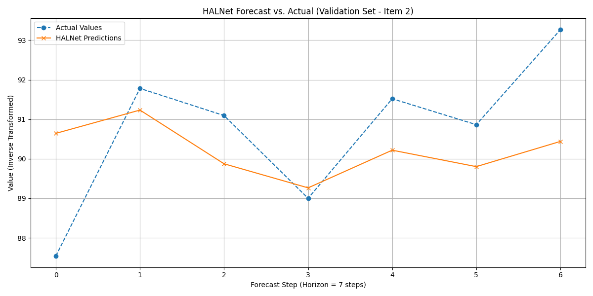

.. _exercise_halnet_guide:

=========================================================
Exercise: Forecasting with HALNet (All Inputs Required)
=========================================================

Welcome to this exercise on using the Hybrid Attentive LSTM
Network, :class:`~fusionlab.nn.models.HALNet`, available in
``fusionlab-learn``. This model is a powerful data-driven
architecture that requires **static**, **dynamic (past observed)**,
and **known future** features to be provided as inputs.

We will perform a multi-step point forecast to illustrate the
specific data preparation and model interaction required for this
advanced forecasting model.

**Learning Objectives:**

* Generate synthetic multi-item time series data with distinct
    static, dynamic, and future features.
* Understand how to define feature roles and prepare the data
    for a model with three separate input streams.
* Utilize a data preparation utility (like
    :func:`~fusionlab.nn.utils.reshape_xtft_data`) to create the
    three required input arrays.
* Correctly structure the input list ``[static_features,
    dynamic_features, future_features]`` for training and prediction
    with ``HALNet``.
* Define, compile, and train the ``HALNet`` model.
* Make predictions and visualize the results.

Let's get started!

Prerequisites
-------------

Ensure you have ``fusionlab-learn`` and its common dependencies
installed. For visualizations, `matplotlib` is also needed.

.. code-block:: bash

   pip install fusionlab-learn matplotlib scikit-learn

---

Step 1: Imports and Setup
~~~~~~~~~~~~~~~~~~~~~~~~~
First, we import all necessary libraries and set up our environment for
reproducibility.

.. code-block:: python
   :linenos:

   import os
   import numpy as np
   import pandas as pd
   import tensorflow as tf
   import matplotlib.pyplot as plt
   from sklearn.preprocessing import StandardScaler, LabelEncoder
   import warnings

   # FusionLab imports
   from fusionlab.nn.models import HALNet
   from fusionlab.nn.utils import reshape_xtft_data

   # Suppress warnings and TF logs for cleaner output
   warnings.filterwarnings('ignore')
   tf.get_logger().setLevel('ERROR')

   # Directory for saving any output images from this exercise
   EXERCISE_OUTPUT_DIR = "./halnet_exercise_outputs"
   os.makedirs(EXERCISE_OUTPUT_DIR, exist_ok=True)

   print("Libraries imported and setup complete for HALNet exercise.")

**Expected Output:**

.. code-block:: text

   Libraries imported and setup complete for HALNet exercise.

Step 2: Generate Synthetic Data
~~~~~~~~~~~~~~~~~~~~~~~~~~~~~~~
We'll create a synthetic dataset for multiple items. Each item will
have static features, dynamic past features, and known future
features, which is the structure ``HALNet`` is designed for.

.. code-block:: python
   :linenos:

   N_ITEMS = 3
   N_TIMESTEPS_PER_ITEM = 100
   SEED = 42
   np.random.seed(SEED)
   tf.random.set_seed(SEED)

   date_rng = pd.date_range(
       start='2022-01-01', periods=N_TIMESTEPS_PER_ITEM, freq='D'
   )
   df_list = []

   for item_id in range(N_ITEMS):
       time_idx = np.arange(N_TIMESTEPS_PER_ITEM)
       # Create a base signal with trend, seasonality, and noise
       value = (
           30 + item_id * 20 + time_idx * 0.4
           + np.sin(time_idx / 7) * 10
           + np.random.normal(0, 3, N_TIMESTEPS_PER_ITEM)
       )
       # Static feature unique to each item
       static_category = f"Category_{'ABC'[item_id]}"
       # Known future feature (e.g., promotional event on weekends)
       future_event = (date_rng.dayofweek >= 5).astype(int)

       item_df = pd.DataFrame({
           'Date': date_rng,
           'ItemID': f'item_{item_id}',
           'StaticCategory': static_category,
           'DayOfWeek': date_rng.dayofweek,
           'FutureEvent': future_event,
           'Value': value
       })
       # Dynamic feature (lagged value)
       item_df['ValueLag1'] = item_df['Value'].shift(1)
       df_list.append(item_df)

   df_raw = pd.concat(df_list).dropna().reset_index(drop=True)
   print(f"Generated raw data shape: {df_raw.shape}")
   print("Sample of generated data:")
   print(df_raw.head())

**Expected Output:**

.. code-block:: text

   Generated raw data shape: (297, 7)
   Sample of generated data:
             Date  ItemID StaticCategory  DayOfWeek  FutureEvent      Value  ValueLag1
   0 2022-01-02  item_0     Category_A          6            1  31.522621  29.988183
   1 2022-01-03  item_0     Category_A          0            0  38.718818  31.522621
   2 2022-01-04  item_0     Category_A          1            0  41.528994  38.718818
   3 2022-01-05  item_0     Category_A          2            0  43.684139  41.528994
   4 2022-01-06  item_0     Category_A          3            0  42.595982  43.684139

Step 3: Define Features and Preprocess Data
~~~~~~~~~~~~~~~~~~~~~~~~~~~~~~~~~~~~~~~~~~~
We assign columns to their roles (static, dynamic, future). Since
``HALNet`` requires numerical inputs, we encode categorical static
features and scale the numerical features.

.. code-block:: python
   :linenos:

   TARGET_COL = 'Value'
   DT_COL = 'Date'

   # Define feature roles
   static_cols = ['ItemID', 'StaticCategory']
   dynamic_cols = ['DayOfWeek', 'ValueLag1']
   future_cols = ['FutureEvent', 'DayOfWeek']
   # Use the original ItemID for grouping the time series
   grouping_cols = ['ItemID']

   df_processed = df_raw.copy()

   # --- Encode Categorical Static Features ---
   static_encoders = {}
   for col in static_cols:
       le = LabelEncoder()
       df_processed[f"{col}_encoded"] = le.fit_transform(df_processed[col])
       static_encoders[col] = le
   print("\nEncoded static categorical features.")

   # --- Update feature lists to use encoded/scaled versions ---
   static_cols_for_model = [f"{c}_encoded" for c in static_cols]

   # --- Scale Numerical Features ---
   scaler = StandardScaler()
   num_cols_to_scale = ['Value', 'ValueLag1']
   df_processed[num_cols_to_scale] = scaler.fit_transform(
       df_processed[num_cols_to_scale]
   )
   print("Scaled numerical features.")

**Expected Output:**

.. code-block:: text

   Encoded static categorical features.
   Scaled numerical features.

Step 4: Prepare Sequences for HALNet
~~~~~~~~~~~~~~~~~~~~~~~~~~~~~~~~~~~~
We use the ``reshape_xtft_data`` utility to transform our flat
DataFrame into the three distinct sequence arrays required by
``HALNet``: static, dynamic past, and known future.

.. code-block:: python
   :linenos:

   TIME_STEPS = 14  # Lookback window
   FORECAST_HORIZON = 7 # Prediction window

   static_data, dynamic_data, future_data, target_data = reshape_xtft_data(
       df=df_processed,
       dt_col=DT_COL,
       target_col=TARGET_COL,
       dynamic_cols=dynamic_cols,
       static_cols=static_cols_for_model, # Use encoded static cols
       future_cols=future_cols,
       spatial_cols=grouping_cols, # Use for grouping items
       time_steps=TIME_STEPS,
       forecast_horizons=FORECAST_HORIZON,
       verbose=0
   )
   targets = target_data.astype(np.float32)

   print(f"\nReshaped Data Shapes for HALNet:")
   print(f"  Static data: {static_data.shape}")
   print(f"  Dynamic data: {dynamic_data.shape}")
   print(f"  Future data: {future_data.shape}")
   print(f"  Target data: {targets.shape}")

**Expected Output:**

.. code-block:: text

   Reshaped Data Shapes for HALNet:
     Static data: (237, 2)
     Dynamic data: (237, 14, 2)
     Future data: (237, 21, 2)
     Target data: (237, 7, 1)

Step 5: Define, Compile, and Train HALNet
~~~~~~~~~~~~~~~~~~~~~~~~~~~~~~~~~~~~~~~~~
Now we instantiate ``HALNet`` with the correct input dimensions
derived from our prepared data, compile it, and train for a few epochs.

.. code-block:: python
   :linenos:

   # Split data into training and validation sets
   train_inputs = [arr[:-20] for arr in [static_data, dynamic_data, future_data]]
   val_inputs = [arr[-20:] for arr in [static_data, dynamic_data, future_data]]
   train_targets, val_targets = targets[:-20], targets[-20:]

   # Instantiate HALNet
   halnet_model = HALNet(
       static_input_dim=static_data.shape[-1],
       dynamic_input_dim=dynamic_data.shape[-1],
       future_input_dim=future_data.shape[-1],
       output_dim=OUTPUT_DIM,
       forecast_horizon=FORECAST_HORIZON,
       max_window_size=TIME_STEPS,
       quantiles=None, # Point forecast for this exercise
       embed_dim=16,
       hidden_units=16,
       lstm_units=16,
       attention_units=16,
       num_heads=2,
       use_vsn=False
   )

   # Compile the model
   halnet_model.compile(optimizer=Adam(learning_rate=1e-3), loss='mse')

   # Train the model
   print("\nStarting HALNet model training...")
   history = halnet_model.fit(
       train_inputs,
       train_targets,
       validation_data=(val_inputs, val_targets),
       epochs=10,
       batch_size=32,
       verbose=1
   )
   print("Training complete.")

**Expected Output:**

.. code-block:: text

   Starting HALNet model training...
   Epoch 1/10
   7/7 [==============================] - 15s 391ms/step - loss: 1.0506 - val_loss: 0.8172
   Epoch 2/10
   7/7 [==============================] - 0s 19ms/step - loss: 0.3957 - val_loss: 0.5841
   ...
   Epoch 10/10
   7/7 [==============================] - 0s 19ms/step - loss: 0.1706 - val_loss: 0.2818
   Training complete.

Step 6: Visualize the Forecast
~~~~~~~~~~~~~~~~~~~~~~~~~~~~~~
Finally, we make predictions on the validation set and plot the
results against the actual values for a single item.

.. code-block:: python
   :linenos:

   # Make predictions on the validation set
   val_predictions_scaled = halnet_model.predict(val_inputs)

   # Reshape for inverse transform (we only scaled 'Value' and 'ValueLag1')
   val_predictions_flat = val_predictions_scaled.flatten()
   val_actuals_flat = val_targets.flatten()
   dummy_shape = (len(val_predictions_flat), len(num_cols_to_scale))
   target_idx = num_cols_to_scale.index('Value')

   dummy_preds = np.zeros(dummy_shape)
   dummy_preds[:, target_idx] = val_predictions_flat
   val_preds_inv = scaler.inverse_transform(dummy_preds)[:, target_idx]

   dummy_actuals = np.zeros(dummy_shape)
   dummy_actuals[:, target_idx] = val_actuals_flat
   val_actuals_inv = scaler.inverse_transform(dummy_actuals)[:, target_idx]

   # --- Visualization for one validation item ---
   # Let's find the first sample in the validation set for item_2
   val_static_df = pd.DataFrame(val_inputs[0], columns=static_cols_for_model)
   item_2_encoded_val = static_encoders['ItemID'].transform(['item_2'])[0]
   first_item_2_idx = val_static_df[
       val_static_df['ItemID_encoded'] == item_2_encoded_val
   ].index[0]

   # Plot the forecast for this single sequence
   plt.figure(figsize=(12, 6))
   plt.plot(
       val_actuals_inv.reshape(val_targets.shape)[first_item_2_idx, :, 0],
       label='Actual Values', marker='o', linestyle='--'
   )
   plt.plot(
       val_preds_inv.reshape(val_predictions_scaled.shape)[first_item_2_idx, :, 0],
       label='HALNet Predictions', marker='x'
   )
   plt.title('HALNet Forecast vs. Actual (Validation Set - Item 2)')
   plt.xlabel(f'Forecast Step (Horizon = {FORECAST_HORIZON} steps)')
   plt.ylabel('Value (Inverse Transformed)')
   plt.legend()
   plt.grid(True)
   plt.tight_layout()
   fig_path = os.path.join(EXERCISE_OUTPUT_DIR, "halnet_exercise_forecast.png")
   # plt.savefig(fig_path)
   plt.show()

**Expected Plot:**

   Visualization of the multi-step point forecast from the ``HALNet``
   model against actual validation data for a specific item.

Discussion of Exercise
----------------------
Congratulations! In this exercise, you have learned the end-to-end
workflow for using the data-driven ``HALNet`` model:

* You successfully structured a dataset with the three required
    input types (static, dynamic past, and known future).
* You used a data preparation utility to create the correctly shaped
    sequence arrays needed by the model.
* You instantiated, trained, and made predictions with ``HALNet``.
* You visualized the multi-step forecast, demonstrating the model's
    ability to predict a sequence of future values.

This forms a strong basis for applying ``HALNet`` to your own complex,
multi-feature forecasting problems.
