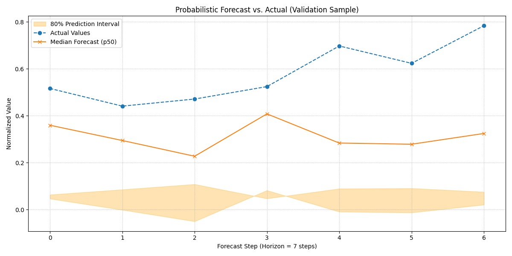

.. _exercise_base_attentive_guide:

===================================================
Exercise: Advanced Forecasting with BaseAttentive
===================================================

Welcome to this exercise on using the ``BaseAttentive`` class, the
foundational forecasting engine within ``fusionlab-learn``. This
exercise will demonstrate how to leverage its powerful, purely
data-driven architecture to perform a complex, multi-horizon,
probabilistic forecast.

We will focus on two key aspects:
1.  Using the ``architecture_config`` dictionary to build a custom
    model structure (e.g., a pure transformer).
2.  Performing a quantile forecast to generate not just a single
    prediction, but a full distribution to quantify uncertainty.

**Learning Objectives:**

* Generate a synthetic dataset with static, dynamic past, and
    known future features.
* Use the ``architecture_config`` dictionary to define the model's
    internal structure.
* Prepare and reshape the data into the three separate input arrays
    required by ``BaseAttentive``.
* Instantiate, compile, and train the model for probabilistic
    (quantile) forecasting.
* Visualize the multi-step forecast results, including the
    uncertainty bounds.

Let's begin!

Prerequisites
-------------

Ensure you have ``fusionlab-learn`` and its common dependencies
installed.

.. code-block:: bash

   pip install fusionlab-learn matplotlib scikit-learn

Step 1: Imports and Setup
----------------------------

First, we import all necessary libraries and set up our environment for
reproducibility.

.. code-block:: python
   :linenos:

   import os
   import numpy as np
   import pandas as pd
   import tensorflow as tf
   import matplotlib.pyplot as plt
   from sklearn.preprocessing import StandardScaler

   # FusionLab imports
   from fusionlab.nn.models import BaseAttentive
   from fusionlab.nn.utils import reshape_xtft_data

   # Suppress warnings and TF logs for cleaner output
   import warnings
   warnings.filterwarnings('ignore')
   tf.get_logger().setLevel('ERROR')

   # Directory for saving any output images
   EXERCISE_OUTPUT_DIR = "./base_attentive_exercise_outputs"
   os.makedirs(EXERCISE_OUTPUT_DIR, exist_ok=True)

   print("Libraries imported and setup complete for BaseAttentive exercise.")

**Expected Output:**

.. code-block:: text

   Libraries imported and setup complete for BaseAttentive exercise.

Step 2: Generate Synthetic Data
----------------------------------

We'll create a synthetic dataset for multiple time series, each with
static, dynamic, and future-known features—the exact structure that
``BaseAttentive`` is designed to handle.

.. code-block:: python
   :linenos:

   # Configuration
   N_ITEMS = 5
   N_TIMESTEPS_PER_ITEM = 120
   SEED = 42
   np.random.seed(SEED)
   tf.random.set_seed(SEED)

   # --- Generate Data ---
   df_list = []
   date_rng = pd.date_range(start='2023-01-01', periods=N_TIMESTEPS_PER_ITEM, freq='D')

   for item_id in range(N_ITEMS):
       time_idx = np.arange(N_TIMESTEPS_PER_ITEM)
       # Base signal with trend and seasonality
       value = (
           50 + item_id * 15 + time_idx * 0.2
           + np.sin(time_idx / 14) * 20
           + np.random.normal(0, 4, N_TIMESTEPS_PER_ITEM)
       )
       # Known future feature (e.g., special event)
       future_promo = np.sin(time_idx / 7) > 0.95

       item_df = pd.DataFrame({
           'Date': date_rng,
           'ItemID': item_id,
           'Value': value,
           'DayOfWeek': date_rng.dayofweek,
           'Month': date_rng.month,
           'FuturePromo': future_promo.astype(int)
       })
       # Dynamic feature (lagged value)
       item_df['ValueLag1'] = item_df['Value'].shift(1)
       df_list.append(item_df)

   df_raw = pd.concat(df_list).dropna().reset_index(drop=True)
   print(f"Generated raw data shape: {df_raw.shape}")
   print("Sample of generated data:")
   print(df_raw.head())

**Expected Output:**

.. code-block:: text

   Generated raw data shape: (595, 7)
   Sample of generated data:
           Date  ItemID      Value  DayOfWeek  Month  FuturePromo  ValueLag1
   0 2023-01-02       0  51.074300          0      1            0  51.986857
   1 2023-01-03       0  55.838189          1      1            0  51.074300
   2 2023-01-04       0  60.945110          2      1            0  55.838189
   3 2023-01-05       0  55.500244          3      1            0  60.945110
   4 2023-01-06       0  57.055428          4      1            0  55.500244

Step 3: Preprocess and Reshape Data
------------------------------------------

We define the roles for each column and then use the
``reshape_xtft_data`` utility to transform the flat dataframe into
the three sequence arrays required by the model's ``tft_like`` mode.

.. code-block:: python
   :linenos:

   # Define feature roles
   static_cols = ['ItemID']
   dynamic_cols = ['ValueLag1']
   future_cols = ['DayOfWeek', 'Month', 'FuturePromo']
   target_col = 'Value'

   # Scale numerical features
   df_processed = df_raw.copy()
   scaler_val  = StandardScaler()
   scaler_lag1 = StandardScaler()
    
   df_processed[target_col]        = scaler_val.fit_transform(
        df_processed[[target_col]]
   )
   df_processed['ValueLag1']       = scaler_lag1.fit_transform(
        df_processed[['ValueLag1']]
    )
   scaler = StandardScaler()
   df_processed[['Value', 'ValueLag1']] = scaler.fit_transform(
    df_processed[['Value', 'ValueLag1']]
   )

   # Reshape data into sequences
   TIME_STEPS = 21  # Lookback window
   FORECAST_HORIZON = 7 # Prediction window

   static_data, dynamic_data, future_data, targets = reshape_xtft_data(
       df=df_processed,
       dt_col='Date',
       target_col=target_col,
       dynamic_cols=dynamic_cols,
       static_cols=static_cols,
       future_cols=future_cols,
       spatial_cols=['ItemID'], # Group by item
       time_steps=TIME_STEPS,
       forecast_horizons=FORECAST_HORIZON
   )

   print(f"\nReshaped Data Shapes for 'tft_like' mode:")
   print(f"  Static data: {static_data.shape}")
   print(f"  Dynamic data: {dynamic_data.shape}")
   # Note: future_data length = TIME_STEPS + FORECAST_HORIZON
   print(f"  Future data: {future_data.shape}")
   print(f"  Target data: {targets.shape}")

**Expected Output:**

.. code-block:: text

   [INFO] Reshaping time‑series data into rolling sequences...

   [INFO] Data grouped by ['ItemID'] into 5 groups.

   [INFO] Total valid sequences to be generated: 460

   [INFO] Final data shapes after reshaping:
     [DEBUG] Static Data : (460, 1)
     [DEBUG] Dynamic Data: (460, 21, 1)
     [DEBUG] Future Data : (460, 28, 3)
     [DEBUG] Target Data : (460, 7, 1)

   [INFO] Time‑series data successfully reshaped into rolling sequences. 

   Reshaped Data Shapes for 'tft_like' mode:
     Static data: (460, 1)
     Dynamic data: (460, 21, 1)
     Future data: (460, 28, 3)
     Target data: (460, 7, 1)

Step 4: Define, Compile, and Train the Model
---------------------------------------------------

Now we instantiate ``BaseAttentive``. We use `architecture_config` to
specify a pure transformer architecture and set `quantiles` to
enable probabilistic forecasting.

.. code-block:: python
   :linenos:

   # Split data into training and validation sets
   val_split = -50
   train_inputs = [arr[:val_split] for arr in [static_data, dynamic_data, future_data]]
   val_inputs = [arr[val_split:] for arr in [static_data, dynamic_data, future_data]]
   train_targets, val_targets = targets[:val_split], targets[val_split:]

   # Define a pure transformer architecture
   tfmr_config = {
       'encoder_type': 'transformer',
       'decoder_attention_stack': ['cross', 'hierarchical'],
       'feature_processing': 'dense'
   }
   # Define quantiles for probabilistic forecast
   output_quantiles = [0.1, 0.5, 0.9]

   # Instantiate the model
   model = BaseAttentive(
       static_input_dim=static_data.shape[-1],
       dynamic_input_dim=dynamic_data.shape[-1],
       future_input_dim=future_data.shape[-1],
       output_dim=1,
       forecast_horizon=FORECAST_HORIZON,
       max_window_size=TIME_STEPS,
       mode='tft_like',
       quantiles=output_quantiles,
       architecture_config=tfmr_config,
       hidden_units=32,
       attention_units=32
   )

   # Compile with a quantile loss function
   def quantile_loss(y_true, y_pred):
       q = tf.constant(np.array(output_quantiles), dtype=tf.float32)
       e = y_true - y_pred
       return tf.keras.backend.mean(
           tf.keras.backend.maximum(q * e, (q - 1) * e), axis=-1
       )

   model.compile(optimizer='adam', loss=quantile_loss)

   # Train the model
   print("\nStarting BaseAttentive model training...")
   history = model.fit(
       train_inputs, train_targets,
       validation_data=(val_inputs, val_targets),
       epochs=20, batch_size=64, verbose=0
   )
   print("Training complete.")
   print(f"Final validation loss: {history.history['val_loss'][-1]:.4f}")

**Expected Output:**

.. code-block:: text

   Starting BaseAttentive model training...
   Training complete.
   Final validation loss: 0.5504

Step 5: Visualize the Probabilistic Forecast
--------------------------------------------------
This is the most exciting part. We'll make predictions on the
validation set and plot the results, showing the median forecast
along with the 80% confidence interval (the area between the 0.1 and
0.9 quantiles).

.. code-block:: python
   :linenos:

   # Make predictions on the validation set
   val_preds = model.predict(val_inputs)

   # Select a single sequence from the validation set to plot
   idx_to_plot = 10
   median_pred = val_preds[idx_to_plot, :, 1].ravel()    # 0.5 quantile is at index 1
   lower_bound = val_preds[idx_to_plot, :, 0].ravel()  # 0.1 quantile is at index 0
   upper_bound = val_preds[idx_to_plot, :, 2].ravel()  # 0.9 quantile is at index 2
   actuals = val_targets[idx_to_plot, :, 0].ravel() 

   # --- Visualization ---
   plt.figure(figsize=(12, 6))
   # Plot uncertainty bounds
   plt.fill_between(
       range(FORECAST_HORIZON), lower_bound, upper_bound,
       color='orange', alpha=0.3, label='80% Prediction Interval'
   )
   # Plot actuals and median forecast
   plt.plot(actuals, label='Actual Values', marker='o', linestyle='--')
   plt.plot(median_pred, label='Median Forecast (p50)', marker='x')

   plt.title('Probabilistic Forecast vs. Actual (Validation Sample)')
   plt.xlabel(f'Forecast Step (Horizon = {FORECAST_HORIZON} steps)')
   plt.ylabel('Normalized Value')
   plt.legend()
   plt.grid(True, linestyle=':')
   plt.tight_layout()
   plt.show()

**Expected Plot:**

   A plot showing the actual values, the median (p50) forecast, and
   the shaded 80% prediction interval. This visualizes not just *what*
   the model predicts, but also its *confidence* in that prediction.

Discussion of Exercise
------------------------------------------

Congratulations! You have successfully built, trained, and evaluated an
advanced forecasting model using the ``BaseAttentive`` engine. In this
exercise, you have learned to:

* Structure a complex dataset with static, dynamic, and future
    features for a sophisticated model.
* Use the ``architecture_config`` dictionary to flexibly define the
    model's internal structure (e.g., as a pure transformer).
* Implement a probabilistic forecast by configuring output quantiles
    and using a corresponding loss function.
* Visualize and interpret a probabilistic forecast, including its
    uncertainty bounds.

This powerful, data-driven workflow forms the foundation for tackling
some of the most challenging time series forecasting problems.