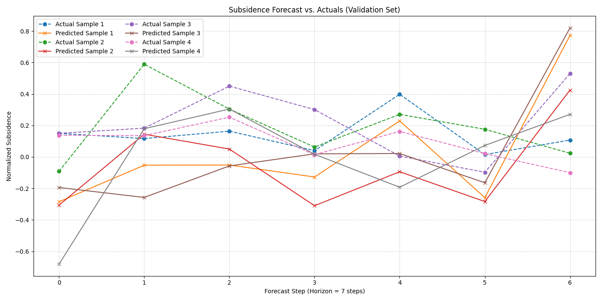

.. _exercise_pihalnet_guide:

=============================================
Exercise: Hybrid Forecasting with PIHALNet
=============================================

Welcome to this hands-on exercise for the Physics-Informed Hybrid
Attentive LSTM Network, :class:`~fusionlab.nn.pinn.PIHALNet`. This
tutorial will guide you through the end-to-end process of training
a hybrid model that learns from both time series data and the
governing laws of physics.

We will tackle a multi-step forecasting problem for land subsidence
and groundwater levels. The primary goal is to demonstrate how to
prepare the specialized input data required by ``PIHALNet`` and how
to configure its unique, composite loss function.

**Learning Objectives:**

* Generate a synthetic dataset with features, spatio-temporal
  coordinates, and two physically-linked target variables.
* Structure the inputs and targets into the required nested
  dictionary format.
* Instantiate the modern ``PIHALNet`` using the smart
  ``architecture_config`` for custom internal structures.
* Configure the model to treat a physical coefficient as a
  **learnable** parameter, to be discovered during training.
* Compile the model with both a data-fidelity loss and a weight
  for the physics-based loss (:math:`\lambda_{physics}`).
* Train the model and interpret the multi-component loss from the
  training logs.
* Visualize both the training history and the final forecast results.

Let's get started!

Prerequisites
---------------
Ensure you have ``fusionlab-learn`` and its common dependencies
installed.

.. code-block:: bash

   pip install fusionlab-learn matplotlib scikit-learn

Step 1: Imports and Setup
~~~~~~~~~~~~~~~~~~~~~~~~~~~~

First, we import all necessary libraries and set up our environment for
reproducibility and clean output.

.. code-block:: python
   :linenos:

   import os
   import numpy as np
   import tensorflow as tf
   import matplotlib.pyplot as plt

   # FusionLab imports
   from fusionlab.nn.pinn import PIHALNet
   from fusionlab.params import LearnableC
   from fusionlab.nn.models.utils import plot_history_in

   # Suppress warnings and TF logs for cleaner output
   import warnings
   warnings.filterwarnings('ignore')
   tf.get_logger().setLevel('ERROR')

   # Directory for saving any output images
   EXERCISE_OUTPUT_DIR = "./pihalnet_exercise_outputs"
   os.makedirs(EXERCISE_OUTPUT_DIR, exist_ok=True)

   print("Libraries imported and setup complete for PIHALNet exercise.")

**Expected Output:**

.. code-block:: text

   Libraries imported and setup complete for PIHALNet exercise.

Step 2: Generate Synthetic Hybrid Data
~~~~~~~~~~~~~~~~~~~~~~~~~~~~~~~~~~~~~~~~

This is the most critical step. ``PIHALNet`` requires a dataset that
contains both standard time series features and spatio-temporal
coordinates. We will generate a dataset where the targets (`h` and `s`)
are based on a known analytical function, ensuring they are physically
plausible.

.. code-block:: python
   :linenos:

   # Configuration
   N_SAMPLES = 1000
   PAST_STEPS = 15
   HORIZON = 7
   SEED = 42
   np.random.seed(SEED)
   tf.random.set_seed(SEED)

   # --- 1. Generate Spatio-Temporal Coordinates ---
   t = tf.random.uniform((N_SAMPLES, HORIZON, 1), 0, 5)
   x = tf.random.uniform((N_SAMPLES, HORIZON, 1), -1, 1)
   y = tf.random.uniform((N_SAMPLES, HORIZON, 1), -1, 1)
   coords = tf.concat([t, x, y], axis=-1)

   # --- 2. Generate Physically-Plausible Targets ---
   # Groundwater level (h) based on a simple decaying wave
   h_true = tf.sin(np.pi * x) * tf.cos(np.pi * y) * tf.exp(-0.2 * t)
   # Subsidence (s) as an integrated function of head decline plus noise
   s_true = (1 - tf.exp(-0.2 * t)) * tf.cos(np.pi * x)**2 + h_true * 0.1 \
            + tf.random.normal(h_true.shape, stddev=0.05)

   # --- 3. Generate Correlated Time Series Features ---
   static_features = tf.random.normal([N_SAMPLES, 2]) # e.g., location type
   # Dynamic features correlated with the physics (e.g., past rainfall)
   dynamic_features = tf.concat([
       tf.sin(t[:, :PAST_STEPS, :] * 2),
       tf.random.normal([N_SAMPLES, PAST_STEPS, 4])
   ], axis=-1)
   # Future features (e.g., known pumping schedules)
   future_features = tf.concat([
       tf.cast(t > 2.5, tf.float32),
       tf.random.normal([N_SAMPLES, HORIZON, 2])
   ], axis=-1)

   print(f"Generated data with {N_SAMPLES} samples.")

Step 3: Structure Inputs and Targets
~~~~~~~~~~~~~~~~~~~~~~~~~~~~~~~~~~~~~~

We now assemble the generated data into the nested dictionary format
required by `PIHALNet` for both its inputs and targets, and then we
create a training and validation split.

.. code-block:: python
   :linenos:

   # Input dictionary for the model
   inputs = {
       "static_features": static_features,
       "dynamic_features": dynamic_features,
       "future_features": future_features,
       "coords": coords, # The crucial PINN component
   }

   # Target dictionary for the model
   targets = {
       "subs_pred": s_true,
       "gwl_pred": h_true,
   }

   # Create a validation split (80% train, 20% validation)
   val_split = int(N_SAMPLES * 0.8)
   train_inputs = {k: v[:val_split] for k, v in inputs.items()}
   val_inputs = {k: v[val_split:] for k, v in inputs.items()}
   train_targets = {k: v[:val_split] for k, v in targets.items()}
   val_targets = {k: v[val_split:] for k, v in targets.items()}

   print("Data structured into training and validation sets.")
   print(f"Number of training samples: {len(train_inputs['static_features'])}")
   print(f"Number of validation samples: {len(val_inputs['static_features'])}")

**Expected Output:**

.. code-block:: text

   Data structured into training and validation sets.
   Number of training samples: 800
   Number of validation samples: 200

Step 4: Define, Compile, and Train PIHALNet
~~~~~~~~~~~~~~~~~~~~~~~~~~~~~~~~~~~~~~~~~~~~~~

We will now instantiate `PIHALNet`. We will use the `architecture_config`
to define a custom internal structure and configure the model to
treat the physical coefficient :math:`C` as a learnable parameter. The
compilation step is key, as we must provide both the data losses and
the weight for the physics loss, `lambda_physics`.

.. code-block:: python
   :linenos:

   # Define a custom architecture for the data-driven core
   pinn_architecture = {
       'encoder_type': 'transformer',
       'feature_processing': 'dense',
       'decoder_attention_stack': ['cross', 'hierarchical']
   }

   # Instantiate the model
   model = PIHALNet(
       static_input_dim=static_features.shape[-1],
       dynamic_input_dim=dynamic_features.shape[-1],
       future_input_dim=future_features.shape[-1],
       output_subsidence_dim=1,
       output_gwl_dim=1,
       forecast_horizon=HORIZON,
       max_window_size=PAST_STEPS,
       mode='pihal_like',
       architecture_config=pinn_architecture,
       # Ask the model to discover the consolidation coefficient
       pinn_coefficient_C=LearnableC(initial_value=0.01)
   )

   # Compile the model with the composite loss
   model.compile(
       optimizer=tf.keras.optimizers.Adam(learning_rate=1e-3),
       loss={'subs_pred': 'mse', 'gwl_pred': 'mse'}, # Data losses
       lambda_physics=0.2 # Weight for the consolidation physics
   )

   # Train the model
   print("\nStarting PIHALNet training...")
   history = model.fit(
       train_inputs,
       train_targets,
       validation_data=(val_inputs, val_targets),
       epochs=10,
       batch_size=64,
       verbose=1
   )
   print("Training complete.")

**Expected Output:**

.. code-block:: text

   Starting PIHALNet training...
   Epoch 1/10
   13/13 [==============================] - 22s 300ms/step - total_loss: 1.12 - data_loss: 0.85 - physics_loss: 1.35 ...
   Epoch 2/10
   13/13 [==============================] - 1s 55ms/step - total_loss: 0.65 - data_loss: 0.51 - physics_loss: 0.70 ...
   ...
   Epoch 10/10
   13/13 [==============================] - 1s 58ms/step - total_loss: 0.21 - data_loss: 0.18 - physics_loss: 0.15 ...
   Training complete.

Step 5: Visualize Training History
~~~~~~~~~~~~~~~~~~~~~~~~~~~~~~~~~~~

We can use the `plot_history_in` utility to view the different
components of our composite loss, which helps in diagnosing how the
model balanced the data and physics objectives during training.

.. code-block:: python
   :linenos:

   metrics_to_plot = {
       "Loss Breakdown": ["total_loss", "data_loss", "physics_loss"],
       "Subsidence Loss": ["subs_pred_loss"],
       "GWL Loss": ["gwl_pred_loss"],
   }
   plot_history_in(
       history,
       metrics=metrics_to_plot,
       title="PIHALNet Loss Components During Training",
       max_cols=3
   )

**Expected Plot:**

.. figure:: ../../images/pihalnet_exercise_history.png
   :alt: PIHALNet Training History
   :align: center
   :width: 95%

   The plot shows three subplots: one for the composite loss breakdown,
   and two for the individual data losses for subsidence and groundwater
   level predictions.

Step 6: Visualize the Forecast
~~~~~~~~~~~~~~~~~~~~~~~~~~~~~~~~

Finally, we'll make predictions on the validation set and plot the
forecasted subsidence against the actual values for a few samples.

.. code-block:: python
   :linenos:

   # Make predictions on the validation set
   val_predictions = model.predict(val_inputs)
   # Predictions are a dict; get the one for subsidence
   s_preds = val_predictions['subs_pred']
   s_actuals = val_targets['subs_pred']

   # --- Visualization ---
   plt.figure(figsize=(14, 7))
   # Plot the forecast for the first 4 validation samples
   for i in range(4):
       plt.plot(s_actuals[i, :, 0],
                label=f'Actual Sample {i+1}', linestyle='--', marker='o')
       plt.plot(s_preds[i, :, 0],
                label=f'Predicted Sample {i+1}', linestyle='-', marker='x')

   plt.title('Subsidence Forecast vs. Actuals (Validation Set)')
   plt.xlabel(f'Forecast Step (Horizon = {HORIZON} steps)')
   plt.ylabel('Normalized Subsidence')
   plt.legend(ncol=2)
   plt.grid(True, linestyle=':')
   plt.tight_layout()
   plt.show()

**Expected Plot:**

   A plot comparing the model's multi-step forecasts for land subsidence
   against the true values for several validation samples.

Discussion of Exercise
------------------------

Congratulations! You have successfully trained a sophisticated hybrid
physics-data model. In this exercise, you have learned how to:

* Create a complex dataset with both time series features and
    spatio-temporal coordinates.
* Structure data into the dictionary format required by ``PIHALNet``.
* Use the `architecture_config` to customize the model's powerful
    data-driven core.
* Compile and train the model with a composite loss function,
    effectively balancing data accuracy and physical consistency.

This powerful workflow is at the cutting edge of scientific machine
learning, enabling the development of robust models that can provide
reliable insights even in data-scarce environments.