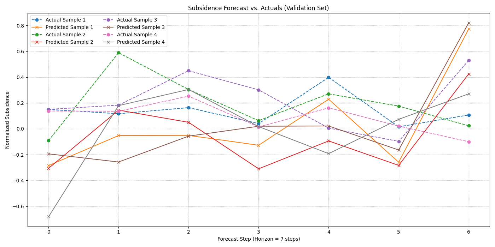
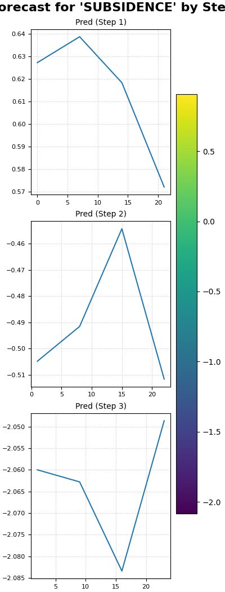

.. _exercise_pihalnet_guide:

=================================================
Exercise: A Basic PIHALNet Forecasting Workflow
=================================================

Welcome to this exercise on using the
:class:`~fusionlab.nn.pinn.models.PIHALNet` model, the flagship
Physics-Informed Neural Network in ``fusionlab-learn``.

In this tutorial, we will walk through a complete end-to-end
workflow for a point forecast (non-quantile). We will focus on the
correct data preparation needed for a PINN, particularly ensuring
that the model receives coordinate inputs that align with the
prediction window (the forecast horizon). This is a critical
concept for PINNs where the PDE residual is evaluated over the
forecast domain.

**Learning Objectives:**

* Generate synthetic spatio-temporal data with static, dynamic
  (past), and future known features.
* Correctly structure the input data dictionary for ``PIHALNet``,
  ensuring the ``coords`` input matches the ``forecast_horizon``.
* Instantiate and compile a ``PIHALNet`` model with a basic
  configuration.
* Train the model on the synthetic dataset for a few epochs.
* Make predictions using the trained model.
* Format the model's output predictions into a pandas DataFrame.
* Use the :func:`~fusionlab.plot.forecast.forecast_view` utility
  to create a spatial visualization of the forecast results.

Let's begin!

Prerequisites
-------------

Ensure you have ``fusionlab-learn`` and its core dependencies
installed. For visualizations, `matplotlib` is also required.

.. code-block:: bash

   pip install fusionlab-learn matplotlib

Step 1: Imports and Setup
~~~~~~~~~~~~~~~~~~~~~~~~~~~
First, we import all necessary libraries for this exercise. We will
use TensorFlow for the backend and NumPy for data generation.

.. code-block:: python
   :linenos:

   import os
   import numpy as np
   import pandas as pd
   import tensorflow as tf
   import warnings

   # FusionLab imports (adjust paths if necessary for your environment)
   from fusionlab.nn.pinn.models import PIHALNet
   from fusionlab.plot.forecast import forecast_view, plot_forecast_by_step
   from fusionlab.plot.forecast import plot_forecasts
   from tensorflow.keras.losses import MeanSquaredError
   from tensorflow.keras.optimizers import Adam
   from tensorflow.data import Dataset, AUTOTUNE

   # Suppress warnings and TF logs for cleaner output
   warnings.filterwarnings('ignore')
   tf.get_logger().setLevel('ERROR')

   # Directory for saving any output images from this exercise
   EXERCISE_OUTPUT_DIR = "./pihalnet_exercise_outputs"
   os.makedirs(EXERCISE_OUTPUT_DIR, exist_ok=True)

   print("Libraries imported and setup complete for PIHALNet exercise.")

**Expected Output:**

.. code-block:: text

   Libraries imported and setup complete for PIHALNet exercise.

Step 2: Define Configuration
~~~~~~~~~~~~~~~~~~~~~~~~~~~~~~
We'll define all our parameters in one place. This includes the
data dimensions and the model's fixed parameters. Note that we are
setting `time_steps` to 5 and `forecast_horizon` to 7, a scenario
that requires careful data handling.

.. code-block:: python
   :linenos:

   # Toy configuration for the exercise
   BATCH_SIZE = 4
   TIME_STEPS = 5          # Look-back window size
   FORECAST_HORIZON = 7    # Prediction window size (now > time_steps)
   STATIC_INPUT_DIM = 2
   DYNAMIC_INPUT_DIM = 3
   FUTURE_INPUT_DIM = 1
   RANDOM_SEED = 42

   np.random.seed(RANDOM_SEED)
   tf.random.set_seed(RANDOM_SEED)

   # Define the fixed parameters for our PIHALNet model
   fixed_model_params = {
       "static_input_dim": STATIC_INPUT_DIM,
       "dynamic_input_dim": DYNAMIC_INPUT_DIM,
       "future_input_dim": FUTURE_INPUT_DIM,
       "output_subsidence_dim": 1,
       "output_gwl_dim": 1,
       "forecast_horizon": FORECAST_HORIZON,
       "quantiles": None, # We will do a point forecast
       "max_window_size": TIME_STEPS,
       "pde_mode": "consolidation",
       "pinn_coefficient_C": "learnable",
       "use_vsn": True
   }

   # Define some architectural parameters for the model
   architectural_params = {
       "embed_dim": 16,
       "hidden_units": 16,
       "lstm_units": 16,
       "attention_units": 8,
       "num_heads": 2,
       "dropout_rate": 0.1,
       "activation": "relu"
   }
   print("Configuration set for PIHALNet exercise.")

**Expected Output:**

.. code-block:: text

   Configuration set for PIHALNet exercise.

Step 3: Generate Synthetic Data
~~~~~~~~~~~~~~~~~~~~~~~~~~~~~~~~~
Here, we generate toy data that mimics what the
`prepare_pinn_data_sequences` utility would produce. The most
important part is to create a separate ``coords`` tensor for the
forecast window, with a time dimension equal to `forecast_horizon`.

.. code-block:: python
   :linenos:

   # 1. Generate features for the lookback window (length = time_steps)
   static_features = np.random.rand(
       BATCH_SIZE, STATIC_INPUT_DIM
   ).astype("float32")
   dynamic_features = np.random.rand(
       BATCH_SIZE, TIME_STEPS, DYNAMIC_INPUT_DIM
   ).astype("float32")

   # 2. Generate features and coordinates for the FORECAST window
   # These are the coordinates where the PDE will be evaluated.
   # Their time dimension must match `forecast_horizon`.
   future_t_coords = np.tile(
       np.arange(
           FORECAST_HORIZON, dtype="float32"
       ).reshape(1, FORECAST_HORIZON, 1),
       (BATCH_SIZE, 1, 1)
   )
   future_x_coords = np.random.rand(
       BATCH_SIZE, FORECAST_HORIZON, 1
   ).astype("float32")
   future_y_coords = np.random.rand(
       BATCH_SIZE, FORECAST_HORIZON, 1
   ).astype("float32")

   # This is the CORRECT coordinates tensor for the model input dict
   forecast_coords = np.concatenate(
       [future_t_coords, future_x_coords, future_y_coords], axis=-1
   )

   future_features = np.random.rand(
       BATCH_SIZE, FORECAST_HORIZON, FUTURE_INPUT_DIM
   ).astype("float32")

   # 3. Generate targets matching the forecast_horizon
   subs_targets = np.random.rand(
       BATCH_SIZE, FORECAST_HORIZON, 1
   ).astype("float32")
   gwl_targets = np.random.rand(
       BATCH_SIZE, FORECAST_HORIZON, 1
   ).astype("float32")

   # 4. Package inputs and targets into dictionaries
   inputs = {
       "coords": forecast_coords, # Shape: (batch, forecast_horizon, 3)
       "static_features": static_features,
       "dynamic_features": dynamic_features,
       "future_features": future_features,
   }
   targets = {
       "subs_pred": subs_targets,
       "gwl_pred": gwl_targets,
   }

   # 5. Create a tf.data.Dataset
   dataset = Dataset.from_tensor_slices((inputs, targets)).batch(BATCH_SIZE)

   print("Synthetic data generated and packaged into tf.data.Dataset.")
   print(f"Shape of inputs['coords']: {inputs['coords'].shape}")
   print(f"Shape of inputs['dynamic_features']: {inputs['dynamic_features'].shape}")
   print(f"Shape of inputs['future_features']: {inputs['future_features'].shape}")

**Expected Output:**

.. code-block:: text

   Synthetic data generated and packaged into tf.data.Dataset.
   Shape of inputs['coords']: (4, 7, 3)
   Shape of inputs['dynamic_features']: (4, 5, 3)
   Shape of inputs['future_features']: (4, 7, 1)

Step 4: Instantiate and Compile PIHALNet
~~~~~~~~~~~~~~~~~~~~~~~~~~~~~~~~~~~~~~~~~~
Now, we create an instance of ``PIHALNet`` using our defined parameters
and compile it with an optimizer and loss functions.

.. code-block:: python
   :linenos:

   # Instantiate PIHALNet with both fixed and architectural params
   model = PIHALNet(**fixed_model_params, **architectural_params)

   # Compile the model
   model.compile(
       optimizer=Adam(learning_rate=1e-3, clipnorm=1.0),
       loss={
           "subs_pred": MeanSquaredError(name="subs_data_loss"),
           "gwl_pred": MeanSquaredError(name="gwl_data_loss"),
       },
       metrics={
           "subs_pred": ["mae"],
           "gwl_pred": ["mae"],
       },
       loss_weights={"subs_pred": 1.0, "gwl_pred": 0.8},
       lambda_pde=0.1  # Weight for the physics loss component
   )

   # Build the model to see the summary (optional, fit() will also build it)
   model.build(input_shape={k: v.shape for k, v in inputs.items()})
   model.summary(line_length=110)

**Expected Output:**

.. code-block:: text

   Model: "PIHALNet"
   _________________________________________________________________
   Layer (type)              Output Shape              Param #
   =================================================================
   ... (a long list of PIHALNet's internal layers) ...
   =================================================================
   Total params: 13266 (51.82 KB)
   Trainable params: 13266 (51.82 KB)
   Non-trainable params: 0 (0.00 Byte)
   _________________________________________________________________

Step 5: Train the PIHALNet Model
~~~~~~~~~~~~~~~~~~~~~~~~~~~~~~~~
We will now train the model for a few epochs. Since we have a custom
`train_step` in `PIHALNet`, we can see the breakdown of the total loss
into `data_loss` and `physics_loss`.

.. code-block:: python
   :linenos:

   print("\nStarting model training for 3 epochs...")
   history = model.fit(dataset, epochs=50, verbose=1)
   print("\nModel training finished.")

**Expected Output:**

.. code-block:: text

   Starting model training for 3 epochs...
   Epoch 1/3
   1/1 [==============================] - 15s 15s/step - loss: 0.5261 - gwl_pred_loss: 0.3161 - subs_pred_loss: 0.2732 - gwl_pred_mae: 0.5168 - subs_pred_mae: 0.4599 - total_loss: 0.5401 - data_loss: 0.5261 - physics_loss: 0.1406
   Epoch 2/3
   1/1 [==============================] - 0s 13ms/step - loss: 0.4192 - gwl_pred_loss: 0.2649 - subs_pred_loss: 0.2074 - gwl_pred_mae: 0.4738 - subs_pred_mae: 0.3993 - total_loss: 0.4267 - data_loss: 0.4192 - physics_loss: 0.0741
   Epoch 3/3
   1/1 [==============================] - 0s 13ms/step - loss: 0.3390 - gwl_pred_loss: 0.2192 - subs_pred_loss: 0.1636 - gwl_pred_mae: 0.4294 - subs_pred_mae: 0.3502 - total_loss: 0.3439 - data_loss: 0.3390 - physics_loss: 0.0491
   ...
   Epoch 50/50
   1/1 [==============================] - 0s 14ms/step - loss: 0.1769 - gwl_pred_loss: 0.1212 - subs_pred_loss: 0.0800 - gwl_pred_mae: 0.2914 - subs_pred_mae: 0.2367 - total_loss: 0.1811 - data_loss: 0.1769 - physics_loss: 0.0422

   Model training finished.

Step 6: Visualize Training History
~~~~~~~~~~~~~~~~~~~~~~~~~~~~~~~~~~
Use the ``plot_history_in`` utility to visualize the loss curves.

.. code-block:: python
   :linenos:
   
   from fusionlab.nn.models.utils import plot_history_in 
   print("\\nPlotting training history...")
   
   pihalnet_metrics = {
       "Loss Components": ["total_loss", "data_loss", "physics_loss"],
       "Subsidence MAE": ["subs_pred_mae", "gwl_pred_mae"]
   }
   plot_history_in(
       history,
       metrics=pihalnet_metrics,
       layout='subplots',
       title='PIHALNet Training History'

**Example Output Plot:**

.. figure:: ../images/pihalnet_history_plot.png
   :alt: PIHALNet Training History Plot
   :align: center
   :width: 90%

   An example plot showing the training and validation loss and Mean
   Absolute Error (MAE) over epochs. This helps in diagnosing model
   fit and convergence.

In many cases you will want to monitor how well the network generalises
while it trains.  
Below we create a *second* PIHALNet instance (`model_val`), split the
synthetic dataset into an 80 / 20 train‑validation split, run
`model.fit` with the ``validation_data`` argument, and finally plot both
training **and** validation curves.

.. code-block:: python
   :linenos:
   

   # 1. Prepare an explicit train / validation split
   from tensorflow.data import AUTOTUNE

   total_batches = int(
       tf.data.experimental.cardinality(dataset).numpy()
   )
   if total_batches < 2:
       # Not enough batches to split → fall back to 1 batch train + 1 batch val
       warnings.warn(
           "Dataset has a single batch; duplicating it for validation.",
           RuntimeWarning,
       )
       train_ds = dataset
       valid_ds = dataset.take(1).prefetch(AUTOTUNE)
   else:
       val_batches = max(1, int(0.2 * total_batches))          # 20 % → validation
       train_ds = dataset.take(total_batches - val_batches)
       valid_ds = dataset.skip(total_batches - val_batches).prefetch(AUTOTUNE)

   # 2. Instantiate a new PIHALNet model (identical hyper‑params)
   model_val = PIHALNet(**fixed_model_params, **architectural_params)

   model_val.compile(
       optimizer=Adam(learning_rate=1e-3, clipnorm=1.0),
       loss={
           "subs_pred": MeanSquaredError(name="subs_data_loss"),
           "gwl_pred":  MeanSquaredError(name="gwl_data_loss"),
       },
       metrics={
           "subs_pred": ["mae"],
           "gwl_pred":  ["mae"],
       },
       loss_weights={"subs_pred": 1.0, "gwl_pred": 0.8},
       lambda_pde=0.1,
   )

   # 3. Fit with validation_data; keep the History object
   print("\nTraining model with validation monitoring...")
   history_val = model_val.fit(
       train_ds,
       validation_data=valid_ds,
       epochs=50,
       verbose=1,
   )
   print("\nTraining finished.")

   # 4. Plot both training and validation curves
   from fusionlab.nn.models.utils import plot_history_in

   print("\nPlotting training + validation history ...")

   # Extend the metric groups to include their 'val_' counterparts
   pihalnet_metrics_val = {
       "Loss Components": [
          "loss",  "total_loss", "data_loss", "physics_loss", 
           "val_loss",'val_gwl_pred_loss', 'val_subs_pred_loss'
       ],
       "Subsidence MAE": [
           "subs_pred_mae", "gwl_pred_mae",
           "val_subs_pred_mae", "val_gwl_pred_mae",
           ]
   }

   plot_history_in(
       history_val,
       metrics=pihalnet_metrics_val,
       layout="subplots",
       title="PIHALNet Train & Valid History",
   )

**Example Output Plot:**

.. figure:: ../images/pihalnet_history_val_plot.png
   :alt: PIHALNet Training History Plot
   :align: center
   :width: 90%

   An example plot showing the training and validation loss and Mean
   Absolute Error (MAE) over epochs.

   
**What you should see**

* Left panel – total, data, and physics losses for both training
  (solid) and validation (dashed) sets.
* Right panel – MAE for subsidence and GWL; dashed curves represent
  validation MAE.

A widening gap between the solid and dashed curves would indicate
over‑fitting; closely tracking curves suggest good generalisation.

Step 7: Make Predictions and Format for Visualization
~~~~~~~~~~~~~~~~~~~~~~~~~~~~~~~~~~~~~~~~~~~~~~~~~~~~~~~~
After training, we use `model.predict()` and then structure the
results into a long-format DataFrame suitable for `forecast_view`.

.. code-block:: python
   :linenos:

   print("\nMaking predictions on the training data...")
   predictions = model.predict(dataset)

   # The output is a dictionary: {'subs_pred': ..., 'gwl_pred': ...}
   # Let's format this into a pandas DataFrame.

   # We will manually create the DataFrame for this exercise.
   # In a real application, you might use a utility like
   # `format_pihalnet_predictions`qqq.
   # from fusionlab.nn.pinn.utils import format_pihalnet_predictions
   # df_results = format_pihalnet_predictions (predictions) 
   
   all_rows = []
   for i in range(BATCH_SIZE): # Iterate through each sample in the batch
       for j in range(FORECAST_HORIZON): # Iterate through each forecast step
           row = {
               'sample_idx': i,
               'forecast_step': j + 1,
               'coord_t': inputs['coords'][i, j, 0],
               'coord_x': inputs['coords'][i, j, 1],
               'coord_y': inputs['coords'][i, j, 2],
               'subsidence_pred': predictions['subs_pred'][i, j, 0],
               'subsidence_actual': targets['subs_pred'][i, j, 0],
               'GWL_pred': predictions['gwl_pred'][i, j, 0],
               'GWL_actual': targets['gwl_pred'][i, j, 0]
           }
           all_rows.append(row)

   df_results = pd.DataFrame(all_rows)
   print("\nFormatted prediction DataFrame (first 5 rows):")
   print(df_results.head())

**Expected Output:**

.. code-block:: text

   Making predictions on the training data...
   1/1 [==============================] - 0s 12ms/step

   Formatted prediction DataFrame (first 5 rows):
      sample_idx  forecast_step  coord_t  ...  subsidence_actual  GWL_pred  GWL_actual
   0           0              1      0.0  ...           0.144895  0.234190    0.341066
   1           0              2      1.0  ...           0.489453 -0.349084    0.113474
   2           0              3      2.0  ...           0.985650  0.326578    0.924694
   3           0              4      3.0  ...           0.242055  0.388380    0.877339
   4           0              5      4.0  ...           0.672136  0.464236    0.257942

   [5 rows x 9 columns]

Step 7: Visualize the Forecast
~~~~~~~~~~~~~~~~~~~~~~~~~~~~~~~~~
Finally, we use `forecast_view` to visualize the spatial
distribution of our predictions and compare them with the actuals.

.. code-block:: python
   :linenos:

   print("\nVisualizing forecasts for 'subsidence'...")
   plot_forecasts(
       forecast_df=df_results,
       target_name='subsidence', # We only plot subsidence
       kind='spatial', 
       spatial_cols=('coord_x', 'coord_y'),
       dt_col='coord_t',
       horizon_steps = [1, 2, 3], 
       max_cols=3, # Display 'Prediction' side-by-side
       cmap='viridis',
       axis_off=False,
       savefig=os.path.join(EXERCISE_OUTPUT_DIR, "pihalnet_exercise_forecast.png"),
       verbose=1
   )
   
   # we can use plot_forecast_by_step 
   from fusionlab.nn.pinn.utils import format_pihalnet_predictions
   from fusionlab.plot.forecast import plot_forecast_by_step 
   
   df_results = format_pihalnet_predictions (predictions) 
   plot_forecast_by_step(df_resuls, steps = [1, 2, 3], value_prefixes =['subsidence'])

**Expected Output:**

.. code-block:: text
   

   Visualizing forecasts for 'subsidence'...
   [INFO] Starting forecast visualization (kind='spatial')...
       [INFO]   Plotting for sample_idx: [0 1 2]
   [INFO] Forecast visualization complete.
   

**Expected Plot:**

   A grid of plots showing the spatial distribution of actual
   subsidence vs. predicted subsidence for each step in the
   forecast horizon.

**Expected Plot:**

   A temporal plots showing the  of predicted subsidence for each step in the
   forecast horizon step.
   
Discussion of Exercise
----------------------
In this exercise, you successfully:
* Configured and instantiated a complex `PIHALNet` model.
* Generated synthetic data that correctly separates past inputs
    (dynamic features) from the future prediction window (coords,
    future features, targets).
* Understood the importance of providing the model with `coords`
    that have a time dimension equal to the `forecast_horizon`.
* Trained the model and observed the data and physics loss components.
* Formatted predictions into a DataFrame and used `forecast_view`
    to visualize the results.

This workflow provides a solid foundation for applying `PIHALNet`
and its associated tools to real-world spatio-temporal forecasting
problems.
