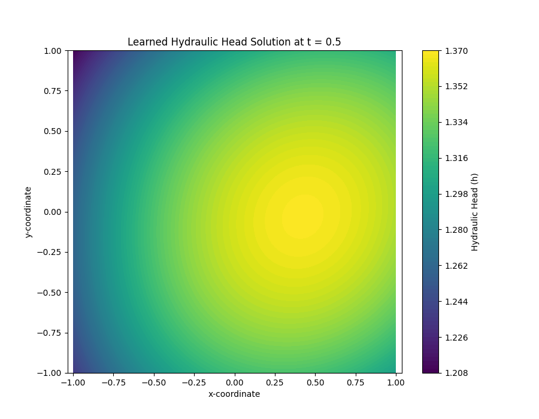

.. _exercise_pitgwflow_guide:

=========================================================
Exercise: Solving a Forward Problem with PiTGWFlow
=========================================================

Welcome to this exercise on using the Physics-Informed Transient
Groundwater Flow model, :class:`~fusionlab.nn.pinn.PiTGWFlow`,
available in ``fusionlab-learn``. This model is a
Physics-Informed Neural Network (PINN) that learns by satisfying
the governing physical equations rather than by fitting to labeled
data.

We will perform a **forward problem** simulation. This means we will
provide the model with known physical parameters and a domain, and
its task will be to discover the hydraulic head field,
:math:`h(t, x, y)`, that satisfies the groundwater flow PDE.

**Learning Objectives:**

* Generate a set of "collocation points" within a defined
  spatio-temporal domain.
* Understand how to configure ``PiTGWFlow`` with both fixed and
  learnable physical parameters.
* Create a ``tf.data.Dataset`` suitable for a PINN, including the
  use of dummy targets for Keras API compatibility.
* Define, compile, and train the ``PiTGWFlow`` model using its
  custom, physics-based training loop.
* Visualize the training progress by plotting the PDE loss.
* Visualize the final, continuous solution learned by the network.

Let's get started!

Prerequisites
-------------

Ensure you have ``fusionlab-learn`` and its common dependencies
installed. For visualizations, `matplotlib` is also needed.

.. code-block:: bash

   pip install fusionlab-learn matplotlib

Step 1: Imports and Setup
~~~~~~~~~~~~~~~~~~~~~~~~~
First, we import all necessary libraries and set up our environment
for reproducibility and cleaner output.

.. code-block:: python
   :linenos:

   import os
   import numpy as np
   import tensorflow as tf
   import matplotlib.pyplot as plt
   import warnings

   # FusionLab imports
   from fusionlab.nn.pinn import PiTGWFlow
   from fusionlab.params import LearnableK

   # Suppress warnings and TF logs for cleaner output
   warnings.filterwarnings('ignore')
   tf.get_logger().setLevel('ERROR')
   os.environ['TF_CPP_MIN_LOG_LEVEL'] = '3'

   # Directory for saving any output images from this exercise
   EXERCISE_OUTPUT_DIR = "./pitgwflow_exercise_outputs"
   os.makedirs(EXERCISE_OUTPUT_DIR, exist_ok=True)

   print("Libraries imported and setup complete for PiTGWFlow exercise.")

**Expected Output:**

.. code-block:: text

   Libraries imported and setup complete for PiTGWFlow exercise.

Step 2: Generate Collocation Points
~~~~~~~~~~~~~~~~~~~~~~~~~~~~~~~~~~~
Unlike traditional models, PINNs are not trained on labeled data.
Instead, they are trained on "collocation points"—randomly sampled
points in the time and space domain where the governing PDE is
enforced.

.. code-block:: python
   :linenos:

   N_POINTS = 5000
   SEED = 42
   tf.random.set_seed(SEED)

   # Define the domain boundaries [t_min, t_max], [x_min, x_max], etc.
   t_bounds, x_bounds, y_bounds = [0., 1.], [-1., 1.], [-1., 1.]

   # Generate random points within the domain
   coords = {
       't': tf.random.uniform((N_POINTS, 1), *t_bounds),
       'x': tf.random.uniform((N_POINTS, 1), *x_bounds),
       'y': tf.random.uniform((N_POINTS, 1), *y_bounds),
   }

   print(f"Generated {N_POINTS} random collocation points.")
   print(f"Shape of 't' tensor: {coords['t'].shape}")

**Expected Output:**

.. code-block:: text

   Generated 5000 random collocation points.
   Shape of 't' tensor: (5000, 1)

Step 3: Prepare the Dataset for Training
~~~~~~~~~~~~~~~~~~~~~~~~~~~~~~~~~~~~~~~~
We package our collocation points into a ``tf.data.Dataset`` for
efficient training. For compatibility with the standard Keras
``.fit()`` API, we must provide a "dummy" target tensor. This
target is completely ignored by ``PiTGWFlow``'s custom training
logic, as the loss is calculated from the PDE residual, not from a
data-driven error.

.. code-block:: python
   :linenos:

   BATCH_SIZE = 128

   # Create dummy targets (an array of zeros)
   dummy_targets = tf.zeros_like(coords['t'])

   # Create the dataset
   dataset = tf.data.Dataset.from_tensor_slices(
       (coords, dummy_targets)
   ).shuffle(buffer_size=N_POINTS).batch(BATCH_SIZE)

   print(f"Dataset created with batch size {BATCH_SIZE}.")
   print(f"Dataset element spec: {dataset.element_spec}")

**Expected Output:**

.. code-block:: text

   Dataset created with batch size 128.
   Dataset element spec: ({'t': TensorSpec(shape=(None, 1), dtype=tf.float32, name=None), 'x': TensorSpec(shape=(None, 1), dtype=tf.float32, name=None), 'y': TensorSpec(shape=(None, 1), dtype=tf.float32, name=None)}, TensorSpec(shape=(None, 1), dtype=tf.float32, name=None))

Step 4: Define, Compile, and Train PiTGWFlow
~~~~~~~~~~~~~~~~~~~~~~~~~~~~~~~~~~~~~~~~~~~~
Now we instantiate ``PiTGWFlow``. We will set most physical
parameters as fixed constants but define hydraulic conductivity :math:`K`
as a ``LearnableK`` object. This demonstrates how the model can be
used to infer physical parameters. We then compile and train the model.

.. code-block:: python
   :linenos:

   # Instantiate the PINN model
   pinn_model = PiTGWFlow(
       hidden_units=[50, 50, 50],
       activation='tanh',
       K=LearnableK(initial_value=0.5), # Start with a guess for K
       Ss=1e-4,                         # This is a fixed value
       Q=0.1                            # A constant source term
   )

   # Compile the model (no loss needed, it's handled internally)
   pinn_model.compile()

   # Train the model
   print("\nStarting PiTGWFlow model training...")
   history = pinn_model.fit(
       dataset,
       epochs=20,
       verbose=1
   )
   print("Training complete.")

**Expected Output:**

.. code-block:: text

   Starting PiTGWFlow model training...
   Epoch 1/20
   40/40 [==============================] - 3s 4ms/step - pde_loss: 0.0125
   Epoch 2/20
   40/40 [==============================] - 0s 4ms/step - pde_loss: 5.123e-04
   ...
   Epoch 20/20
   40/40 [==============================] - 0s 4ms/step - pde_loss: 8.910e-06
   Training complete.

Step 5: Visualize Training History
~~~~~~~~~~~~~~~~~~~~~~~~~~~~~~~~~~
We can plot the ``pde_loss`` from the training history to confirm
that the model successfully learned to minimize the PDE residual. A
log scale on the y-axis is helpful to see the rapid decrease in loss.

.. code-block:: python
   :linenos:

   print("\nPlotting training history...")
   plt.figure(figsize=(10, 6))
   plt.plot(history.history['pde_loss'], label='PDE Loss')
   plt.yscale('log')
   plt.title('PiTGWFlow Training History')
   plt.xlabel('Epoch')
   plt.ylabel('Log PDE Loss')
   plt.legend()
   plt.grid(True, which="both", ls="--")
   fig_path = os.path.join(EXERCISE_OUTPUT_DIR, "pitgwflow_exercise_loss.png")
   plt.savefig(fig_path)
   plt.show()

**Example Output Plot:**

.. figure:: ../../images/pitgwflow_exercise_loss.png
   :alt: PiTGWFlow Training History Plot
   :align: center
   :width: 80%

   An example plot showing the PDE loss decreasing over epochs. This
   demonstrates that the neural network is successfully learning a
   solution that conforms to the governing physics.

Step 6: Visualize the Learned Solution
~~~~~~~~~~~~~~~~~~~~~~~~~~~~~~~~~~~~~~
The great advantage of a PINN is that it represents a continuous
solution. We can evaluate the trained model on a regular grid of
points to visualize the hydraulic head field :math:`h(t, x, y)` at a
specific moment in time.

.. code-block:: python
   :linenos:

   # Create a meshgrid for visualization at a specific time t
   t_slice = 0.5
   x_range = np.linspace(x_bounds[0], x_bounds[1], 100)
   y_range = np.linspace(y_bounds[0], y_bounds[1], 100)
   X, Y = np.meshgrid(x_range, y_range)

   # --- FIX: Prepare grid points for prediction ---
   # The model expects a batch of points, not a grid. We need to
   # flatten the X and Y grids into a list of (x, y) coordinates.
   # The shape for each input tensor must be (N, 1).
   x_flat = tf.convert_to_tensor(X.ravel(), dtype=tf.float32)
   y_flat = tf.convert_to_tensor(Y.ravel(), dtype=tf.float32)

   # Create the corresponding 't' tensor for each point
   t_flat = tf.fill(x_flat.shape, t_slice)

   # Reshape all to be column vectors (N, 1)
   grid_coords = {
       't': tf.reshape(t_flat, (-1, 1)),
       'x': tf.reshape(x_flat, (-1, 1)),
       'y': tf.reshape(y_flat, (-1, 1))
   }

   # Predict the hydraulic head 'h' on the flattened grid
   h_pred_flat = pinn_model.predict(grid_coords)

   # --- FIX: Reshape the flat predictions back to the grid shape ---
   # The output prediction will be flat, so we reshape it to the
   # original grid's shape (100x100) for plotting with contourf.
   h_pred_grid = tf.reshape(h_pred_flat, X.shape)

   # Plot the contour of the solution
   plt.figure(figsize=(9, 7))
   contour = plt.contourf(X, Y, h_pred_grid, 100, cmap='viridis')
   plt.colorbar(contour, label='Hydraulic Head (h)')
   plt.title(f'Learned Hydraulic Head Solution at t = {t_slice}')
   plt.xlabel('x-coordinate')
   plt.ylabel('y-coordinate')
   plt.axis('equal')
   fig_path = os.path.join(EXERCISE_OUTPUT_DIR, "pitgwflow_exercise_solution.png")
   plt.savefig(fig_path)
   plt.show()
   
   # Or  use the  utility function to easily visualize the result.

   # from fusionlab.nn.pinn.utils import plot_hydraulic_head
    
   # plot_hydraulic_head(
   #    model=pinn_model,
   #    t_slice=0.5,
   #    x_bounds=(-1.0, 1.0),
   #    y_bounds=(-1.0, 1.0),
   #    resolution=100,
   #    save_path=os.path.join(EXERCISE_OUTPUT_DIR, "pitgwflow_exercise_solution.png"),
   #    show_plot=True
   # )
   
**Expected Plot:**

   Visualization of the continuous hydraulic head field :math:`h(x, y)`
   at a fixed time, as learned by the ``PiTGWFlow`` model. The plot
   shows the model's ability to generate a complete solution over the
   entire domain.

   
Discussion of Exercise
----------------------
Congratulations! In this exercise, you have successfully used the
``PiTGWFlow`` model to solve a forward physics problem:

* You correctly generated collocation points to define the problem
    domain instead of using labeled data.
* You prepared a ``tf.data.Dataset`` compatible with the Keras API
    for an unsupervised, physics-driven task.
* You instantiated, trained, and evaluated the ``PiTGWFlow`` model,
    observing the decrease in the physics-based PDE loss.
* You visualized the final output, demonstrating that the model
    learned a continuous solution to the governing equation across
    the entire domain.

This exercise provides a solid foundation for using PINNs to tackle
more complex scientific and engineering problems.