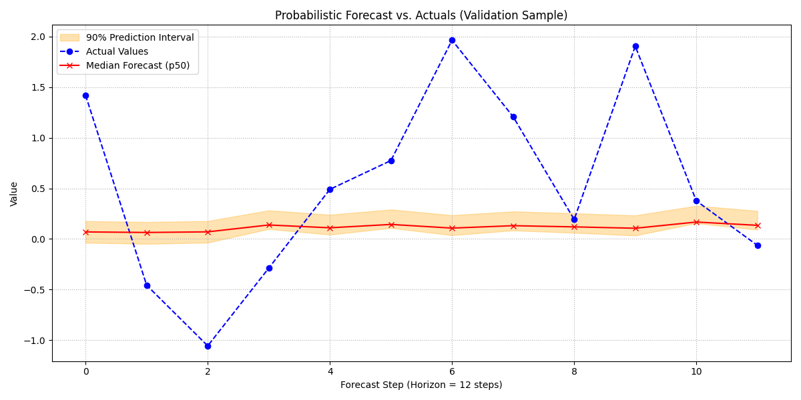

.. _exercise_pure_transformer_guide:

================================================
Exercise: Forecasting with a Pure Transformer
================================================

Welcome to this exercise on using the
:class:`~fusionlab.nn.transformers.TimeSeriesTransformer`. This guide
will walk you through the complete process of building and training a
pure transformer model for a multi-horizon, probabilistic time series
forecasting task.

We will focus on demonstrating the model's ability to handle multiple
input types (static, dynamic, and future) and to generate quantile
forecasts that capture prediction uncertainty.

**Learning Objectives:**

* Generate a synthetic time series dataset with static, dynamic
  past, and known future features.
* Prepare and shape the data into the list format required by the
  model: ``[static_data, dynamic_data, future_data]``.
* Instantiate the ``TimeSeriesTransformer`` and configure it for
  probabilistic (quantile) forecasting.
* Implement a custom quantile loss function and compile the model.
* Train the model and visualize the results, including the forecast
  distribution and uncertainty bounds.

Let's get started!

Prerequisites
---------------

Ensure you have ``fusionlab-learn`` and its common dependencies
installed.

.. code-block:: bash

   pip install fusionlab-learn matplotlib scikit-learn

TimeSeriesTransformer
-----------------------

Step 1: Imports and Setup
~~~~~~~~~~~~~~~~~~~~~~~~~~~~~~~~~~~~~
First, we import all necessary libraries and set up our environment.

.. code-block:: python
   :linenos:

   import os
   import numpy as np
   import tensorflow as tf
   import matplotlib.pyplot as plt

   # FusionLab imports
   from fusionlab.nn.transformers import TimeSeriesTransformer

   # Suppress warnings and TF logs for cleaner output
   import warnings
   warnings.filterwarnings('ignore')
   tf.get_logger().setLevel('ERROR')

   # Directory for saving any output images
   EXERCISE_OUTPUT_DIR = "./pure_transformer_exercise_outputs"
   os.makedirs(EXERCISE_OUTPUT_DIR, exist_ok=True)

   print("Libraries imported and setup complete.")

**Expected Output:**

.. code-block:: text

   Libraries imported and setup complete.

Step 2: Generate and Prepare Synthetic Data
~~~~~~~~~~~~~~~~~~~~~~~~~~~~~~~~~~~~~~~~~~~~

We'll create a synthetic dataset and shape it into the three arrays
required by the ``TimeSeriesTransformer``: static, dynamic past, and
known future features.

.. code-block:: python
   :linenos:

   # Configuration
   N_SAMPLES = 1000
   PAST_STEPS = 30
   HORIZON = 12
   STATIC_DIM, DYNAMIC_DIM, FUTURE_DIM = 3, 4, 2
   SEED = 42
   np.random.seed(SEED)
   tf.random.set_seed(SEED)

   # --- Generate Dummy Data Arrays ---
   static_features = np.random.randn(N_SAMPLES, STATIC_DIM)
   dynamic_features = np.random.randn(N_SAMPLES, PAST_STEPS, DYNAMIC_DIM)
   future_features = np.random.randn(N_SAMPLES, HORIZON, FUTURE_DIM)

   # Create a simple target based on one of the dynamic features
   targets = np.roll(dynamic_features[:, :, 0], -HORIZON, axis=1)[:, :HORIZON, np.newaxis] \
             + np.random.randn(N_SAMPLES, HORIZON, 1) * 0.5

   # Split data into training and validation sets
   val_split = -100
   train_inputs = [arr[:val_split] for arr in [static_features, dynamic_features, future_features]]
   val_inputs = [arr[val_split:] for arr in [static_features, dynamic_features, future_features]]
   train_targets, val_targets = targets[:val_split], targets[val_split:]

   print("Generated data shapes:")
   print(f"  Training Inputs (static, dynamic, future): "
         f"{[x.shape for x in train_inputs]}")
   print(f"  Training Targets: {train_targets.shape}")

**Expected Output:**

.. code-block:: text

   Generated data shapes:
     Training Inputs (static, dynamic, future): [(900, 3), (900, 30, 4), (900, 12, 2)]
     Training Targets: (900, 12, 1)

### Step 3: Define, Compile, and Train the Model
Now, we instantiate the ``TimeSeriesTransformer``. We will configure it
for probabilistic forecasting by setting the `quantiles` parameter.
This requires a corresponding quantile loss function for training.

.. code-block:: python
   :linenos:

   # Define quantiles for probabilistic forecast
   output_quantiles = [0.05, 0.5, 0.95] # p5, p50 (median), p95

   # Instantiate the model
   model = TimeSeriesTransformer(
       static_input_dim=STATIC_DIM,
       dynamic_input_dim=DYNAMIC_DIM,
       future_input_dim=FUTURE_DIM,
       output_dim=1,
       forecast_horizon=HORIZON,
       quantiles=output_quantiles,
       embed_dim=32,
       num_heads=4,
       ffn_dim=64,
       num_encoder_layers=2,
       num_decoder_layers=2
   )

   # Define a quantile loss function
   def quantile_loss(y_true, y_pred):
       q = tf.constant(np.array(output_quantiles), dtype=tf.float32)
       e = y_true - y_pred
       # The tilted absolute loss function
       return tf.keras.backend.mean(
           tf.keras.backend.maximum(q * e, (q - 1) * e), axis=-1
       )

   # Compile the model with the custom loss
   model.compile(optimizer="adam", loss=quantile_loss)

   # Train the model
   print("\nStarting TimeSeriesTransformer training...")
   history = model.fit(
       train_inputs,
       train_targets, 
       validation_data=(val_inputs, val_targets),
       epochs=15,
       batch_size=128,
       verbose=0
   )
   print("Training complete.")
   print(f"Final validation loss: {history.history['val_loss'][-1]:.4f}")

**Expected Output:**

.. code-block:: text

   Starting TimeSeriesTransformer training...
   Training complete.
   Final validation loss: 0.4041

Step 4: Visualize the Probabilistic Forecast
~~~~~~~~~~~~~~~~~~~~~~~~~~~~~~~~~~~~~~~~~~~~~~
The key advantage of a quantile forecast is the ability to visualize
uncertainty. We will plot the median prediction (p50) as our main
forecast and shade the area between the lower (p5) and upper (p95)
quantiles to represent the 90% prediction interval.

.. code-block:: python
   :linenos:

   # Make predictions on the validation set
   val_preds = model.predict(val_inputs)

   # Select a single sequence from the validation set to plot
   idx_to_plot = 25
   median_pred = val_preds[idx_to_plot, :, 1] # 0.5 quantile is at index 1
   lower_bound = val_preds[idx_to_plot, :, 0] # 0.05 quantile is at index 0
   upper_bound = val_preds[idx_to_plot, :, 2] # 0.95 quantile is at index 2
   actuals = val_targets[idx_to_plot, :, 0]

   # --- Visualization ---
   plt.figure(figsize=(12, 6))
   time_axis = range(HORIZON)

   # Plot uncertainty bounds
   plt.fill_between(
       time_axis, lower_bound, upper_bound,
       color='orange', alpha=0.3, label='90% Prediction Interval'
   )
   # Plot actuals and median forecast
   plt.plot(time_axis, actuals, 'o--', color='blue', label='Actual Values')
   plt.plot(time_axis, median_pred, 'x-', color='red', label='Median Forecast (p50)')

   plt.title('Probabilistic Forecast vs. Actuals (Validation Sample)')
   plt.xlabel(f'Forecast Step (Horizon = {HORIZON} steps)')
   plt.ylabel('Value')
   plt.legend()
   plt.grid(True, linestyle=':')
   plt.tight_layout()
   plt.show()

**Expected Plot:**

   A plot showing the actual values, the median forecast, and the
   shaded 90% prediction interval. This visualizes not just *what*
   the model predicts, but also its *confidence* in that prediction.

Discussion of Exercise
~~~~~~~~~~~~~~~~~~~~~~~~~~~
Congratulations! You have successfully trained a pure transformer model
for a complex, probabilistic forecasting task. In this exercise, you
have learned to:

* Prepare data into the three-part list format (`[static, dynamic,
    future]`) required by the ``TimeSeriesTransformer``.
* Configure the model to output quantile predictions for estimating
    uncertainty.
* Implement and use a custom quantile loss function for training.
* Visualize a probabilistic forecast, clearly showing the prediction
    interval around the median forecast.

This workflow demonstrates the power of pure attention-based models
for capturing long-range dependencies and providing rich, uncertainty-
aware forecasts.