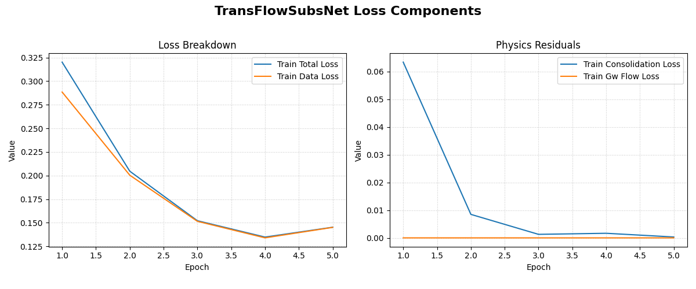
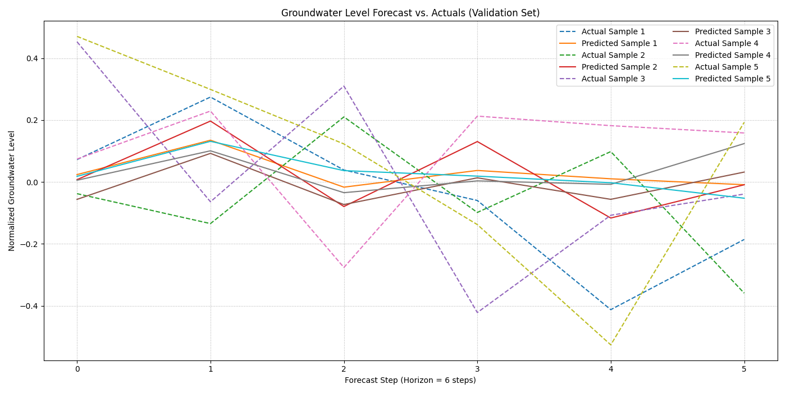

.. _exercise_transflow_subnet_guide:

=======================================================
Exercise: Hybrid Forecasting with TransFlowSubsNet
=======================================================

Welcome to this exercise on using ``TransFlowSubsNet``, a hybrid
physics-informed neural network from the ``fusionlab-learn`` library.
This model is unique because it learns from two sources of
information simultaneously: **structured time series data** and the
**governing laws of physics**.

We will perform a multi-step forecast for both groundwater level and
land subsidence. This exercise will walk you through the specific data
preparation needed to satisfy both the data-driven and
physics-informed components of the model.

**Learning Objectives:**

* Generate a synthetic dataset with features, coordinates, and two
  target variables (subsidence and groundwater level).
* Structure the inputs into the required dictionary format,
  separating feature inputs from coordinate inputs.
* Instantiate ``TransFlowSubsNet`` with both data-driven and
  physics-informed configurations.
* Compile the model with a composite data loss and physics-loss
  weights (:math:`\lambda_{gw}`, :math:`\lambda_{c}`).
* Train the model and interpret the multi-component loss in the
  training log.
* Visualize the forecast results against the true values.

Let's begin!

Prerequisites
-------------

Ensure you have ``fusionlab-learn`` and its common dependencies
installed.

.. code-block:: bash

   pip install fusionlab-learn matplotlib

Step 1: Imports and Setup
~~~~~~~~~~~~~~~~~~~~~~~~~
First, we import all necessary libraries and set up our environment.

.. code-block:: python
   :linenos:

   import os
   import numpy as np
   import tensorflow as tf
   import matplotlib.pyplot as plt
   import warnings

   # FusionLab imports
   from fusionlab.nn.pinn import TransFlowSubsNet
   from fusionlab.nn.models.utils import plot_history_in

   # Suppress warnings and TF logs for cleaner output
   warnings.filterwarnings('ignore')
   tf.get_logger().setLevel('ERROR')

   # Directory for saving any output images
   EXERCISE_OUTPUT_DIR = "./transflow_exercise_outputs"
   os.makedirs(EXERCISE_OUTPUT_DIR, exist_ok=True)

   print("Libraries imported and setup complete for TransFlowSubsNet exercise.")

**Expected Output:**

.. code-block:: text

   Libraries imported and setup complete for TransFlowSubsNet exercise.

Step 2: Generate Synthetic Hybrid Data
~~~~~~~~~~~~~~~~~~~~~~~~~~~~~~~~~~~~~~~~
This is the most critical step. We need to create a dataset that
includes:
1.  Standard time series features (`static`, `dynamic`, `future`).
2.  Spatio-temporal coordinates (`t`, `x`, `y`).
3.  Two target variables (`groundwater_level`, `subsidence`) that are
    logically linked to the coordinates and features.

.. code-block:: python
   :linenos:

   # Configuration
   N_SAMPLES = 500
   PAST_STEPS = 12
   HORIZON = 6
   SEED = 42
   np.random.seed(SEED)
   tf.random.set_seed(SEED)

   # --- Generate Coordinates ---
   t = tf.random.uniform((N_SAMPLES, HORIZON, 1), 0, 10)
   t_past = tf.random.uniform((N_SAMPLES, PAST_STEPS, 1), 0, 10)
   x = tf.random.uniform((N_SAMPLES, HORIZON, 1), -1, 1)
   y = tf.random.uniform((N_SAMPLES, HORIZON, 1), -1, 1)
   coords = tf.concat([t, x, y], axis=-1)

   # --- Generate Physically-Plausible Targets ---
   # Groundwater level (h) based on a simple analytical solution
   h_true = tf.sin(np.pi * x) * tf.cos(np.pi * y) * tf.exp(-0.1 * t)
   # Subsidence (s) as an integrated function of head decline
   s_true = (1 - tf.exp(-0.1 * t)) * (tf.cos(np.pi * x))**2 + h_true * 0.1

   # --- Generate Correlated Features ---
   # These features will be used by the data-driven part of the model
   static_features = tf.random.normal([N_SAMPLES, 3])
   # Dynamic features correlated with the physics
   dynamic_features = tf.concat([
       tf.sin(t_past[:, :PAST_STEPS, :]),
       tf.random.normal([N_SAMPLES, PAST_STEPS, 7])
   ], axis=-1)
   # Future features
   future_features = tf.random.normal([N_SAMPLES, HORIZON, 4])

   print("Generated data shapes:")
   print(f"  Static Features:  {static_features.shape}")
   print(f"  Dynamic Features: {dynamic_features.shape}")
   print(f"  Future Features:  {future_features.shape}")
   print(f"  Coordinates:      {coords.shape}")
   print(f"  True GWL Target:    {h_true.shape}")
   print(f"  True Subsidence Target: {s_true.shape}")

**Expected Output:**

.. code-block:: text

   Generated data shapes:
     Static Features:  (500, 3)
     Dynamic Features: (500, 12, 8)
     Future Features:  (500, 6, 4)
     Coordinates:      (500, 6, 3)
     True GWL Target:    (500, 6, 1)
     True Subsidence Target: (500, 6, 1)

Step 3: Structure Inputs and Targets for Training
~~~~~~~~~~~~~~~~~~~~~~~~~~~~~~~~~~~~~~~~~~~~~~~~~
``TransFlowSubsNet`` expects a dictionary of inputs and a dictionary
of targets for its ``.fit()`` method. We now assemble the data we
generated into this required format.

.. code-block:: python
   :linenos:

   # Input dictionary for the model
   inputs = {
       "static_features": static_features,
       "dynamic_features": dynamic_features,
       "future_features": future_features,
       "coords": coords, # The crucial PINN component
   }

   # Target dictionary for the model
   targets = {
       "subs_pred": s_true,
       "gwl_pred": h_true,
   }

   # Create a validation split
   val_split = int(N_SAMPLES * 0.8)
   train_inputs = {k: v[:val_split] for k, v in inputs.items()}
   val_inputs = {k: v[val_split:] for k, v in inputs.items()}
   train_targets = {k: v[:val_split] for k, v in targets.items()}
   val_targets = {k: v[val_split:] for k, v in targets.items()}

   print("Data structured into training and validation sets.")

Step 4: Define, Compile, and Train TransFlowSubsNet
~~~~~~~~~~~~~~~~~~~~~~~~~~~~~~~~~~~~~~~~~~~~~~~~~~~
We now instantiate the model. The most important step is `.compile()`,
where we provide **both** the standard data loss functions (one for
each target) and the weights for the physics-based losses
(:math:`\lambda_{gw}` and :math:`\lambda_{c}`).

.. code-block:: python
   :linenos:

   # Instantiate the model
   model = TransFlowSubsNet(
       static_input_dim=static_features.shape[-1],
       dynamic_input_dim=dynamic_features.shape[-1],
       future_input_dim=future_features.shape[-1],
       output_subsidence_dim=1,
       output_gwl_dim=1,
       forecast_horizon=HORIZON,
       max_window_size=PAST_STEPS,
       mode='pihal_like',
       pde_mode='both',      # Use both physics loss terms
       K='learnable',        # Ask the model to infer K
       pinn_coefficient_C=0.01 # Use a fixed C
   )

   # Compile the model with composite loss
   model.compile(
       optimizer=tf.keras.optimizers.Adam(learning_rate=1e-3),
       loss={'subs_pred': 'mse', 'gwl_pred': 'mse'}, # Data losses
       lambda_gw=1.0,      # Weight for groundwater physics
       lambda_cons=0.5     # Weight for consolidation physics
   )

   # Train the model
   print("\nStarting TransFlowSubsNet training...")
   history = model.fit(
       train_inputs,
       train_targets,
       validation_data=(val_inputs, val_targets),
       epochs=5,
       batch_size=32,
       verbose=1
   )
   print("Training complete.")

**Expected Output:**

.. code-block:: text

   Starting TransFlowSubsNet training...
   Epoch 1/5
   13/13 [==============================] - 37s 237ms/step - loss: 1.0443 - gwl_pred_loss: 0.6407 - subs_pred_loss: 0.4036 - total_loss: 0.9620 - data_loss: 0.9616 - consolidation_loss: 8.8173e-04 - gw_flow_loss: 1.6358e-07 - val_loss: 0.1779 - val_gwl_pred_loss: 0.1779 - val_subs_pred_loss: 0.0000e+00
   Epoch 2/5
   13/13 [==============================] - 0s 24ms/step - loss: 0.2164 - gwl_pred_loss: 0.1499 - subs_pred_loss: 0.0665 - total_loss: 0.2129 - data_loss: 0.2128 - consolidation_loss: 2.9616e-04 - gw_flow_loss: 4.7181e-08 - val_loss: 0.1271 - val_gwl_pred_loss: 0.1271 - val_subs_pred_loss: 0.0000e+00
   ...
   Epoch 5/5
   13/13 [==============================] - 0s 24ms/step - loss: 0.1502 - gwl_pred_loss: 0.1120 - subs_pred_loss: 0.0382 - total_loss: 0.1496 - data_loss: 0.1496 - consolidation_loss: 2.7363e-05 - gw_flow_loss: 7.7033e-10 - val_loss: 0.1170 - val_gwl_pred_loss: 0.1170 - val_subs_pred_loss: 0.0000e+00
   Training complete.

Step 5: Visualize Training History
~~~~~~~~~~~~~~~~~~~~~~~~~~~~~~~~~~
We can use the `plot_history_in` utility to view all the components
of our composite loss function, which helps in understanding how the
model balanced the data and physics objectives.

.. code-block:: python
   :linenos:

   metrics_to_plot = {
       "Loss Breakdown": ["total_loss", "data_loss"],
       "Physics Residuals": ["consolidation_loss", "gw_flow_loss"]
   }
   plot_history_in(
       history,
       metrics=metrics_to_plot,
       title="TransFlowSubsNet Loss Components"
   )

**Expected Plot:**

   The plot shows two subplots: one comparing the total loss to the
   data-fidelity loss, and another showing the evolution of the two
   physics-based loss components.

Step 6: Visualize the Forecast
~~~~~~~~~~~~~~~~~~~~~~~~~~~~~~
Finally, let's make predictions on the validation set and compare the
forecasted groundwater level against the actual values for a sample.

.. code-block:: python
   :linenos:

   # Make predictions on the validation set
   val_predictions = model.predict(val_inputs)
   # Predictions are a dict, get the one for groundwater level
   gwl_preds = val_predictions['gwl_pred']
   gwl_actuals = val_targets['gwl_pred']

   # Plot the forecast for the first 5 validation samples
   plt.figure(figsize=(14, 7))
   for i in range(5):
       plt.plot(gwl_actuals[i, :, 0],
                label=f'Actual Sample {i+1}', linestyle='--')
       plt.plot(gwl_preds[i, :, 0],
                label=f'Predicted Sample {i+1}', linestyle='-')

   plt.title('Groundwater Level Forecast vs. Actuals (Validation Set)')
   plt.xlabel(f'Forecast Step (Horizon = {HORIZON} steps)')
   plt.ylabel('Normalized Groundwater Level')
   plt.legend(ncol=2)
   plt.grid(True, linestyle=':')
   plt.tight_layout()
   plt.show()

**Expected Plot:**

   A comparison plot showing the model's multi-step forecasts for the
   groundwater level against the true values for several validation samples.

Discussion of Exercise
----------------------
Congratulations! You have successfully trained a hybrid
physics-data model. In this exercise, you have learned to:

* Create a complex dataset suitable for a hybrid model that
  requires both feature and coordinate inputs.
* Structure the data into the dictionary format required by
  ``TransFlowSubsNet``.
* Compile the model with a composite loss function, balancing data
  fidelity and physical consistency using loss weights.
* Train the model and interpret its multi-component loss log.

This workflow is a powerful paradigm for building more robust and
generalizable scientific machine-learning models, especially in
data-scarce or noisy environments where physics can provide a strong
inductive bias.