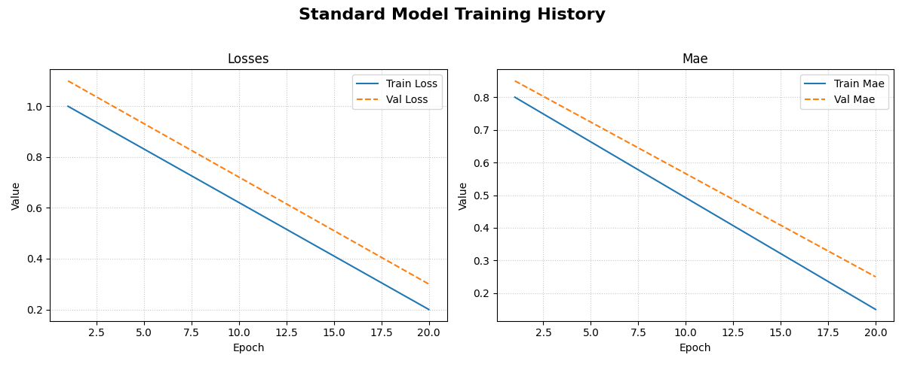
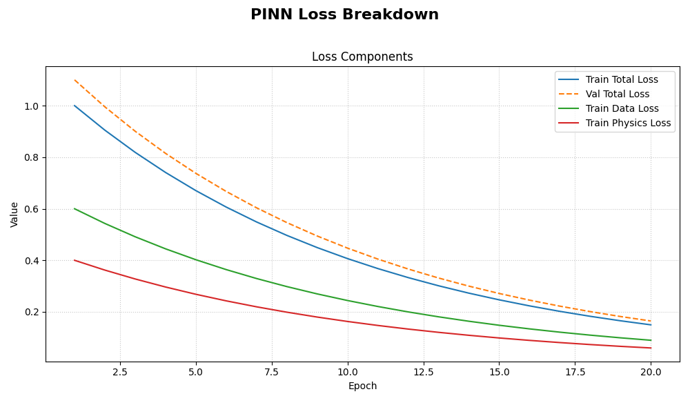
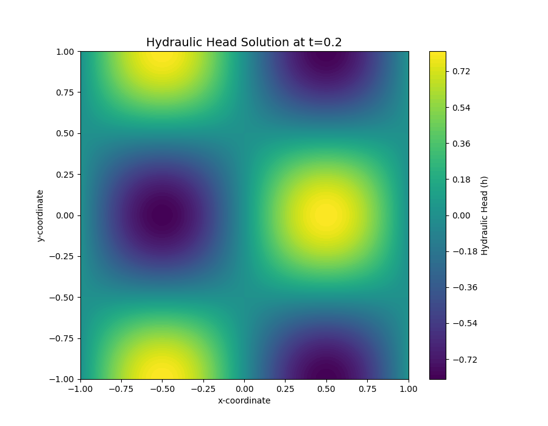

.. _plotting_utils_guide:

====================
Plotting Utilities
====================

``fusionlab-learn`` provides a suite of convenient plotting utilities
designed to help you visualize model performance and results with
minimal effort. These functions are built on top of Matplotlib and
are tailored to work seamlessly with the outputs of Keras models and
the specialized models within the library.

This guide covers the primary utilities for plotting training history
and visualizing the outputs of physics-informed models.

Training History Visualization (`plot_history_in`)
==================================================

:API Reference: :func:`~fusionlab.nn.models.utils.plot_history_in`

After training a model, the first step is always to inspect its
learning curves. The ``plot_history_in`` function is a flexible
tool for visualizing the training and validation metrics (e.g., loss,
MAE, accuracy) recorded in a Keras ``History`` object. This is
essential for diagnosing model convergence, identifying overfitting,
and comparing the performance of different model components.

Key Parameters Explained
--------------------------

* **history**: This is the primary input, which is the object
  returned by the ``model.fit()`` method. It contains the metric
  values for each epoch.

* **metrics**: A dictionary that gives you fine-grained control
  over which metrics to plot and how to group them. The dictionary
  keys become the titles for subplots, and the values are lists of
  metric names from the history object. If you don't provide this,
  the function will intelligently plot all available metrics.

* **layout**: This string argument controls the overall structure
  of the figure.
  
  * Use ``'subplots'`` (the default) to give each metric group
    its own dedicated plot. This is ideal for a clear, detailed
    view of each metric.
  * Use ``'single'`` to plot all specified metric curves on a
    single set of axes. This is very useful for comparing the
    trends of different loss components together, such as for a
    PINN with data loss and physics loss.

Usage Examples
----------------

**1. Standard Model History**

This example demonstrates how to plot the loss and Mean Absolute Error
(MAE) for a standard model. The function automatically detects the
``loss`` and ``mae`` keys and their validation counterparts
(``val_loss``, ``val_mae``) and places them in separate subplots.

.. code-block:: python
   :linenos:

   import numpy as np
   from fusionlab.nn.models.utils import plot_history_in

   # Create a mock history object (as returned by model.fit)
   history_data = {
       'loss': np.linspace(1.0, 0.2, 20),
       'val_loss': np.linspace(1.1, 0.3, 20),
       'mae': np.linspace(0.8, 0.15, 20),
       'val_mae': np.linspace(0.85, 0.25, 20),
   }

   # Plot the history with default settings (subplots)
   plot_history_in(
       history_data,
       title='Standard Model Training History'
   )

This will generate a figure with two subplots: "Loss" and "Mae",
each containing the training (solid line) and validation (dashed
line) curves.

**Expected Output:**

    
   The generated figure contains two subplots. The left subplot shows
   the training and validation loss, while the right shows the
   training and validation Mean Absolute Error (MAE) over epochs.

**2. Composite Loss Breakdown for a PINN**

This example shows how to use ``layout='single'`` to visualize the
different loss components of a Physics-Informed Neural Network on a
single graph. This helps in understanding how each part of the loss
contributes to the total.

.. code-block:: python
   :linenos:

   # Mock history for a model with multiple loss components
   pinn_history = {
       'total_loss': np.exp(-np.arange(0, 2, 0.1)),
       'val_total_loss': np.exp(-np.arange(0, 2, 0.1)) * 1.1,
       'data_loss': np.exp(-np.arange(0, 2, 0.1)) * 0.6,
       'physics_loss': np.exp(-np.arange(0, 2, 0.1)) * 0.4,
   }

   # Define which metrics to plot in one group
   pinn_metrics = {
       "Loss Components": ["total_loss", "data_loss", "physics_loss"]
   }

   # Plot all loss curves on a single set of axes
   plot_history_in(
       pinn_history,
       metrics=pinn_metrics,
       layout='single',
       title='PINN Loss Breakdown'
   )

This will produce one plot titled "Loss Components", showing the
trends of the total, data, and physics losses together.

**Expected Output:**

   The generated plot displays all specified loss components on a
   single set of axes, making it easy to compare their trends and
   magnitudes throughout the training process.

.. raw:: html

   

Hydraulic Head Visualization (`plot_hydraulic_head`)
======================================================

:API Reference: :func:`~fusionlab.nn.pinn.utils.plot_hydraulic_head`

This is a specialized utility for visualizing the output of PINNs
that solve for a 2D spatial field, such as the ``PiTGWFlow`` model.
It takes a trained model and a specific point in time, :math:`t`, and
generates a contour plot of the learned hydraulic head solution,
:math:`h(x, y)`.

Key Parameters Explained
------------------------

* **`model`**: The trained PINN model that you want to visualize.
  It must have a ``.predict()`` method that accepts a dictionary
  of coordinates.

* **`t_slice`**: A single float value representing the time at
  which you want to see the spatial solution.

* **x_bounds**, **y_bounds**, **resolution**: These
  parameters define the visualization domain and the quality of
  the plot. The function will create a grid of
  ``resolution x resolution`` points within these spatial bounds.

* **`ax`**: This powerful optional parameter allows you to pass a
  pre-existing Matplotlib ``Axes`` object. This is perfect for
  creating complex figures with multiple subplots, such as
  comparing the solution at different times side-by-side.

Usage Example
-------------

This example shows how to visualize the output of a mock PINN model.
In a real scenario, you would pass your trained ``PiTGWFlow`` model.

.. code-block:: python
   :linenos:

   import tensorflow as tf
   from fusionlab.nn.pinn.utils import plot_hydraulic_head

   # Create a mock model for demonstration purposes.
   # This model implements a simple analytical function.
   class MockPINN(tf.keras.Model):
       def call(self, inputs):
           t, x, y = inputs['t'], inputs['x'], inputs['y']
           return tf.sin(np.pi * x) * tf.cos(np.pi * y) * tf.exp(-t)

   mock_model = MockPINN()

   # --- Generate a single plot of the solution at t=0.2 ---
   plot_hydraulic_head(
       model=mock_model,
       t_slice=0.2,
       x_bounds=(-1, 1),
       y_bounds=(-1, 1),
       resolution=80,
       title="Hydraulic Head Solution at t=0.2"
   )

This code will generate a 2D contour plot showing the spatial
distribution of the hydraulic head at the specified time.

**Expected Output:**

    
   A 2D contour plot showing the spatial distribution of the
   hydraulic head. The color indicates the value of :math:h at each
   :math:(x, y) coordinate for the specified time slice.
    