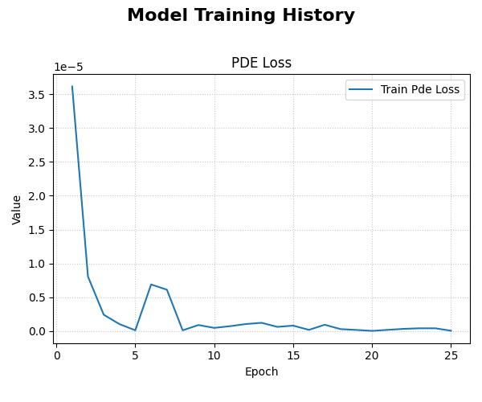
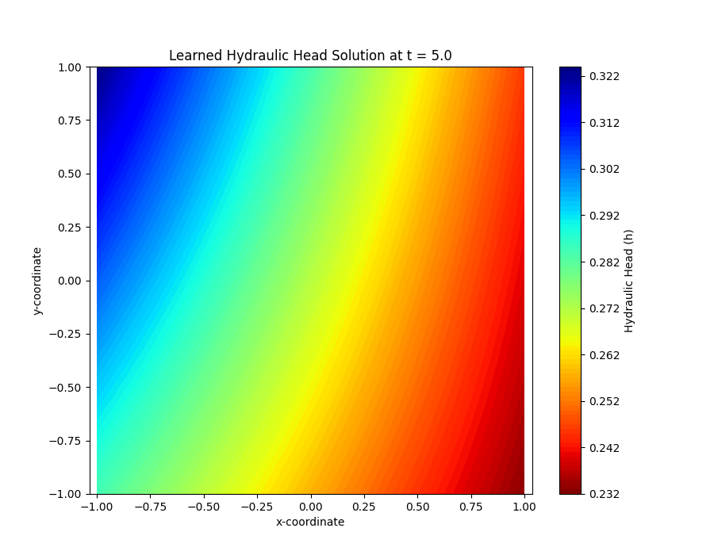

.. _user_guide_pitgwflow:

=======================================================
Physics-Informed Transient Groundwater Flow (PiTGWFlow)
=======================================================

:API Reference: :class:`~fusionlab.nn.pinn.PiTGWFlow`

The ``PiTGWFlow`` model is a powerful application of deep learning to
solve a fundamental problem in hydrogeology: the **2D transient
groundwater flow equation**. It stands as a prime example of a
**Physics-Informed Neural Network (PINN)**, a class of models that
learn directly from the governing physical laws themselves, rather
than from large, labeled datasets.

Instead of traditional numerical methods like Finite Element or Finite
Difference which require complex mesh generation and solve for values
at discrete points, ``PiTGWFlow`` leverages a simple Multi-Layer
Perceptron (MLP) as a **universal function approximator**. This MLP
learns to represent the hydraulic head, :math:`h`, as a continuous
and differentiable function of time :math:`t` and space
:math:`(x, y)`. The model is trained not by comparing its output to
known data points, but by minimizing the residual of the PDE itself
at thousands of randomly sampled "collocation points" within the
domain. This forces the neural network to discover a solution that is
inherently consistent with the physics of groundwater flow.

Key Features
------------

* **Mesh-Free Differential Equation Solver**
  The model uses a neural network to represent the solution space,
  completely bypassing the need for complex and computationally
  expensive mesh generation. This makes it particularly well-suited
  for problems with irregular or complex domain geometries.

* **Unsupervised, Physics-Driven Training**
  ``PiTGWFlow`` operates in a purely unsupervised manner. Its loss
  function is the Mean Squared Error of the PDE residual. In effect,
  the "label" it trains against is always zero—the value the PDE
  residual should have if the equation is perfectly satisfied. This
  eliminates the need for large, labeled datasets, making it ideal
  for data-scarce scientific applications.

* **Enables Parameter Discovery (Inverse Modeling)**
  One of the most powerful features of the PINN approach is the
  ability to solve inverse problems. Key physical coefficients like
  hydraulic conductivity (:math:`K`) and specific storage
  (:math:`S_s`) can be declared as **trainable variables**. The model
  can then infer the values of these parameters that best satisfy
  the governing equation, effectively discovering the underlying
  physics from sparse observations (when integrated into a hybrid loss).

* **Simple and Familiar API**
  Despite the complex underlying mathematics (automatic
  differentiation for computing PDE derivatives), the entire training
  process is encapsulated within the standard, user-friendly Keras
  workflow. The model is instantiated, compiled with `.compile()`,
  and trained with `.fit()`, making this advanced scientific computing
  technique highly accessible.

When to Use PiTGWFlow
---------------------

``PiTGWFlow`` is an excellent choice for a range of hydrogeological
problems where the physics of the system are well understood.

* **Solving the Forward Problem**
  This is the classic use case for a PDE solver. When you know the
  physical parameters of your aquifer system (:math:`K`, :math:`S_s`,
  :math:`Q`) and the boundary/initial conditions, you can use
  ``PiTGWFlow`` to accurately predict the evolution of the hydraulic
  head field, :math:`h(t, x, y)`, over any point in your domain.

* **Solving the Inverse Problem**
  This is a key strength of the PINN methodology. If you have sparse
  measurements of the hydraulic head at a few locations, ``PiTGWFlow``
  can be used as the core of a system to infer the unknown physical
  parameters of the aquifer. By setting parameters like `K` to be
  learnable, the model can find the values that cause the PDE solution
  to best fit the sparse observations.

* **For Problems Governed by Known Physics with Scarce Data**
  The model shines in scenarios where you trust the governing equation
  more than you trust the availability or quality of your data. It
  provides a way to generate a high-fidelity, continuous solution
  field *from* the physical laws themselves, which can then be used
  for further analysis.

* **To Obtain a Continuous and Differentiable Solution**
  Unlike traditional numerical solvers that produce values at discrete
  grid points, the ``PiTGWFlow`` model learns a continuous analytical
  function. This is a significant advantage, as it means you can:
  
  1.  Evaluate the solution :math:`h` at **any** continuous
      coordinate :math:`(t, x, y)`.
  2.  Analytically compute its derivatives using ``tf.GradientTape``
      to find other physical quantities, such as the groundwater
      flow velocity field (:math:`\mathbf{v} = -K \nabla h`), without
      introducing numerical discretization errors.
        
        
The Governing Equation
----------------------
The ``PiTGWFlow`` model is designed to solve one of the most fundamental
equations in hydrogeology: the **2D transient groundwater flow
equation**. This equation is derived from Darcy's Law and the principle
of conservation of mass, and it describes how the hydraulic head (a
measure of groundwater level) changes in time and space within an
aquifer.

The equation is expressed as:

.. math::
   S_s \frac{\partial h}{\partial t} - K \left( \frac{\partial^2 h}{\partial x^2} + \frac{\partial^2 h}{\partial y^2} \right) - Q = 0

This can be written more compactly using the **Laplacian operator**,
:math:`\nabla^2 h = \frac{\partial^2 h}{\partial x^2} + \frac{\partial^2 h}{\partial y^2}`,
which represents the net divergence of flow at a point. The equation
balances the change in storage against subsurface flow and external
sources/sinks:

.. math::
   \underbrace{S_s \frac{\partial h}{\partial t}}_{\text{Change in Storage}} - \underbrace{K \nabla^2 h}_{\text{Net Subsurface Flow}} - \underbrace{Q}_{\text{Sources/Sinks}} = 0

Let's break down each term:

* :math:`h(t, x, y)`: The **hydraulic head**, which is the unknown
  function that the neural network learns to approximate. It represents
  the potential energy of the groundwater at a given point and time.

* :math:`\frac{\partial h}{\partial t}` **(The Transient Term)**:
  This is the rate of change of the hydraulic head over **time**. It
  quantifies how quickly water levels are rising or falling. A
  positive value means the water level is increasing, and vice-versa.

* :math:`\nabla^2 h` **(The Laplacian Term)**:
  This term describes the net "curvature" of the hydraulic head surface
  in space. A non-zero Laplacian indicates an imbalance of flow. For
  instance, at the center of a pumping well's cone of depression, the
  Laplacian is large and negative, indicating that water is flowing
  *into* that point from all directions faster than it is flowing out.

* :math:`S_s` **(Specific Storage)**: A crucial physical property of
  the aquifer. It represents the volume of water that a unit volume of
  the aquifer releases from storage for every unit decline in
  hydraulic head, due to the compressibility of both the water and the
  aquifer's porous skeleton.

* :math:`K` **(Hydraulic Conductivity)**: A parameter that measures how
  easily water can move through the soil or rock. High-permeability
  materials like sand have a high :math:`K`, while low-permeability
  materials like clay have a very low :math:`K`.

* :math:`Q` **(Source/Sink Term)**: This term accounts for any water
  being artificially added to (e.g., via injection wells) or removed
  from (e.g., via pumping wells) the aquifer system per unit volume.

Architectural Workflow: A Deep Dive
-----------------------------------
The ``PiTGWFlow`` architecture is elegant in its simplicity. It combines
a standard neural network with a custom, physics-driven training loop that
enforces the governing equation described above.

**1. The Neural Network Surrogate**
***********************************
The core of the model is a simple **Multi-Layer Perceptron (MLP)**.
In the context of PINNs, this MLP acts as a **universal function
approximator**. Its job is to learn a continuous function,
:math:`h_{NN}(\theta; t, x, y)`, that serves as a surrogate for the
true, unknown solution :math:`h`.

The inputs to this network are *only* the continuous spatio-temporal
coordinates, and its output is a single scalar value—the predicted
hydraulic head at that point.

.. math::
   h_{NN} = \text{MLP}(\theta; [t, x, y])

Here, :math:`\theta` represents all the trainable weights and biases
of the MLP.

**2. The Physics-Informed Training Step**
*****************************************
This is where the "physics" is injected. Instead of comparing the
network's output to ground-truth labels, the training process forces
the network's output to obey the PDE. This happens in several stages
within the custom ``train_step``:

* **A. Collocation Point Sampling:**
  For each training step, the model receives a batch of random
  spatio-temporal points, :math:`(t, x, y)`, called **collocation
  points**. These points are sampled from within the problem's
  domain and are where the physical law will be evaluated and enforced.

* **B. Forward Pass:**
  The coordinates of these collocation points are fed through the MLP
  surrogate to get the predicted head values, :math:`h_{NN}`, at each
  of those points.

* **C. Automatic Differentiation:**
  This is the core mechanism of PINNs. The model uses TensorFlow's
  ``GradientTape``, a powerful tool that acts like a "computational
  microscope," to calculate the exact partial derivatives of the MLP's
  output (:math:`h_{NN}`) with respect to its inputs (:math:`t, x, y`).
  It computes all terms needed for the PDE:

  .. math::
     \frac{\partial h_{NN}}{\partial t}, \quad
     \frac{\partial h_{NN}}{\partial x}, \quad
     \frac{\partial h_{NN}}{\partial y}, \quad
     \frac{\partial^2 h_{NN}}{\partial x^2}, \quad
     \frac{\partial^2 h_{NN}}{\partial y^2}

* **D. Residual Calculation:**
  These analytically computed derivatives are then plugged into the
  governing groundwater flow equation to calculate the PDE
  **residual**, :math:`R`, for each collocation point. A perfect
  solution would have :math:`R=0` everywhere.

  .. math::
     R = S_s \frac{\partial h_{NN}}{\partial t} - K \left(
     \frac{\partial^2 h_{NN}}{\partial x^2} +
     \frac{\partial^2 h_{NN}}{\partial y^2} \right) - Q

* **E. Loss Computation:**
  The model's loss function, :math:`\mathcal{L}`, is simply the
  **Mean Squared Error** of these residuals. The goal of training is
  to find the network weights :math:`\theta` (and any learnable
  physical parameters) that make this loss as close to zero as
  possible.

  .. math::
     \mathcal{L}(\theta, K, S_s, Q) = \frac{1}{N}\sum_{i=1}^{N} (R_i)^2

**3. End-to-End Optimization**
******************************
The final step is to compute the gradient of the physics loss
:math:`\mathcal{L}` with respect to **all** trainable variables in the
model. This includes:

1.  The weights and biases of the MLP surrogate (:math:`\theta`).
2.  Any physical parameters that were defined as `Learnable` (e.g.,
    `LearnableK`, `LearnableSs`).

The optimizer (e.g., Adam) then uses these gradients to update all
variables, simultaneously tuning the neural network to better
approximate the solution field and tuning the physical parameters to
values that best describe the system.

Complete Example
-----------------
This example demonstrates a complete workflow for using ``PiTGWFlow``
to solve a **forward problem** where we also ask the model to perform
parameter discovery for the hydraulic conductivity (:math:`K`).

**Step 1: Imports and Setup**

First, we import the necessary libraries from TensorFlow and
``fusionlab-learn``, and set up a directory to save our results.

.. code-block:: python
   :linenos:

   import os
   import numpy as np
   import tensorflow as tf
   import matplotlib.pyplot as plt

   # FusionLab imports
   from fusionlab.nn.pinn import PiTGWFlow
   from fusionlab.params import LearnableK

   os.environ['TF_CPP_MIN_LOG_LEVEL'] = '3' # Suppress logs

   EXERCISE_OUTPUT_DIR = "./pitgwflow_outputs"
   os.makedirs(EXERCISE_OUTPUT_DIR, exist_ok=True)

**Step 2: Generate Collocation Points**

Unlike traditional models, PINNs are not trained on labeled data.
Instead, they learn by minimizing the PDE residual at thousands of
randomly sampled points, known as **collocation points**, within the
problem's spatio-temporal domain.

We also create a `dummy_y` tensor of zeros. This is required to satisfy
the Keras ``.fit()`` API, which expects data in an `(X, y)` format, but
these dummy targets are **completely ignored** during training. The actual
loss is derived solely from the physics.

.. code-block:: python
   :linenos:

   # Configuration
   N_POINTS = 5000
   BATCH_SIZE = 128

   # Generate random (t, x, y) coordinates within a defined domain
   tf.random.set_seed(42)
   coords = {
       "t": tf.random.uniform((N_POINTS, 1), 0, 10), # Time from 0 to 10
       "x": tf.random.uniform((N_POINTS, 1), -1, 1), # x from -1 to 1
       "y": tf.random.uniform((N_POINTS, 1), -1, 1), # y from -1 to 1
   }

   # Dummy targets are required for the Keras API but are ignored
   dummy_y = tf.zeros((N_POINTS, 1))

   # Create an efficient tf.data.Dataset for training
   dataset = tf.data.Dataset.from_tensor_slices(
       (coords, dummy_y)
   ).shuffle(N_POINTS).batch(BATCH_SIZE).prefetch(tf.data.AUTOTUNE)

   print(f"Generated {N_POINTS} collocation points for training.")

**Step 3: Define, Compile, and Train PiTGWFlow**

We now instantiate the ``PiTGWFlow`` model. Note how we pass `Ss` and `Q`
as fixed Python floats, but we pass `K` as a ``LearnableK`` object. This
tells the model to treat :math:`K` as a trainable parameter to be
discovered during optimization.

Because the model uses its own internal PDE residual loss, we only need
to call ``.compile()`` to set up the optimizer.

.. code-block:: python
   :linenos:

   # Instantiate PiTGWFlow with a learnable K
   pinn_model = PiTGWFlow(
       hidden_units=[40, 40, 40],
       activation='tanh',
       K=LearnableK(1.0), # The model will infer this value
       Ss=1e-4,           # Fixed value
       Q=0.0              # Fixed value
   )

   # Compile the model (loss is handled internally)
   pinn_model.compile(optimizer=tf.keras.optimizers.Adam(learning_rate=1e-3))
   
   print("Training PiTGWFlow model...")
   history = pinn_model.fit(
       dataset,
       epochs=25, # Use more epochs for a more converged solution
       verbose=0
   )
   print("Training complete.")

   # Extract the final learned value for K
   # The name 'param_K' is set internally by the model
   learned_k = [v for v in pinn_model.trainable_variables if 'param_K' in v.name]
   if learned_k:
       # The model learns log(K), so we take the exp()
       final_k_value = tf.exp(learned_k[0]).numpy()
       print(f"Final Learned K: {final_k_value:.4f}")

**Step 4: Visualize Training History**

After training, we should always inspect the learning curve. A steadily
decreasing `pde_loss` indicates that the neural network is successfully
learning a function that minimizes the PDE residual, thus satisfying
the governing physical law.

.. code-block:: python
   :linenos:

   from fusionlab.nn.models.utils import plot_history_in
   
   print("\nPlotting training history...")
   plot_history_in(history, metrics={"PDE Loss": ["pde_loss"]})

**Expected Output Plot:**

   An example plot showing the PDE loss decreasing over epochs. The
   logarithmic scale helps visualize the rapid reduction in error as
   the model learns to satisfy the physics.

**Step 5: Visualize the Learned Solution**

The key advantage of the PINN is that it has learned a **continuous**
function :math:`h(t, x, y)`. We can now evaluate this function on a
regular grid of points to visualize the full solution field at a
specific moment in time.

.. code-block:: python
   :linenos:

   # 1. Create a meshgrid for visualization at a specific time slice
   t_slice = 5.0
   x_range = np.linspace(-1, 1, 100)
   y_range = np.linspace(-1, 1, 100)
   X, Y = np.meshgrid(x_range, y_range)

   # 2. Prepare grid coordinates for prediction
   x_flat = tf.convert_to_tensor(X.ravel(), dtype=tf.float32)
   y_flat = tf.convert_to_tensor(Y.ravel(), dtype=tf.float32)
   t_flat = tf.fill(x_flat.shape, t_slice)
   
   grid_coords = {
       't': tf.reshape(t_flat, (-1, 1)),
       'x': tf.reshape(x_flat, (-1, 1)),
       'y': tf.reshape(y_flat, (-1, 1))
   }

   # 3. Predict the hydraulic head 'h' on the grid
   h_pred_flat = pinn_model.predict(grid_coords)
   h_pred_grid = tf.reshape(h_pred_flat, X.shape)

   # 4. Plot the contour of the solution
   plt.figure(figsize=(9, 7))
   contour = plt.contourf(X, Y, h_pred_grid, 100, cmap='viridis')
   plt.colorbar(contour, label='Hydraulic Head (h)')
   plt.title(f'Learned Hydraulic Head Solution at t = {t_slice}')
   plt.xlabel('x-coordinate')
   plt.ylabel('y-coordinate')
   plt.axis('equal')
   plt.show()

**Expected Output Plot:**

   A 2D contour map showing the continuous hydraulic head field learned
   by the model. The smooth contours demonstrate the differentiable
   nature of the neural network solution.

Next Steps
----------

.. note::

   Now that you understand the theory and the complete workflow for
   ``PiTGWFlow``, you can apply these concepts to solve your own forward
   or inverse hydrogeological problems.

   Proceed to the exercises for more hands-on practice:
   :doc:`../../exercises/exercise_pitgwflow`