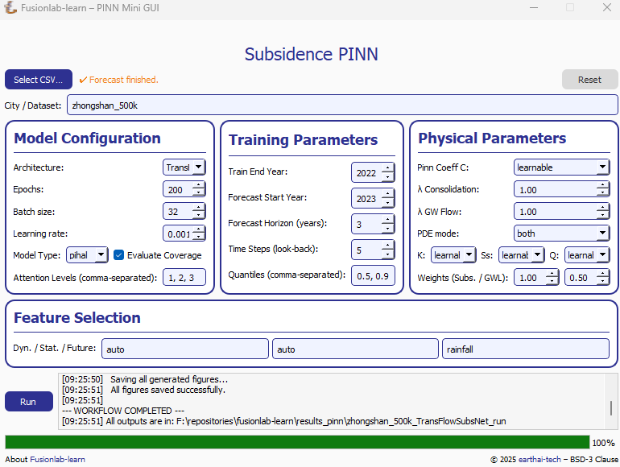

.. _pinn_gui_guide:

=====================================
Subsidence PINN Mini GUI Guide
=====================================

This guide provides a complete walkthrough of the **Subsidence PINN
Mini GUI**, a desktop application designed to provide a user-friendly
interface for the complex forecasting workflows in ``fusionlab-learn``.

The application allows users who may not be familiar with Python to
load their own data, configure model parameters, run a full
training and forecasting pipeline, and view the results, all from a
simple graphical interface.

   A preview of the main application window.

.. raw:: html

   

Launching the Application
-------------------------

The GUI is a tool within the ``fusionlab-learn`` library. To run it,
you must have the library and its dependencies (especially `PyQt5`)
installed.

1.  Navigate to the root directory of the `fusionlab-learn` project
    in your terminal.
2.  Run the application using the following command:

    .. code-block:: bash

       python -m fusionlab.tools.app.mini_forecaster_gui

    This will launch the main application window.

.. raw:: html

   

User Interface Guide
--------------------

The application is divided into several logical panels for configuration
and results.

**1. Data Input & Main Controls**
*********************************
Located at the top and bottom left of the window, these are the primary
controls for starting and resetting the workflow.

* **Select CSV...**: Click this button to open a file dialog. Navigate
  to and select the `.csv` file containing your spatiotemporal data.
  The path to the selected file will appear next to the button.
* **Run**: After selecting a file and configuring the parameters, click
  this button to start the end-to-end workflow. The button will become
  disabled while processing is active.
* **Reset**: This button clears all logs and results and resets all
  configuration options to their default values.

**2. Model Configuration**
**************************
This panel allows you to control the high-level architecture and
training parameters.

* **Architecture**: Choose between ``TransFlowSubsNet`` (the advanced,
  coupled-physics model) and ``PIHALNet`` (the consolidation-focused
  model).
* **Epochs**: Sets the maximum number of training epochs for the model.
* **Batch Size**: Defines the number of samples processed in each batch
  during training.
* **Learning Rate**: Sets the learning rate for the Adam optimizer.

**3. Physical Parameters**
**************************
This panel gives you control over the physics-informed components of
the model's loss function.

* **λ Consolidation**: Sets the weight (:math:`\lambda_c`) for the
  consolidation PDE loss. Higher values force stricter adherence to
  this physical law.
* **λ GW Flow**: Sets the weight (:math:`\lambda_{gw}`) for the
  groundwater flow PDE loss. This is only active when using the
  ``TransFlowSubsNet`` model.
* **PDE Mode**: Controls which physics constraints are active during
    training (e.g., `'both'`, `'consolidation'`).

**4. Feature Selection**
************************
This panel allows you to specify which columns from your input data
should be used for the different feature streams required by the model.

* **Dyn. / Stat. / Future**: Enter the names of your columns, separated
  by commas, into the appropriate fields for **Dynamic**, **Static**,
  and **Future** features. Leaving a field as ``auto`` will let the
  application attempt to automatically detect the appropriate columns.

**5. Log and Output Panel**
***************************
The large text area on the bottom right is the **Log Panel**. It provides
real-time feedback as the workflow progresses, showing which step is
currently running. Any warnings or errors that occur during the process
will also be displayed here. Once the workflow is complete, this area will
be updated to show the formatted results DataFrame and any generated plots.
