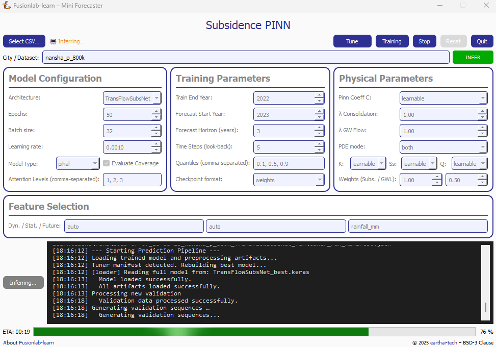

.. _pinn_gui_guide:

========================================
Subsidence PINN: Mini Forecaster Guide
========================================

This guide provides a complete walkthrough of the **Subsidence PINN
Mini Forecaster**, a desktop application designed to provide a user-friendly
interface for the complex forecasting workflows in ``fusionlab-learn``.

The application allows users who may not be familiar with Python to
load their own data, configure model parameters, run a full
training and forecasting pipeline, and view the results, all from a
simple graphical interface.

.. figure:: ../images/gui_overview.png
   :alt: Screenshot of Subsidence PINN Mini Forecaster
   :align: center
   :width: 80%

   A preview of the main application window with its detailed configuration panels.

.. raw:: html

   

Launching the Application
-------------------------

The GUI is a tool within the ``fusionlab-learn`` library. To run it,
you must have the library and its dependencies (especially `PyQt5`)
installed. There are three ways to launch the application, each suited
for different needs.

**Method 1: Direct Command (Recommended)**

Once `fusionlab-learn` is installed, a direct command is added to your
system's path. This is the simplest and recommended way to start the GUI.

.. code-block:: bash

   mini-forecaster

This will launch the main application window.

**Method 2: Using the Main [fusionlab-learn] CLI**

The GUI can also be launched via the main `fusionlab-learn` command-line
interface. This is useful for users who are already working with the
other CLI tools.

.. code-block:: bash

   fusionlab-learn app launch-mini-forecaster

.. tip::
   You can also pass the ``--theme`` option to this command to change
   the appearance, for example:
   
   .. code-block:: bash 
   
      fusionlab-learn app launch-mini-forecaster --theme dark
   
**Method 3: Running as a Python Module (for Developers)**

If you are developing the library or need to run the GUI directly from
the source code without a full installation, you can execute it as a
Python module from the root directory of the project.

1.  Navigate to the root directory of the `fusionlab-learn` project
    in your terminal.
2.  Run the application using the following command:

.. code-block:: bash

   python -m fusionlab.tools.app.mini_forecaster_gui

.. raw:: html

   

   
Prerequisites: Data Format Requirements
---------------------------------------

.. important::
   The **Subsidence PINN Mini Forecaster** is designed to work with a
   specific data structure. To ensure the workflow runs correctly,
   your uploaded CSV file **must** contain the following columns with these
   **exact names**:

   * ``longitude``: The spatial x-coordinate.
   * ``latitude``: The spatial y-coordinate.
   * ``year``: The time dimension column.
   * ``subsidence``: The primary target variable for land subsidence.
   * ``GWL``: The secondary target variable for Groundwater Level.

   The underlying PINN models (`TransFlowSubsNet` and `PIHALNet`) are
   specifically designed to model the coupled physical relationship
   between subsidence and groundwater levels. The workflow **will fail** if
   these two target columns are missing or named differently. For more 
   theoretical details, please see the :doc:`PINN Models guide
   </user_guide/models/pinn/index>`.

   **How to Fix Naming Issues:**
   If your dataset uses different names (e.g., `Lat`, `Lon`, `Date`), you
   **must** use the **"CSV Preview & Editing"** window that appears after
   loading your file to rename the columns to match the required names
   before running the workflow.

   **Feature Columns:**
   Similarly, any columns you specify in the **Feature Selection** panel
   (for Dynamic, Static, and Future features) must exist in your dataset.
   These should be provided as comma-separated lists.
   
.. raw:: html

   

User Interface Guide
--------------------

The application is divided into several logical panels for configuration
and results.
  
**1. Data Input & Main Controls**
*********************************

   The top bar now groups every high-level control in a single row.

These buttons and fields let you load data, launch or stop a workflow,
and switch between *training*, *tuning* and *inference*.

* **Select CSV…** – Opens a file-chooser.  Pick the `.csv` file
  containing your spatiotemporal data.  The chosen filename is displayed
  next to the button.

* **Tune** – Enabled as soon as a CSV (or a previous tuner manifest) is
  detected.  Opens a setup dialog where you define the hyper-parameter
  search-space and the number of trials.  
  While tuning is running the button turns *orange*; inference is
  temporarily disabled.

* **Inference** – A toggle.  
  It becomes active (blue) when a previously *trained* manifest
  is found next to the selected CSV.  
  Click once to switch the GUI into *inference mode* (button shows
  orange); click again to return to training.

* **Stop** – Appears in red once a workflow is running.  
  Sends a graceful interruption request to the background thread
  (sequence generation, training, tuning or forecasting). The button is 
  when the GUI is idle.

* **Reset** – Clears logs, progress-bar and cached state.  
  It also deletes the local registry cache (model checkpoints, scalers,
  sequence cache, …) so the next run starts from a clean slate.

* **Quit** – Closes the application. If a workflow is active you will be
  asked to confirm the cancellation first.

* **City / Dataset** – A free-text field used to name the current run
  (e.g. “Agnibilekrou”).  The value becomes part of the
  output-directory path so consecutive runs never overwrite each other.

* **Run / Infer** – Located under the log panel. 
 
  • In *training* mode the button reads **Run** and launches the full
    end-to-end pipeline.  
  • In *inference* mode it changes to **Infer** and only executes the
    prediction pipeline with the existing model.

The **Run** (or **Infer**) button is disabled while any background
workflow is active; **Stop** and **Reset** reflect the opposite state.

  
**2. Data Preview and Editing**
*******************************
After a CSV file is selected, a new **"Preview & Edit Data"** button
will appear. Clicking this opens a data preview window, allowing you to
perform basic cleaning and preparation steps directly within the GUI
before running the main workflow.

   The data editor allows for quick modifications to the loaded dataset.

This window provides several useful tools:

* **Table Preview**: Displays the first several rows of your dataset,
  allowing you to verify that it was loaded correctly.
* **Delete row(s)**: Allows you to select and remove specific rows
  from the dataset.
* **Delete col(s)**: Allows you to select and remove unwanted columns.
* **Rename column**: Provides a dialog to rename a selected column.
* **Save / Apply**: Saves all changes you've made and closes the window,
  updating the dataset that will be used by the main workflow.
* **Cancel**: Closes the window without saving any changes.

**3. Model Configuration**
**************************
This panel allows you to configure the model's core architecture.

* **Architecture**: Choose between ``TransFlowSubsNet`` (the advanced,
  coupled-physics model) and ``PIHALNet`` (the consolidation-focused
  model).
* **Epochs**: Sets the maximum number of training epochs.
* **Batch Size**: Defines the number of samples processed in each batch
  during training.
* **Learning Rate**: Sets the initial learning rate for the Adam optimizer.
* **Model Type**: Sets the internal data handling mode, typically `'pihal'`
  or `'tft'`.
* **Attention Levels**: A comma-separated list defining which attention
  mechanisms to use (e.g., `'1, 2, 3'`).
* **Evaluate Coverage**: A checkbox to enable the calculation of quantile
  coverage score after prediction. 

**4. Training Parameters**
**************************
This panel controls the temporal aspects of the training and forecasting
process.

* **Train End Year**: The last year of data to be included in the training set.
* **Forecast Start Year**: The first year for which predictions will be made.
* **Forecast Horizon (Years)**: The number of years to predict into the future.
* **Time Steps (look-back)**: The number of historical time steps to use as
  input for the model's encoder.
* **Quantiles (comma-separated)**: A list of quantiles for probabilistic
  forecasting (e.g., `0.1, 0.5, 0.9`). Leave blank for point forecasting.
* **Checkpoint Format**: Select the file format used when saving model
  checkpoints—``weights`` (recommended for the GUI), ``keras``, or ``tf``.
  
**5. Physical Parameters**
**************************
This panel gives you fine-grained control over the physics-informed components.

* **Pinn Coeff C, K, Ss, Q**: For each physical parameter, you can select
  ``learnable`` to have the model infer its value, or provide a fixed
  numerical value.
* **λ Consolidation / λ GW Flow**: Sets the weights (:math:`\lambda_c`,
  :math:`\lambda_{gw}`) for the physics loss terms.
* **PDE Mode**: Controls which physics constraints are active during
  training (e.g., `'both'`, `'consolidation'`).
* **Weights (Subs. / GWL)**: Sets the relative importance of the data-fidelity
  loss for the two main targets (subsidence and groundwater level).

**6. Feature Selection**
************************
This panel allows you to specify which columns from your input data
should be used for the different feature streams.

* **Dyn. / Stat. / Future**: Enter the names of your columns, separated
  by commas, into the appropriate fields for **Dynamic**, **Static**,
  and **Future** features. Leaving a field as ``auto`` will let the
  application attempt to automatically detect the appropriate columns.
  
  
**7. Log and Output Panel**
***************************
The large text area at the bottom of the window is the Log Panel.
This is your primary window into the workflow's progress. It provides
real-time, timestamped feedback for each major step, from data loading
to model training and final visualization. Any warnings or errors that
occur during the process will be printed here, providing crucial
information for debugging.

Once the workflow is complete, this panel will also display the head of
the final results DataFrame and any generated plots, giving you an
immediate preview of the outcome.

**8. Viewing the Results**
**************************
Once the workflow finishes successfully, the GUI provides the results in
two main ways: status updates on the main window and an interactive plot viewer.

.. grid:: 1 2 2 2
   :gutter: 2

   .. grid-item-card::
      :shadow: none
      :class-card: no-border

      .. figure:: ../images/gui_results_view.png
         :alt: GUI after run completion
         :align: center

         **(a)** The main application window showing the 'Forecast finished'.

   .. grid-item-card::
      :shadow: none
      :class-card: no-border

      .. figure:: ../images/gui_plot_viewer.png
         :alt: Plot visualization window
         :align: center

         **(b)** The interactive plot viewer window that opens automatically
         to display all generated visualizations.

* **Main Window Updates (a):** A checkmark and "Forecast finished"
  message appear at the top.If the **"Evaluate Coverage"** checkbox in the
  Model Configuration panel was ticked, the calculated coverage score
  (e.g., `cov-result: 0.792`) will be displayed in the bottom status bar.

* **Interactive Plot Viewer (b):** A new window opens to display all
  plots generated during the run, such as the training history and
  forecast visualizations. This viewer allows you to inspect the
  visuals closely and provides options to "Save as..." or "Copy to
  clipboard" for easy export.

* **Zoom & Pan Controls:** The viewer includes a translucent floating
  toolbar in the upper-left corner with **“+”** (zoom in),
  **“–”** (zoom out) and **“□”** (fit view) buttons.
  You can also scroll the mouse wheel to zoom and drag with the left
  mouse button to pan the image for detailed inspection.
  
* **Final Log Messages**: The log panel will show the final messages,
  including confirmation that all figures have been saved and the path
  to the final output directory.
  
**9. Saving Results and Artifacts**
************************************
Upon successful completion of a run, the application automatically saves all
generated artifacts and plots to a dedicated output directory. This ensures that your
configuration, processed data, trained model, and results are preserved
for later analysis and reproducibility.

The output directory is structured using the parameters from your
configuration: ``.fusionlab_runs/training_results/<city_name>_<model_name>_run/``

Inside this directory, you will find:

* **Processed Data:** Intermediate CSV files from the preprocessing steps.
* **Fitted Scalers:** The saved scikit-learn scalers and encoders as
  `.joblib` files.
* **Trained Model:** The best model checkpoint saved in the `.keras` format.
* **Forecast DataFrame:** The final prediction results in a `.csv` file.
* **Visualizations:** All generated plots (e.g., training history, forecast
  maps) saved as `.png` and `.pdf` files.
* **Coverage Results:** If ``Evaluate Coverage`` is enabled, the coverage
  score results will also be included in the output.
  
.. raw:: html

   

   
.. _pinn_gui_inference_guide:

Running Inference with a Trained Model
----------------------------------------

The GUI is not just for training; it's also a tool for
running **inference**. This allows you to take a model you have
already trained and apply it to a new, unseen dataset to generate
predictions.

The inference workflow is automatically enabled when the application
detects that a model has already been trained.

   After a training run is found, the "Inference" button becomes
   active, allowing you to run predictions with the trained model.

**How it Works:**

1.  **Automatic Detection:** When you select a CSV file using the
    **"Select CSV..."** button, the application automatically searches
    the surrounding directories trained or tuning model manifest file. This
    file, created at the end of a successful training run, contains all
    the information about the trained model and its artifacts.

2.  **Enabling the "Inference" Button:** If a manifest file is found,
    the **"Inference"** button at the top right of the window will
    become active and turn blue, as shown in the screenshot above. Its
    tooltip will confirm that a trained model has been detected.

3.  **Launching the Inference Workflow:**

    * Click the **"Inference"** button.
    * You will be prompted to select a **new CSV file** containing the
      data you want to run predictions on. This should be a file with
      the same structure as your original training data.
    * The application will then use the ``PredictionPipeline`` to:
    
      * Load the pre-trained model and its specific scalers/encoders.
      * Process your new data using these loaded artifacts.
      * Generate a forecast.
      * Display the results and visualizations in the output panel.

This workflow provides a seamless way to apply your trained models to
new data without having to re-run the entire training process.

.. raw:: html

   

   
.. _hyperparameter_tuning:

Hyper-parameter Tuning with the Tune Wizard
--------------------------------------------------

Clicking **Tune** opens a dedicated window that lets you define the
*Keras-Tuner* search-space and launch a full hyper-parameter search
without writing code. The wizard offers two entry points:

- **Easy Setup** – a minimal form for non-experts: pick an algorithm,
  the number of trials and paste a small Python-dict with the search
  space.

- **Developer** – a multi-tab notebook that exposes *all* knobs of the
  PINN models (model topology, physics weights, system settings, search
  limits, etc.). Each field can be fixed or declared “searchable”
  (e.g. ``hp.Int('batch_size', 16, 128, step=16)``).

.. grid:: 1 2 2 2
   :gutter: 2

   .. grid-item-card::
      :shadow: none
      :class-card: no-border

      .. figure:: ../images/gui_tune_easy.png
         :alt: Easy-Setup mode of the Tune dialog
         :align: center
         :width: 100%

         **(a)** *Easy Setup* – a tabbed interface exposing every
         hyper-parameter; use the *Search Space* tab to mark which values
         should be optimised.

   .. grid-item-card::
      :shadow: none
      :class-card: no-border

      .. figure:: ../images/gui_tune_developer.png
         :alt: Developer-mode of the Tune dialog
         :align: center
         :width: 100%

         **(b)** *Developer* mode – enter the algorithm, trials and a concise
         Python dictionary describing the search-space.

**1. Wizard Workflow**
*************************

1. The left-hand panel shows **Fixed Parameters** – dimensions and
   constants inferred from your dataset; they are *not* tunable.

2. Fill in or edit the search-space:

   - *Developer* – type a plain Python ``dict`` such as:

     .. code-block:: python

        {
            "learning_rate": [1e-4, 1e-3],
            "num_heads":    [2, 4],
            "K":            ["learnable", 1e-5]
        }

   - *Easy Setup* – open **Search Space** and click the tab next
     to any field to turn it into a Keras-Tuner definition
     (``hp.Int``, ``hp.Float``, ``hp.Choice`` …).

3. Choose the tuner algorithm (``randomsearch``, ``bayesian``,
   ``hyperband`` …), set *Max Trials* and *Executions per Trial*.

4. Press **Start Tuning**.
   The **Tune** button in the main window turns orange and inference is
   disabled until all trials finish. The global progress-bar shows
   “Trial x/N – Epoch y/M – ETA”.

5. When the search completes, the wizard writes:

   - (configuration + best HPs),
   - ``<model>_best.keras`` or ``.weights.h5``, and
   - ``best_hyperparameters.json``

   to the run directory and re-enables inference so you can immediately
   test the tuned model.

The wizard therefore provides a guided, GUI-driven alternative to the
Python-level ``HydroTuner`` API – perfect for users who prefer point-and-click
experimentation.

.. _tuning_in_progress:

**2. Tuning in Progress**
**************************

Once the **Start Tuning** button is pressed, the GUI enters tuning mode,
as shown in the figure below. During this phase, the system executes a
series of hyper-parameter trials using the configuration defined in the
**Tune Wizard**. The main window dynamically reflects the current state of
training and tuning progress.

   The application during an active tuning run, showing the console logs,
   progress bar, and disabled controls to prevent interference.

**Key Elements During Tuning**

- **Tuning Indicator:** The top-right corner shows a glowing orange
  **TUNING** badge, replacing the Tune button label. This visually
  indicates that tuning is currently active and other operations like
  inference are temporarily disabled.

- **Live Logging Console:** The central black terminal pane provides
  real-time updates of each trial's progress. For instance:

  .. code-block:: text

     Trial 2/3 – Global batch 517 – Progress: 54.18%
     Trial 2/3 – Global batch 520 – Progress: 55.03%

- **ETA Display:** A real-time ETA estimate is shown below the console
  to help anticipate when the current trial or tuning session will finish:

  .. code-block:: text

     Trial 2/3 – Epoch 5/7 – ETA: 00:42

- **Progress Bar:** A green bar at the bottom visually represents total
  completion, updated incrementally as tuning proceeds.

- **Parameter Locking:** All input fields in the configuration area
  (e.g., model type, training parameters, physical constraints) are
  disabled to preserve trial consistency.

- **Trial Tracker:** The console output shows the current trial and batch
  number, giving fine-grained visibility into the internal training loop
  during each trial.

.. note::

   You may press **Stop** to interrupt the search. If so, partial results
   (completed trials) will still be saved to the run directory.

**3. Output Files After Completion**
**************************************

When tuning concludes, the following files are written to disk:

- ``best_hyperparameters.json`` – best trial configuration.
- ``<model>_best.keras`` or ``.weights.h5`` – saved weights of the
  optimal model.

These can be reloaded directly for further evaluation or inference without
re-running the full tuning process.
