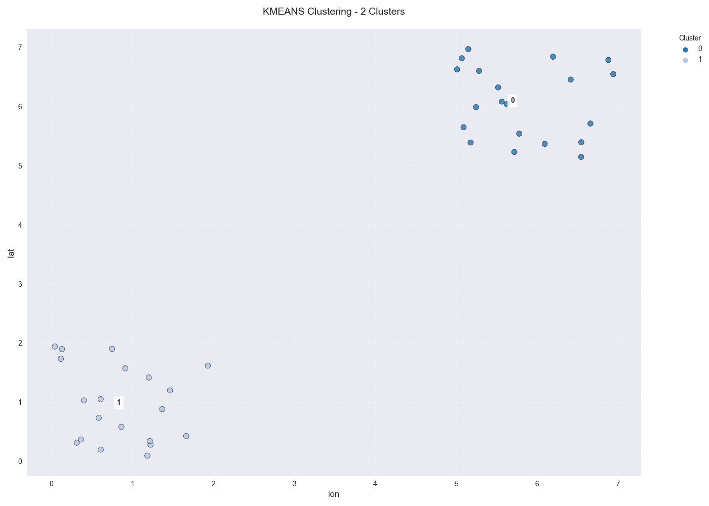

.. _spatial_utils_guide:

===============================
Spatial Data Utilities
===============================

The ``fusionlab.utils.spatial_utils`` module provides a collection of
specialized functions for common data processing and analysis tasks
involving geospatial data (e.g., longitude/latitude coordinates).

This guide covers the primary utilities for spatial clustering,
stratified sampling, coordinate-based filtering and merging, and other
data manipulation techniques essential for preparing data for
spatiotemporal models.

.. raw:: html

   

Spatial Clustering (`create_spatial_clusters`)
----------------------------------------------
:API Reference: :func:`~fusionlab.utils.spatial_utils.create_spatial_clusters`

Spatial clustering is a fundamental technique in exploratory data
analysis used to identify natural groupings or "regions" within a set
of geographic points. This can be invaluable for tasks like defining
study areas, creating regional features for a model, or understanding
the spatial structure of your data.

The ``create_spatial_clusters`` function provides a high-level,
convenient interface for applying popular clustering algorithms from
``scikit-learn`` directly to the coordinate data in your DataFrame.

**Supported Algorithms**

The function acts as a wrapper for three distinct algorithms, each
suited for different scenarios:

* **KMeans (`algorithm='kmeans'`)**: This is a partitioning algorithm
    that aims to divide data points into a pre-defined number of
    clusters (:math:`k`). It works by minimizing the within-cluster
    sum of squares. It is fast and effective for finding well-separated,
    spherical-shaped clusters.

* **DBSCAN (`algorithm='dbscan'`)**: A density-based algorithm that
    groups together points that are closely packed, marking as outliers
    points that lie alone in low-density regions. It is excellent for
    discovering clusters of **arbitrary shape** and does not require
    the number of clusters to be specified beforehand. Its behavior is
    controlled by the `eps` (neighborhood distance) and `min_samples`
    parameters.

* **Agglomerative Clustering (`algorithm='agglo'`)**: A hierarchical
    clustering method that starts with each data point as its own
    cluster and iteratively merges the closest pairs of clusters until
    the desired number of clusters is reached. It is useful for
    understanding nested structures in the data.

**Key Features**

* **Multiple Algorithms:** Easily switch between KMeans, DBSCAN, and
    Agglomerative clustering via the `algorithm` parameter.
* **Automatic `k` Detection:** For KMeans, if you do not specify
    ``n_clusters``, the function can automatically estimate the optimal
    number of clusters using silhouette and elbow analysis.
* **Automatic Coordinate Scaling:** Clustering algorithms are sensitive
    to feature scales. With ``auto_scale=True`` (the default), the
    function automatically standardizes your coordinate data before
    clustering to ensure distances are weighted equally.
* **Integrated Visualization:** Setting ``view=True`` provides immediate
    visual feedback by generating a scatter plot of the data points,
    colored by their newly assigned cluster labels.

Usage Example 1: KMeans with a Fixed Number of Clusters
~~~~~~~~~~~~~~~~~~~~~~~~~~~~~~~~~~~~~~~~~~~~~~~~~~~~~~~~~~~~
This example shows the most straightforward use case, where we have two
clear groups of points and we ask KMeans to find them.

.. code-block:: python
   :linenos:

   import pandas as pd
   import numpy as np
   from fusionlab.utils.spatial_utils import create_spatial_clusters

   # 1. Create a sample DataFrame with two clear groups of points
   np.random.seed(42)
   group1 = np.random.rand(20, 2) * 2
   group2 = (np.random.rand(20, 2) * 2) + 5
   df = pd.DataFrame(np.vstack([group1, group2]), columns=['lon', 'lat'])

   # 2. Use KMeans to find 2 spatial clusters and visualize them
   df_clustered = create_spatial_clusters(
       df=df,
       spatial_cols=['lon', 'lat'],
       algorithm="kmeans",
       n_clusters=2, # Manually set to 2 for this example
       view=True,
       cluster_col='my_regions' # Custom name for the cluster column
   )

   # 3. Display the head of the resulting DataFrame
   print("\nDataFrame with new cluster column:")
   print(df_clustered.head())

**Expected Output:**

   A scatter plot showing the data points colored by their two assigned
   KMeans cluster labels.

.. code-block:: text

   DataFrame with new cluster column:
          lon       lat  my_regions
   0  0.749080  1.901429           0
   1  1.463988  1.536165           0
   2  1.458941  1.054942           0
   3  1.238539  1.171827           0
   4  0.413864  0.763176           0

Usage Example 2: DBSCAN with Custom Parameters
~~~~~~~~~~~~~~~~~~~~~~~~~~~~~~~~~~~~~~~~~~~~~~~~~
This example demonstrates how to use a different algorithm (DBSCAN) and
pass algorithm-specific parameters (like `eps` and `min_samples`)
through the ``**kwargs``.

.. code-block:: python
   :linenos:

   # Use the same DataFrame 'df' from the previous example
   
   # Use DBSCAN to find density-based clusters
   df_dbscan = create_spatial_clusters(
       df=df,
       spatial_cols=['lon', 'lat'],
       algorithm="dbscan",
       view=False, # Disable plot for this example
       # Pass DBSCAN-specific parameters via kwargs
       eps=0.5,
       min_samples=3
   )

   # Display the new cluster labels
   print("\nCluster labels assigned by DBSCAN:")
   print(df_dbscan['region'].value_counts())

**Expected Output:**

.. code-block:: text

   Cluster labels assigned by DBSCAN:
   region
   0    20
   1    20
   Name: count, dtype: int64

.. raw:: html

   

Stratified Spatial Sampling
------------------------------

Working with large geospatial datasets presents a unique challenge:
how do you create a smaller, representative subset for training or
analysis? A simple random sample is often insufficient, as it may miss
or under-represent important spatial patterns and rare categories.

**Stratified sampling** is the solution. It works by dividing the
entire dataset into homogeneous subgroups, or "strata," and then
drawing a proportional number of samples from each one. This ensures
that the final sample is a faithful microcosm of the original data's
spatial and categorical distribution.

The utilities in ``fusionlab-learn`` implement a sophisticated
stratification strategy that combines two methods:

1.  **Spatial Binning:** The geographic area is first divided into a
    grid based on the coordinate columns (e.g., longitude and latitude).
    This is done using quantile-based bins, which ensures that each
    spatial "tile" contains a similar number of data points, effectively
    stratifying by location.
2.  **Categorical Stratification:** The spatial bins are then further
    subdivided by any categorical columns provided in the `stratify_by`
    parameter (e.g., `year`, `geology_type`).

By sampling from these highly specific strata (e.g., "points in the
northwest quadrant that are in the 'Sedimentary' category from the year
2020"), the resulting subset is exceptionally representative.

Core Sampling Functions
~~~~~~~~~~~~~~~~~~~~~~~~

The library provides two functions for this task, each with a specific
purpose.

`spatial_sampling`
^^^^^^^^^^^^^^^^^^^^

:API Reference: :func:`~fusionlab.utils.spatial_utils.spatial_sampling`

This is the fundamental function for drawing a **single, representative
sample** from a large dataset. It is the ideal tool for creating a
holdout test set or a smaller dataset for exploratory analysis that
accurately reflects the characteristics of the full dataset.

`batch_spatial_sampling`
^^^^^^^^^^^^^^^^^^^^^^^^^
:API Reference: :func:`~fusionlab.utils.spatial_utils.batch_spatial_sampling`

This utility extends `spatial_sampling` by dividing the total desired
sample into **multiple, non-overlapping batches**. This is extremely
useful for:
* Training models on datasets that are too large to fit into memory at
    once.
* Creating stratified folds for a robust cross-validation scheme.

Usage Example 1: Creating a Single Stratified Sample
~~~~~~~~~~~~~~~~~~~~~~~~~~~~~~~~~~~~~~~~~~~~~~~~~~~~~
This example shows how to use `spatial_sampling` to draw a single 5%
sample from a dataset, stratified by location and category.

.. code-block:: python
   :linenos:

   import pandas as pd
   import numpy as np
   from fusionlab.utils.spatial_utils import spatial_sampling

   # 1. Create a large dummy DataFrame
   np.random.seed(42)
   df_large = pd.DataFrame({
       "longitude": np.random.uniform(-120, -80, 10000),
       "latitude": np.random.uniform(30, 50, 10000),
       "category": np.random.choice(['A', 'B', 'C'], 10000, p=[0.6, 0.3, 0.1])
   })

   # 2. Draw a single 5% sample, stratified by space and category
   sampled_df = spatial_sampling(
       data=df_large,
       sample_size=0.05, # 5% of total data
       stratify_by=['category'],
       spatial_bins=5,
       verbose=1
   )

   # 3. Print the shape and category distribution of the sample
   print(f"\nShape of single stratified sample: {sampled_df.shape}")
   print("\nOriginal category distribution (%):")
   print(df_large['category'].value_counts(normalize=True) * 100)
   print("\nSampled category distribution (%):")
   print(sampled_df['category'].value_counts(normalize=True) * 100)

**Expected Output:**

.. code-block:: text

   Shape of single stratified sample: (500, 3)

   Original category distribution (%):
   category
   A    60.41
   B    29.53
   C    10.06
   Name: proportion, dtype: float64

   Sampled category distribution (%):
   category
   A    60.4
   B    29.6
   C    10.0
   Name: proportion, dtype: float64

Usage Example 2: Creating Multiple Batches
~~~~~~~~~~~~~~~~~~~~~~~~~~~~~~~~~~~~~~~~~~~~~~~~~~~~~
This example uses `batch_spatial_sampling` to achieve the same total
sample size (10%) but splits it into 5 non-overlapping batches.

.. code-block:: python
   :linenos:

   from fusionlab.utils.spatial_utils import batch_spatial_sampling

   # Use the same df_large from the previous example

   # 2. Draw a total sample of 10% of the data, split into 5 batches
   batches = batch_spatial_sampling(
       data=df_large,
       sample_size=0.1, # 10% of total data
       n_batches=5,
       stratify_by=['category'],
       spatial_bins=5,
       verbose=1
   )

   # 3. Print the shape of each generated batch
   print("\n--- Shape of Generated Batches ---")
   for i, batch in enumerate(batches):
       print(f"Batch {i+1}: {batch.shape}")

**Expected Output:**

.. code-block:: text

   Creating 5 stratified batches with a total of 1,000 samples...
   Batch Sampling Progress: 100%|...| 5/5 [00:00<00:00, ...]
   Batch sampling completed. 5 batches created.

   --- Shape of Generated Batches ---
   Batch 1: (200, 3)
   Batch 2: (200, 3)
   Batch 3: (200, 3)
   Batch 4: (200, 3)
   Batch 5: (200, 3)

.. raw:: html

   

Filtering and Merging by Position
---------------------------------
These utilities are designed to select or combine data based on spatial
proximity, which is a common requirement when working with real-world
geospatial datasets that may not have perfectly aligned coordinates.

`filter_position`
~~~~~~~~~~~~~~~~~~
:API Reference: :func:`~fusionlab.utils.spatial_utils.filter_position`

This function acts like a "spatial query" tool. Its primary purpose is
to select rows from a DataFrame that correspond to a specific geographic
point of interest. It offers two powerful modes for matching:

* **Exact Matching (`find_closest=False`):** This mode is useful when
    you need to retrieve data for a known, precise location, such as a
    specific monitoring well or sensor with exact coordinates.

* **Approximate Matching (`find_closest=True`):** This is the more
    advanced feature. It is designed for situations where an exact
    coordinate match might not exist in your dataset. It finds the data
    point that is numerically closest to your target coordinate, as long
    as it falls within a given `threshold` distance. This is ideal for
    querying gridded data or aligning with points from a different source.

Usage Example
^^^^^^^^^^^^^^

.. code-block:: python
   :linenos:

   import pandas as pd
   from fusionlab.utils.spatial_utils import filter_position

   # 1. Create a sample DataFrame of sensor locations
   df = pd.DataFrame({
       'lon': [10.0, 10.05, 12.5],
       'lat': [20.0, 20.06, 22.0],
       'value': [100, 110, 120]
   })

   # 2. Example of an exact match
   # This will only find the row where lon is exactly 12.5
   df_exact = filter_position(
       df, pos=12.5, pos_cols='lon', find_closest=False
   )
   print("--- Exact Match Result ---")
   print(df_exact)

   # 3. Example of an approximate match
   # Find points "near" (10.01, 20.01) within a 0.1 degree radius
   df_approx = filter_position(
       df,
       pos=(10.01, 20.01),
       pos_cols=('lon', 'lat'),
       find_closest=True,
       threshold=0.1
   )
   print("\n--- Approximate Match Result ---")
   print(df_approx)

**Expected Output:**

.. code-block:: text

   --- Exact Match Result ---
      lon    lat  value
   2  12.5   22.0    120

   --- Approximate Match Result ---
      lon    lat  value
   0  10.00  20.00    100
   1  10.05  20.06    110

`dual_merge`
~~~~~~~~~~~~~~~~~~
:API Reference: :func:`~fusionlab.utils.spatial_utils.dual_merge`

Think of this function as a "spatially-aware" `pandas.merge`. It is
designed to solve the common problem of joining two DataFrames that
should represent the same locations but have slightly different,
misaligned coordinates (e.g., due to different data sources, precision,
or map projections).

Instead of requiring an exact match on coordinate columns, it can join
rows based on spatial proximity, finding the nearest point in the second
DataFrame for each point in the first.

Usage Example
^^^^^^^^^^^^^^
.. code-block:: python
   :linenos:

   from fusionlab.utils.spatial_utils import dual_merge
   
   # 1. Create two DataFrames with slightly misaligned coordinates
   df1_wells = pd.DataFrame({
       'well_id': ['W1', 'W2'],
       'longitude': [10.01, 12.52],
       'latitude': [20.02, 22.03],
   })
   df2_geology = pd.DataFrame({
       'lon': [10.0, 12.5],
       'lat': [20.0, 22.0],
       'rock_type': ['Sandstone', 'Shale']
   })

   # 2. Merge them by finding the closest spatial points
   df_merged = dual_merge(
       df1_wells, df2_geology,
       feature_cols=('longitude', 'latitude'), # df1 uses these names
       find_closest=True,
       threshold=0.1 # Max distance to consider a match
   )
   print(df_merged)

**Expected Output:**

.. code-block:: text

     well_id  longitude  latitude  lon   lat  rock_type
   0      W1      10.01     20.02  10.0  20.0  Sandstone
   1      W2      12.52     22.03  12.5  22.0      Shale

.. raw:: html

   

Other Utilities
---------------

Extracting Data Zones (`extract_zones_from`)
~~~~~~~~~~~~~~~~~~~~~~~~~~~~~~~~~~~~~~~~~~~~~
:API Reference: :func:`~fusionlab.utils.spatial_utils.extract_zones_from`

This is a powerful data exploration and filtering tool. Its purpose is
to isolate subsets of your data—or "zones"—based on a value criterion.
For example, you can use it to "find all locations where subsidence is
greater than 50mm" or "show me the data points corresponding to the
top 10% of rainfall events." The `threshold='auto'` feature, which uses
percentiles, makes this kind of exploratory analysis particularly easy.

Usage Example
^^^^^^^^^^^^^^

.. code-block:: python
   :linenos:

   from fusionlab.utils.spatial_utils import extract_zones_from

   # 1. Create sample data
   data = {'value': np.arange(1, 101)}
   df_zones = pd.DataFrame(data)

   # 2. Extract the zone containing the top 5% of values
   top_5_percent_zone = extract_zones_from(
       z=df_zones['value'],
       threshold='auto',
       percentile=95, # The threshold will be the 95th percentile
       condition='above'
   )
   print(top_5_percent_zone)

**Expected Output:**

.. code-block:: text

      value
   0     96
   1     97
   2     98
   3     99
   4    100

Coordinate Column Extraction (`extract_coordinates`)
~~~~~~~~~~~~~~~~~~~~~~~~~~~~~~~~~~~~~~~~~~~~~~~~~~~~
:API Reference: :func:`~fusionlab.utils.spatial_utils.extract_coordinates`

This is a convenience utility designed to reduce boilerplate code. It
robustly finds and extracts common coordinate column pairs (like
`longitude`/`latitude` or `easting`/`northing`) from a DataFrame. It can
return the coordinates as a new DataFrame, calculate their central
midpoint, and optionally drop them from the original DataFrame.

Usage Example
^^^^^^^^^^^^^^

.. code-block:: python
   :linenos:

   from fusionlab.utils.spatial_utils import extract_coordinates
   
   df = pd.DataFrame({'lon': [10, 20], 'lat': [30, 40], 'data': [1, 2]})

   # 1. Extract coordinates as a separate DataFrame
   xy_df, _, _ = extract_coordinates(df, as_frame=True, drop_xy=False)
   print("--- Coordinates as DataFrame ---")
   print(xy_df)

   # 2. Extract the central midpoint of the coordinates
   midpoint, _, _ = extract_coordinates(df, as_frame=False, drop_xy=False)
   print("\n--- Central Midpoint ---")
   print(midpoint)

   # 3. Extract coordinates and drop them from the original DataFrame
   _, df_no_coords, _ = extract_coordinates(df, as_frame=True, drop_xy=True)
   print("\n--- DataFrame with Coords Dropped ---")
   print(df_no_coords)

**Expected Output:**

.. code-block:: text

   --- Coordinates as DataFrame ---
      longitude  latitude
   0         10        30
   1         20        40

   --- Central Midpoint ---
   (15.0, 35.0)

   --- DataFrame with Coords Dropped ---
      data
   0     1
   1     2